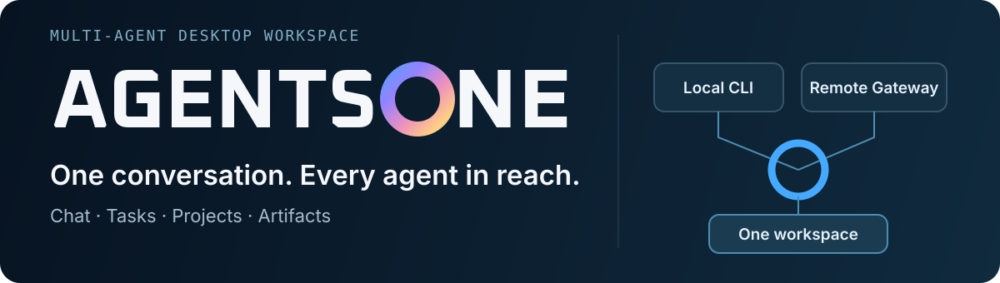

# Agents One

<p align="center">
  
</p>

<p align="center">
  <a href="README.zh-CN.md">简体中文</a> · <a href="#see-it-in-action">Preview</a> · <a href="#get-started">Get started</a> · <a href="#development">Develop</a> · <a href="#license">License</a>
</p>

**An AI agent management and collaboration platform.** Connect Pi, Codex, Claude Code, OpenCode, and other local agents, as well as remote agents through Gateway, to manage conversations, tasks, collaboration, and artifacts in one place. Each agent keeps its native tools and permissions while you work from one conversation surface.

> **Pre-release · Windows x64 Alpha candidate.** No public Agents One release has been published yet. The current candidate is still behind release and clean-machine acceptance gates. Features and stored-data formats may change. Follow [Releases](https://github.com/pkulyn/agents-one/releases) for the first published build.

**Alpha source:** the repository is public under MIT. There is no accepted installer Release yet, and remote Hermes conversation recall remains experimental. See [known issues](KNOWN_ISSUES.md).

## See it in action

The opening scene of the current app carries the Agents One Dawn Ring identity:

<p align="center">
  
</p>

The product itself is a conversation workspace. Chat stays central, with projects, scheduled work, and agent selection close at hand.

<p align="center">
  
</p>

<details>
<summary>View the agent registry</summary>

<p align="center">
  
</p>

</details>

Screenshots show development builds; labels and layout may change before release.

## What comes together

| Your work                  | What Agents One adds                                                                                                                         |
| -------------------------- | -------------------------------------------------------------------------------------------------------------------------------------------- |
| **Conversations**          | Streaming responses, tool activity, artifacts, retry and cancel controls, searchable history, and a native terminal fallback for CLI output. |
| **Agents**                 | One registry for local CLI runtimes and remote Gateway v1 agents, with health probes and capability badges based on reported behavior.       |
| **Projects & tasks**       | Folder-scoped workspaces, conversations that also serve as tasks, scheduled runs, archives, and structured multi-agent handoffs.             |
| **Ownership of your data** | Portable backup and restore with integrity checks, credential exclusions, and rollback safeguards.                                           |

### Local power, one shared surface

Agents One starts local CLIs as native processes. Pi, Codex, Claude Code, and OpenCode keep their own models, tools, project instructions, and permission modes. For remote agents, Gateway v1 uses a URL and bearer token, negotiates capabilities, and grants workspace access only for a bounded run. Both routes feed the same conversation experience.

The [Plugin SDK](docs/AGENTS_ONE_PLUGIN_SDK.md) lets additional agents implement this contract without changing the desktop app. The [event stream](docs/AGENT_EVENT_STREAM_V1.md) carries tool activity, artifacts, and handoffs; the [Gateway protocol](docs/AGENTS_ONE_REMOTE_GATEWAY_V1.md) covers remote runs and workspace grants.

## Get started

### Install when the Alpha is published

The first public package is planned for **Windows x64**. Download only from the [official Releases page](https://github.com/pkulyn/agents-one/releases) and compare the package SHA-256 with `SHA256SUMS.txt`. The Alpha is expected to be unsigned, so Windows SmartScreen may warn on first launch. Automatic updates are disabled for unsigned builds. macOS and Linux packages are outside this first release.

### Add an agent

1. Open **Agents** and choose **Add agent**.
2. For a local agent, select Pi, Codex, Claude Code, or OpenCode. Set the executable path requested by the adapter.
3. For a remote agent, enter its Gateway v1 URL and bearer token.
4. Save and probe the connection, then open **Chat** to start a conversation or task.

Create a **Project** to attach conversations to a folder. That folder becomes the workspace scope for local CLI runs and remote runs with an explicit workspace grant.

## Data and trust boundaries

Desktop state lives in Electron `userData` (normally `%APPDATA%\Agents One` on Windows); portable builds use `%LOCALAPPDATA%\agents-one-portable` by default. User-selected project folders and local CLI homes stay outside that desktop state. Backups omit known credentials and protected secrets, but user-authored chats, memories, skills, and attachments can still contain sensitive information.

The built-in Doubao, ChatGPT, and Grok browser adapters are **default-off experiments** in public builds. Enabling them sends selected prompts and attachments through the signed-in provider webpage. See the [security policy](SECURITY.md), and [known issues](KNOWN_ISSUES.md) for the current boundaries and limitations.

## Development

Node.js **24 or newer** is required. From the repository root on Windows:

```powershell
npm.cmd run install:clean
npm.cmd run dev
npm.cmd run typecheck
npm.cmd test
```

See the [contribution guide](CONTRIBUTING.md) for the full checks and the [runbook](docs/AGENTS_ONE_RUNBOOK.md) for usage and troubleshooting. Changes are tracked in the [changelog](CHANGELOG.md).

## License

Original Agents One contributions in this repository are offered under the [MIT License](LICENSE). MIT permits use, modification, distribution, and commercial use when the copyright and license notice is retained. Contributors keep their own copyright and submit only material they can license under MIT.

The inherited `hermes-desktop` material retains its original author's MIT notice in [THIRD_PARTY_NOTICES.md](THIRD_PARTY_NOTICES.md). Third-party dependencies and assets retain their respective terms; the Oxanium-derived wordmark notice and font license are also linked there. This code license does not grant rights to impersonate the Agents One project or its maintainers.
