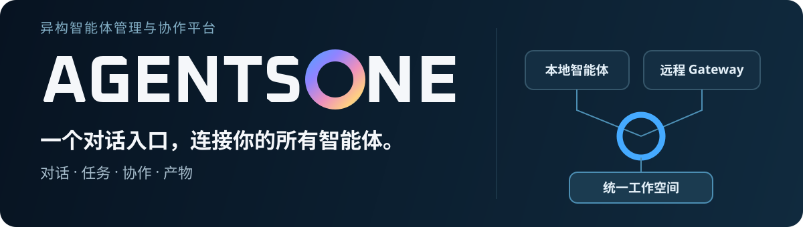
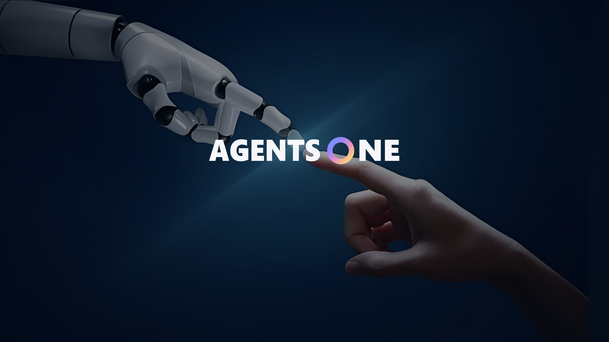
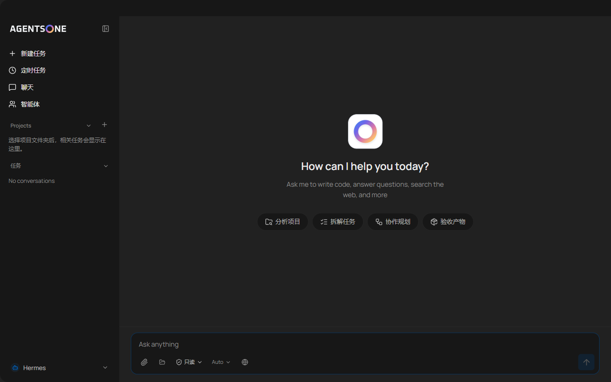
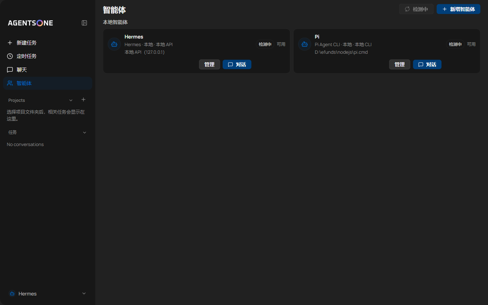

# Agents One

<p align="center">
  
</p>

<p align="center">
  <a href="README.md">English</a> · <a href="#产品一览">界面预览</a> · <a href="#快速开始">快速开始</a> · <a href="#参与开发">参与开发</a> · <a href="#许可协议">许可协议</a>
</p>

**一个原生桌面工作空间，串联多个 AI 智能体的对话、任务、项目与产物。** 将 Pi、Codex、Claude Code 作为本地 CLI 接入，也可以通过 Gateway v1 接入远程智能体。每个智能体保留自己的工具与权限，而你的工作集中在同一个对话界面。

> **预发布 · Windows x64 Alpha 候选。** Agents One 尚无公开 Release；当前候选仍需通过发布门禁与干净环境验收。功能及持久化数据格式可能变化。首个公开版本请关注 [Releases 页面](https://github.com/pkulyn/agents-one/releases)。

**开发源码状态：**本地 OpenCode 长任务及取消后同会话回忆已通过定向验证；远程 Hermes 多轮记忆与重启续接仍为实验性路径。详情见 [Alpha 源码状态](docs/AGENTS_ONE_ALPHA_SOURCE_STATUS_20261003.md)与[已知问题](KNOWN_ISSUES.md)。公开源码不代表稳定安装包已经发布。

## 产品一览

当前版本的启动画面使用 Agents One 的 Dawn Ring 品牌标识：

<p align="center">
  
</p>

真正的工作发生在对话里：项目、定时任务与智能体入口围绕对话组织。

<p align="center">
  
</p>

<details>
<summary>查看智能体注册表</summary>

<p align="center">
  
</p>

</details>

截图来自开发构建，正式发布前文案与布局可能调整。

## 核心体验

| 工作内容       | Agents One 提供什么                                                             |
| -------------- | ------------------------------------------------------------------------------- |
| **对话**       | 流式回复、工具过程、产物、重试与取消、可搜索历史，以及 CLI 原始输出的终端回退。 |
| **智能体**     | 本地 CLI 与远程 Gateway v1 共用一个注册表；健康探测和能力徽章来自实际探测结果。 |
| **项目与任务** | 以文件夹限定工作区，让对话成为任务；支持定时运行、归档和结构化多智能体交接。    |
| **数据自主**   | 可移植备份与恢复，包含完整性校验、凭据排除和回滚保护。                          |

### 保留原生能力，汇入统一界面

Agents One 以原生进程启动本地 CLI。Pi、Codex、Claude Code 保留自己的模型、工具、项目指令与权限模式。远程智能体通过一个 Gateway v1 地址和 Bearer Token 接入，按协议协商能力，工作区访问只在有边界的运行期间授权。两条路径最终都进入同一套对话体验。

[插件 SDK](docs/AGENTS_ONE_PLUGIN_SDK.md) 允许新智能体实现统一契约，无需改动桌面端。[事件流协议](docs/AGENT_EVENT_STREAM_V1.md)承载工具过程、产物与交接；[Gateway 协议](docs/AGENTS_ONE_REMOTE_GATEWAY_V1.md)负责远程运行与工作区授权。

## 快速开始

### Alpha 发布后安装

首个公开安装包计划仅面向 **Windows x64**。请从[官方 Releases 页面](https://github.com/pkulyn/agents-one/releases)下载，并用 `SHA256SUMS.txt` 核对 SHA-256。Alpha 预计不带代码签名，Windows SmartScreen 首次启动可能提示风险；未签名构建默认关闭自动更新。首版不提供 macOS / Linux 发布资产。

### 添加智能体

1. 打开**智能体**，点击**新增智能体**。
2. 本地 CLI 可选 Pi、Codex 或 Claude Code；应用找到 `PATH` 中的可执行文件后会预填路径。
3. 远程智能体填写 Gateway v1 地址与 Bearer Token。
4. 保存并探测连接，再进入**聊天**开始对话或任务。

创建**项目**后，可将对话关联到项目文件夹。该文件夹就是本地 CLI 运行，以及获得明确工作区授权的远程运行的工作区边界。

## 数据与信任边界

桌面状态存放于 Electron `userData`（Windows 通常为 `%APPDATA%\Agents One`）；便携版默认使用 `%LOCALAPPDATA%\agents-one-portable`。用户选择的项目目录和本地 CLI 数据位于桌面状态之外。备份排除已知凭据与受保护密文，但用户编写的对话、记忆、技能和附件仍可能含敏感信息。

内置的豆包、ChatGPT 和 Grok 浏览器适配器在公开构建中是**默认关闭的实验功能**。启用后，选定的提示词和附件会通过已登录的第三方网页发送。当前边界与限制见[网页 Provider 合规记录](docs/AGENTS_ONE_WEB_PROVIDER_COMPLIANCE_20260910.md)、[安全策略](SECURITY.md)和[已知问题](KNOWN_ISSUES.md)。

## 参与开发

需要 Node.js **24 或更新版本**。在 Windows 仓库根目录运行：

```powershell
npm.cmd run install:clean
npm.cmd run dev
npm.cmd run typecheck
npm.cmd test
```

完整检查流程见[贡献指南](CONTRIBUTING.zh-CN.md)，发布运维见[运行手册](docs/AGENTS_ONE_RUNBOOK.md)，版本变化见[变更日志](CHANGELOG.md)。

## 许可协议

本仓库中 Agents One 原创贡献采用 [PolyForm Noncommercial License 1.0.0](LICENSE)。个人或组织可在协议允许的**非商业用途**下研究、使用、修改和分享；该协议不授予商用权利。继承自 `hermes-desktop` 的部分继续遵循原 MIT 条款，声明见 [THIRD_PARTY_NOTICES.md](THIRD_PARTY_NOTICES.md)。此前已依据 MIT 条款获得的副本，其既有授权继续有效。

商业机构可依据[商业机构内部评估补充许可](COMMERCIAL_EVALUATION_PERMISSION.md)**不限时**在机构内部评估和研究，包括内部测试、原型验证及为此所需的修改；该许可不允许生产使用、对外分发，或将换皮产品用于商业推广。超出上述授权范围的使用需另行取得相关权利人的书面许可。

由于限制商用，本项目应称为**源码可见、限制商用的软件**，不属于 OSI 定义的开源软件。生产使用或对外商用需另行取得相关著作权人的许可。
