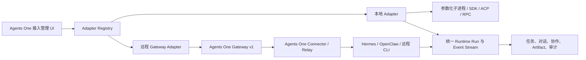

# Agents One 接入管理升级 PRD

## 1. 文档信息

| 项目     | 内容                                                   |
| -------- | ------------------------------------------------------ |
| 产品     | Agents One 智能体接入管理                              |
| 版本     | PRD v1.0                                               |
| 状态     | 方案已确认，待开发                                     |
| 日期     | 2026-09-03                                             |
| 首批范围 | Adapter Registry、OpenCode 本地接入、OpenClaw 远程接入 |
| 后续范围 | ZCode、Gemini CLI、Qwen Code、Kimi CLI 等              |

本文是后续开发智能体的执行依据。除非本文明确标记为“可选”或“后续”，实现时应以本文的目标、边界、数据模型和验收条件为准。

## 2. 背景与现状

Agents One 已经具备 Runtime、任务运行、事件流、Artifact、Workspace Grant、Remote Gateway v1 和 Connector 的基础能力，但接入管理仍存在三类硬编码：

1. Runtime 类型静态限制在 Hermes、Codex、Claude Code、Pi、Web Agent；见 [`src/shared/agent-runtimes.ts`](../src/shared/agent-runtimes.ts)。
2. 本地 CLI 自动发现只包含 Pi、Claude Code、Codex；见 [`src/main/local-cli-detect.ts`](../src/main/local-cli-detect.ts)。
3. 新建 Runtime 的 UI 只提供 3 个本地 CLI 和 Hermes 远程模板；见 [`AgentRuntimesPane.tsx`](../src/renderer/src/components/settings/AgentRuntimesPane.tsx)。

主进程的任务启动、探测、会话、模型和取消逻辑也大量按 `runtime.kind` 分支。若直接增加 OpenCode、OpenClaw 和未来更多智能体，核心 Runtime 文件会继续膨胀，且新增智能体容易出现“可以保存配置但不能真正运行”的假接入。

仓库已有两个可复用基础：

- [`AGENTS_ONE_REMOTE_GATEWAY_V1.md`](./AGENTS_ONE_REMOTE_GATEWAY_V1.md)：定义远程地址、Token、Run、事件、Artifact、Workspace Grant 和 Connector 边界。
- [`AGENTS_ONE_PLUGIN_SDK.md`](./AGENTS_ONE_PLUGIN_SDK.md)：定义远程 Gateway Plugin、本地 CLI Adapter 和统一事件流的实现方向。

本次升级要把上述基础真正收敛为产品级的 Adapter Registry，而不是继续增加供应商专用分支。

## 3. 产品目标

### 3.1 总目标

建立统一的智能体接入管理中心，使 Agents One 能够通过 Adapter Registry 管理不同供应商、不同位置和不同协议的 Runtime，并以能力协商驱动 UI、任务和协作功能。

### 3.2 首批交付目标

- 支持注册和管理本地 Claude Code、Codex、Pi Agent、OpenCode。
- 支持通过 Remote Gateway v1 接入远程 Hermes、OpenClaw。
- 支持未来在不修改核心任务系统的情况下增加 ZCode、Gemini CLI、Qwen Code、Kimi CLI 等适配器。
- 本地 CLI 保留原生会话、权限、工作目录和工具能力。
- 远程智能体统一使用 Gateway v1/Connector，不向桌面端暴露厂商私有 API 和第二套 Token。
- UI 不再根据智能体名称写死配置表单，而是由 Adapter Manifest 生成。
- Runtime 的“健康、可对话、可执行、可协作”状态必须来自真实探测结果。

### 3.3 非目标

本期不做：

- 不通过屏幕抓取、键盘模拟或逆向私有协议接入 ZCode。
- 不把所有智能体强行转换为 OpenAI Chat Completions。
- 不把本地 CLI 转成 Remote Gateway。
- 不以 SSH 作为普通用户远程接入的默认协议。
- 不提供任意远程 Shell、PowerShell、文件服务器或端口转发。
- 不自动迁移、覆盖或删除已有 Token、会话、项目和历史记录。
- 不承诺不同智能体具有完全一致的权限语义；只做高层能力归一化，并保留供应商原生策略。

## 4. 核心产品模型

### 4.1 概念拆分

| 概念             | 含义                                             | 示例                                          |
| ---------------- | ------------------------------------------------ | --------------------------------------------- |
| Vendor           | 智能体品牌或运行时来源                           | `codex`、`opencode`、`openclaw`               |
| Runtime          | 某个具体可运行实例                               | 办公电脑上的 OpenCode、NAS 上的 OpenClaw      |
| Adapter          | 把供应商协议转换为 Agents One Runtime 契约的实现 | `builtin:opencode-acp`                        |
| Transport        | Adapter 与 Runtime 的通信方式                    | `acp-stdio`、`codex-app-server`、`gateway-v1` |
| Capability       | Runtime 实际支持的能力                           | 流式、取消、Artifact、Workspace               |
| Run              | 一次对话、任务或协作执行                         | `run_xxx`                                     |
| Artifact         | 可核验的文件、差异或报告                         | 文件 ID、相对路径、SHA-256                    |
| Workspace Grant  | 临时、项目范围内的本机访问授权                   | 只读、可写、过期时间                          |
| Secret Reference | 受保护凭据引用                                   | `AGENTS_ONE_GATEWAY_xxx_TOKEN`                |

同一 Vendor 可以有多个 Runtime 实例；同一 Vendor 也可以同时存在本地和远程实例。例如：

- `opencode-office`：本地 OpenCode ACP 进程；
- `opencode-vps`：远程 OpenCode ACP，通过 Connector/Gateway 接入；
- `openclaw-nas`：远程 OpenClaw Gateway；
- `hermes-nas`：远程 Hermes Gateway。

### 4.2 目标架构



### 4.3 接入优先级

协议选择遵循以下优先级：

1. 供应商官方 SDK 或原生控制协议；
2. ACP、JSON-RPC、RPC 等结构化协议；
3. 官方 headless HTTP/API；
4. CLI 的 JSONL/结构化输出；
5. 纯文本 CLI 仅作为基础兼容模式，不显示增强事件能力。

## 5. Adapter Registry 需求

### FR-01 Adapter 注册中心

系统必须提供统一的 Adapter Registry，负责：

- 注册内置 Adapter；
- 加载已安装的 Plugin Adapter；
- 根据 `adapterId` 获取 Adapter；
- 根据位置、传输方式、平台和配置类型筛选 Adapter；
- 执行 Adapter 的探测、启动、查询、取消、续接和能力协商；
- 管理 Adapter 版本和兼容性；
- 为 UI 提供 Adapter Manifest 和配置字段定义。

建议新增目录：

```text
src/main/runtime-adapters/
  types.ts
  registry.ts
  manifests.ts
  local-process.ts
  event-normalizer.ts
  builtin/
    claude-code.ts
    codex.ts
    pi.ts
    opencode-acp.ts
    hermes-local-api.ts
    gateway-v1.ts
    openclaw-gateway.ts
```

现有 `claude-code-runtime.ts`、`codex-runtime.ts`、`pi-runtime.ts` 先作为兼容实现接入 Registry，后续再逐步抽取公共逻辑，不要求本期一次性重写。

### FR-02 Adapter 契约

建议接口如下，具体类型可以根据现有代码调整，但职责不能减少：

```ts
export interface RuntimeAdapter {
  descriptor: RuntimeAdapterDescriptor;

  probe(config: AgentRuntimeConfig): Promise<AgentRuntimeProbe>;

  start(
    runtime: AgentRuntimeDefinition,
    input: AgentRuntimeTaskInput,
    context: RuntimeAdapterContext,
  ): Promise<StartedRuntimeRun>;

  get(runId: string, context: RuntimeAdapterContext): Promise<AgentRuntimeRun>;

  cancel?(runId: string, context: RuntimeAdapterContext): Promise<void>;

  continue?(
    runId: string,
    text: string,
    context: RuntimeAdapterContext,
  ): Promise<void>;

  listModels?(context: RuntimeAdapterContext): Promise<RuntimeModelOption[]>;

  dispose?(): Promise<void>;
}
```

Adapter 不得直接操作 Renderer，不得把 Token 写入普通 Runtime 配置，不得绕过主进程的 Workspace Authority、Secret Store、事件审计和任务状态机。

### FR-03 Adapter Manifest

每个 Adapter 必须提供机器可读 Manifest：

```ts
export interface RuntimeAdapterDescriptor {
  id: string;
  version: string;
  vendorId: string;
  displayName: string;
  description?: string;
  locations: Array<"local" | "remote">;
  transports: string[];
  platforms?: Array<"win32" | "darwin" | "linux">;
  configSchema: RuntimeConfigField[];
  capabilityDefaults?: Partial<AgentRuntimeCapabilities>;
  detection?: {
    commands?: string[];
    executableNames?: string[];
    endpointProbe?: boolean;
  };
  experimental?: boolean;
}
```

配置字段至少支持：字符串、数字、布尔、文件、目录、枚举、Secret Reference。敏感字段只能通过受保护凭据接口读写。

### FR-04 Runtime 数据模型升级

在保留现有字段兼容性的基础上，为 `AgentRuntimeDefinition` 增加：

```ts
interface AgentRuntimeDefinition {
  // 既有字段保留
  id: string;
  name: string;
  kind: AgentRuntimeKind;
  location: "local" | "remote";
  enabled: boolean;
  config: AgentRuntimeConfig;

  // 新增字段
  vendorId?: string;
  adapterId?: string;
  adapterVersion?: string;
  authRef?: string;
  capabilitySnapshot?: AgentRuntimeCapabilities;
  lastProbe?: {
    state: AgentRuntimeHealthState;
    checkedAt: number;
    message?: string;
  };
}
```

`adapterId` 是真正的执行路由；`kind` 只作为兼容字段和展示分类。不得继续用 `kind` 单独决定启动方式。

推荐示例：

```json
{
  "id": "opencode-office",
  "name": "OpenCode 本机",
  "kind": "opencode",
  "vendorId": "opencode",
  "adapterId": "builtin:opencode-acp",
  "location": "local",
  "enabled": true,
  "config": {
    "agentTransport": "local-cli",
    "executablePath": "opencode",
    "workspace": "D:/Projects/demo"
  }
}
```

```json
{
  "id": "openclaw-nas",
  "name": "OpenClaw NAS",
  "kind": "openclaw",
  "vendorId": "openclaw",
  "adapterId": "builtin:openclaw-gateway",
  "location": "remote",
  "enabled": true,
  "config": {
    "agentTransport": "gateway-v1",
    "endpoint": "https://relay.example.com/agents-one/v1",
    "remoteGateway": { "protocol": "agents-one-v1" }
  }
}
```

## 6. 接入向导与 UI 需求

### FR-05 新建 Runtime 向导

新建流程调整为：

1. 选择位置：本地 / 远程；
2. 选择智能体：从 Adapter Manifest 生成；
3. 选择连接协议：默认使用 Adapter 推荐协议，也允许高级模式切换；
4. 填写配置：由 `configSchema` 动态生成；
5. 探测：版本、认证、协议握手、工作区和能力；
6. 保存并显示能力摘要。

不得再在 `AgentRuntimesPane.tsx` 中维护“本地固定数组”和“远程固定数组”。

### FR-06 Runtime 卡片

每个 Runtime 卡片显示：

- 名称、Vendor、位置；
- Adapter 名称和版本；
- 连接方式；
- 健康状态；
- 认证状态；
- 工作区状态；
- 能力标签；
- 最近探测时间；
- 最近一次结构化错误码；
- 管理、重新探测、启用/禁用、删除操作。

能力标签必须区分：

- 对话；
- 流式；
- 连续会话；
- 会话恢复；
- 工具事件；
- 取消；
- 模型选择；
- Artifact；
- Workspace；
- 协作/交接；
- 只读规划。

### FR-07 状态分层

不要只显示“在线/离线”，统一使用以下四级：

| 等级     | 含义                                                |
| -------- | --------------------------------------------------- |
| 基础接入 | 可获取版本、认证和健康状态                          |
| 可对话   | 可以发送消息并获得最终答复                          |
| 可执行   | 支持结构化事件、工具、取消或产物中的一部分          |
| 可协作   | 支持任务、Artifact、Workspace Grant、交接和断线恢复 |

实际不支持的能力必须显示为“不支持”或“基础模式”，不能根据 Vendor 名称猜测。

## 7. 首批 Adapter 需求

### 7.1 OpenCode 本地 Adapter

#### 目标

在 Windows 本地以独立子进程接入 OpenCode，优先使用 ACP，保留 HTTP Server 作为后续扩展路径。

#### 推荐协议

- 主协议：`opencode acp`；
- 通信：JSON-RPC over stdio；
- 后续备用：`opencode serve` headless HTTP；
- 本地工作目录：使用 Runtime/任务指定的已授权目录；
- 启动：参数数组 + `shell: false`；
- 取消：优先调用 ACP/原生取消，失败时终止整个进程树；
- 事件：转换为 Agents One Event Stream v1 和现有 `AgentRuntimeEvent`。

OpenCode 官方文档确认 `opencode acp` 通过 stdio 提供 ACP JSON-RPC，`opencode serve` 提供无界面 HTTP 服务和会话、消息、事件、权限、差异等接口。因此首版应采用 ACP，避免解析 TUI 文本。[OpenCode ACP](https://dev.opencode.ai/docs/acp/)、[OpenCode Server](https://dev.opencode.ai/docs/server/)

#### 配置字段

```text
可执行文件：opencode / 绝对路径
ACP 参数：默认 ["acp"]，高级可编辑
工作目录：可选；任务工作区优先
默认模型：可选
默认 Agent：可选
超时：默认 5 分钟，最大 24 小时
```

#### 事件映射

| OpenCode 行为      | Agents One 事件                                      |
| ------------------ | ---------------------------------------------------- |
| 会话创建           | `started` / `run.started`                            |
| assistant 文本增量 | `message` / `assistant.delta`                        |
| 工具开始/结束      | `tool_call`、`tool_result`                           |
| 权限请求           | Runtime 控制事件，不能伪装为工具结果                 |
| 文件变更           | `artifact_published`，必须由本机文件或 diff 证据确认 |
| 会话中止           | `cancelled`                                          |
| ACP/进程异常       | `error` / `run.failed`                               |

#### OpenCode 验收

- 可探测版本并完成 ACP 握手；
- 可创建一次对话并返回最终答复；
- 可接收至少一条结构化增量事件；
- 可执行只读任务；
- 可在临时 Git 项目执行一次写入任务；
- 可检测真实 diff，不依赖模型文字声明；
- 可取消长任务；
- 可从断线/进程错误中恢复为明确状态；
- Windows `.cmd`/Node 入口不使用 Shell 兜底。

### 7.2 OpenClaw 远程 Adapter

#### 目标

把远程 OpenClaw Gateway 接入 Agents One Remote Gateway v1。桌面端只保存 Gateway 地址和一个 Agents One Token，OpenClaw 原生 Token、WebSocket 地址和内部配置全部留在远端 Adapter/Connector。

#### 连接结构

```text
Agents One Desktop
        │ HTTPS + Agents One Gateway Token
        ▼
Agents One Gateway / Relay
        │ Connector Token 或 mTLS
        ▼
OpenClaw Adapter
        │ Loopback / 本机受限连接
        ▼
OpenClaw Gateway
```

OpenClaw 官方 Gateway 是包含 WebSocket 控制/RPC、HTTP API、会话、工具和事件的长驻控制平面。Agents One 不应直接复刻 OpenClaw Gateway 协议，而应由 Adapter 转换为 Remote Gateway v1。[OpenClaw Gateway](https://github.com/openclaw/openclaw/blob/main/docs/gateway/index.md)

#### Adapter 责任

- 实现 `/capabilities`；
- 实现 `/runs`、查询、取消和事件快照/SSE；
- 将 OpenClaw session 映射为 `conversationId`；
- 将 subagent/agent handoff 映射为交接事件；
- 将工具、MCP、技能和浏览器等行为映射为脱敏工具事件；
- 将真实代码变更、文件和报告发布为 Artifact；
- 支持 `runtimeId` 路由，不使用显示名称路由；
- 支持 Connector 断线、重连、事件序号续传；
- OpenClaw 离线时返回 `503 agent_offline`，不得伪装为已排队；
- 不暴露任意 Shell、绝对路径、环境变量、Token 或 Cookie。

#### OpenClaw 验收

- 使用一个 Gateway 地址和一个 Token 完成 capabilities 探测；
- 完成一轮真实对话；
- 能读取运行状态和事件；
- 取消请求幂等且最终状态可确认；
- 工具事件可去重；
- 远程生成的 Artifact 可下载并校验 SHA-256；
- Connector 离线时桌面端显示明确错误；
- Workspace Grant 只能使用相对路径和短时授权；
- 旧 OpenClaw Bridge 在迁移期仍可继续运行。

## 8. 本地与远程接入边界

### 8.1 本地 Runtime

本地 Claude Code、Codex、Pi 和 OpenCode 必须由 Agents One 主进程直接管理：

- 使用参数数组启动，禁止拼接 Shell 命令；
- Windows 下处理 `.cmd`、`.exe`、Node 入口；
- 明确工作目录和权限模式；
- 通过进程树取消和超时；
- 原生输出无法结构化时保留折叠式原始诊断；
- 文件修改必须由本机文件系统或 Git diff 验证；
- Token、环境变量和完整敏感输出必须脱敏。

### 8.2 远程 Runtime

远程 Hermes、OpenClaw，以及未来远程 Claude Code、Codex、Pi、OpenCode，统一使用：

- Gateway v1；
- Agents One Connect/Relay；
- 一个桌面 Gateway URL；
- 一个桌面 Bearer Token；
- 远程设备独立的 Connector 凭据；
- 能力声明和结构化事件；
- Workspace Grant 和 Artifact 证据。

不得把远程智能体直接实现为“桌面端发一个 HTTP 请求并等待字符串”。

## 9. 权限与安全需求

### SEC-01 凭据

- Gateway Token、API Key、Basic Auth 密码只能进入 Secret Store；
- Runtime JSON、导出文件、日志、SSE、Artifact、截图和错误正文不得包含凭据；
- 远程 Gateway Token 与 Connector Token 分离；
- 支持重新授权、轮换和撤销；
- 配置导出时只导出 `authRef` 和“已配置”状态。

### SEC-02 本地权限

统一提供高层模式：`analysis`、`safe_write`、`implementation`、`full_access`，但必须映射到各 Adapter 的原生能力：

- Claude Code：权限模式和工具允许/拒绝规则；
- Codex：sandbox 和 approval 模式；
- Pi：RPC/SDK 会话工具集合；
- OpenCode：按工具和命令的 permission 规则。

高层模式不能宣称比供应商原生协议更强的隔离能力。

### SEC-03 远程工作区

- 只有显式 Workspace Grant 才能访问桌面项目；
- Gateway 不得获得桌面绝对路径；
- 删除操作必须逐项确认；
- 文件操作必须检查路径穿越、符号链接、大小、哈希冲突和 Grant 过期；
- 远程模型的文字回复不能作为文件已写入的证据。

## 10. 兼容与迁移

### MIG-01 旧配置兼容

现有字段保留：`kind`、`location`、`config.agentTransport`、`config.remoteGateway`、`config.connect`。新增字段缺失时按以下规则懒推导：

| 现有配置               | 默认 Adapter                                          |
| ---------------------- | ----------------------------------------------------- |
| 本地 Claude Code + CLI | `builtin:claude-code-cli`                             |
| 本地 Codex + CLI       | `builtin:codex-exec`                                  |
| 本地 Pi + CLI          | `builtin:pi-rpc`                                      |
| 本地 Hermes API        | `builtin:hermes-local-api`                            |
| 远程 Gateway v1        | `builtin:gateway-v1` 或按 `vendorId` 选择专用 Adapter |

### MIG-02 不丢数据

- 不删除旧 Runtime；
- 不自动覆盖旧 Token；
- 不自动把旧 Hermes/OpenClaw 私有地址合并到新 Gateway 地址；
- 旧配置缺少对应 Adapter 时显示为“需要重新配置/适配器不可用”，不能静默丢弃；
- 保存新配置前保留旧配置快照；
- 迁移失败可以回滚；
- 迁移日志不得包含敏感字段。

### MIG-03 Kind 扩展

`AgentRuntimeKind` 不应继续作为阻止新 Adapter 加载的静态白名单。建议保留内置类型的 TypeScript 联合，同时允许 Registry 校验已注册的动态 `vendorId/adapterId`，使未来插件可以增加新智能体。

## 11. 开发分阶段计划

### Phase 0：契约和回归基线

任务：

- 固化 Adapter 接口、Manifest、Registry API；
- 固化 `AgentRuntimeDefinition` 迁移规则；
- 为旧 Claude Code、Codex、Pi、Hermes 建立兼容 Adapter；
- 补充 Registry、Manifest、旧配置加载测试；
- 不改变现有用户可用路径。

完成标准：旧 Runtime 的探测、对话、任务、取消、会话和导出测试全部通过。

### Phase 1：本地通用执行底座

任务：

- 抽取公共本地进程启动器；
- 统一 Windows `.cmd`、`.exe`、Node 入口解析；
- 统一 stdout/stderr 分帧、JSONL、超时、取消、进程树终止；
- 统一事件归一化、脱敏、原始诊断保留和 Artifact 验证；
- `local-cli-detect.ts` 改为读取 Adapter Manifest。

完成标准：现有 3 个本地 Adapter 使用 Registry 启动，主流程不再新增供应商判断分支。

### Phase 2：OpenCode 本地 Adapter

任务：

- 新增 `builtin:opencode-acp`；
- 实现版本探测和 ACP 握手；
- 实现对话、消息、工具、权限、取消、会话和错误事件映射；
- 实现 Workspace/Diff/Artifact 验证；
- 设置页由 Manifest 自动生成 OpenCode 表单；
- 完成 Windows portable 环境验收。

完成标准：OpenCode 通过本地 ACP 完成基础接入、对话、只读任务、写入任务、取消和历史结果查看。

### Phase 3：OpenClaw 远程 Adapter

任务：

- 新增 `builtin:openclaw-gateway`；
- 基于现有 Gateway Plugin SDK 和 Connector 实现；
- 实现 capabilities、Run、事件、取消、Artifact、Connector 离线；
- 映射 OpenClaw session、subagent、tool、skill、MCP 和 Artifact；
- 完成 Gateway v1 conformance harness；
- 保留旧 Bridge 兼容路径。

完成标准：仅配置一个 Gateway 地址和 Token，即可完成远程 OpenClaw 对话、事件、取消、Artifact 和离线错误验收。

### Phase 4：接入向导和产品化

任务：

- 位置优先的新建向导；
- Manifest 驱动的字段和能力展示；
- 本地自动发现；
- 远程配对码/二维码；
- Adapter 版本、升级、禁用和诊断；
- Runtime 能力矩阵和错误码展示。

### Phase 5：后续 Adapter

按实际需求接入：

1. ZCode：等待官方稳定 CLI/API/ACP；
2. Gemini CLI；
3. Qwen Code；
4. Kimi CLI；
5. 其他 ACP、JSON-RPC、Gateway v1 兼容智能体。

后续 Adapter 不得修改核心任务系统，只需提供 Manifest、Adapter 实现和 conformance 测试。

## 12. 建议的执行任务清单

| 编号 | 任务                                       | 主要路径                                                            | 依赖       |
| ---- | ------------------------------------------ | ------------------------------------------------------------------- | ---------- |
| A0   | 建立 Registry 契约和测试夹具               | `src/main/runtime-adapters/*`                                       | 无         |
| A1   | 增加 `adapterId/vendorId/authRef` 兼容字段 | `src/shared/agent-runtimes.ts`、`src/main/agent-runtimes.ts`        | A0         |
| A2   | 接入现有 Claude/Codex/Pi/Hermes Adapter    | `src/main/*-runtime.ts`                                             | A0、A1     |
| A3   | 抽取本地进程和 JSONL/ACP 通用层            | `src/main/runtime-adapters/local-process.ts`                        | A2         |
| A4   | Manifest 驱动本地发现和表单                | `local-cli-detect.ts`、`AgentRuntimesPane.tsx`                      | A0、A1     |
| A5   | 实现 OpenCode ACP Adapter                  | `src/main/runtime-adapters/builtin/opencode-acp.ts`                 | A3、A4     |
| A6   | 实现 OpenClaw Gateway Adapter              | `src/main/runtime-adapters/builtin/openclaw-gateway.ts`、`plugins/` | A0、A1     |
| A7   | 实现远程 conformance 测试                  | `plugins/agents-one-plugin/test`、`tests/`                          | A6         |
| A8   | 完成迁移、回滚和诊断                       | `src/main/agent-runtimes.ts`、设置 UI                               | A5、A6     |
| A9   | Windows portable 全链路验收                | `scripts/`、`tests/`                                                | A5、A6、A8 |

## 13. 统一验收矩阵

每个 Adapter 至少需要通过以下场景：

| 类别          | 验收项                                              |
| ------------- | --------------------------------------------------- |
| Discovery     | 可发现、版本可读、路径有效、平台兼容                |
| Auth          | 登录/Token 状态正确，错误不泄露凭据                 |
| Health        | 健康、不可达、不支持、需要重新授权可区分            |
| Conversation  | 单轮、多轮、连续会话、会话恢复                      |
| Stream        | 增量文本、工具开始/结束、最终答复不重复             |
| Control       | 取消、超时、重复取消、运行终态确认                  |
| Permission    | 只读、工作区写入、全权限确认正确映射                |
| Workspace     | 路径授权、路径穿越、符号链接、删除确认、过期        |
| Artifact      | 文件/差异可验证，包含大小、路径和 SHA-256           |
| Resilience    | 进程异常、Gateway 断线、重连、事件去重、状态恢复    |
| Compatibility | 旧配置读取、保存、导出、回滚                        |
| Windows       | `.cmd`、`.exe`、Node 入口、无 Shell 启动、中文路径  |
| Security      | 日志、事件、错误、配置和截图均无 Token/绝对敏感路径 |

## 14. 监控与诊断

Adapter 运行日志只记录结构化、脱敏字段：

- `adapterId`、Adapter 版本；
- `runtimeId`；
- 运行阶段：probe/start/stream/cancel/complete；
- 错误码和是否可重试；
- 启动耗时、首个事件耗时、完成耗时；
- 事件数量和丢弃数量；
- Artifact 数量和校验结果；
- Gateway/Connector 在线状态。

禁止记录：Token、Cookie、完整提示词、完整文件内容、环境变量、绝对路径和原始私有思维链。

## 15. 风险与处理原则

| 风险                     | 处理原则                                                       |
| ------------------------ | -------------------------------------------------------------- |
| Adapter 协议频繁变化     | 记录协议版本；能力由握手决定；保留兼容适配层                   |
| OpenCode ACP 能力差异    | 以 ACP 实际响应为准，不硬编码全部能力                          |
| OpenClaw 私有接口变化    | 变化隔离在远端 Adapter，不修改桌面核心                         |
| Windows CLI Shim 不一致  | 统一入口解析和固定回归测试                                     |
| 权限语义不一致           | 高层模式 + 原生策略双层展示                                    |
| 远程服务离线             | 状态保持 queued/running 语义，明确 `agent_offline`，不伪造成功 |
| 新 Vendor 缺少结构化事件 | 降级为基础反馈，不伪造工具、思考或 Artifact                    |
| ZCode 尚无稳定控制协议   | 先做实验性发现/外部启动，禁止逆向成为正式依赖                  |

## 16. Definition of Done

本 PRD 的首批范围完成必须同时满足：

1. Adapter Registry 已成为 Runtime 探测、启动、查询和取消的唯一入口；
2. 现有 Claude Code、Codex、Pi、Hermes 功能没有回归；
3. OpenCode 可通过本地 ACP 完成真实对话和代码任务；
4. OpenClaw 可通过 Gateway v1 完成远程对话、事件、取消和 Artifact；
5. UI 不再依赖固定的本地/远程智能体数组；
6. 新增 Adapter 只需添加 Manifest、Adapter 和测试，不修改核心任务状态机；
7. 旧 Runtime 配置、Token、会话和历史可继续使用；
8. 所有能力标签来自真实探测或协议声明；
9. 远程接入不需要桌面端保存厂商私有 Token；
10. Windows portable 构建通过本地与远程全链路回归；
11. 失败、取消、超时、断线、重连和权限拒绝均有明确可操作提示；
12. 通过安全审计：无凭据泄露、无任意远程 Shell、无绝对路径外泄、无未经确认的删除。

## 17. 参考资料

- [Agents One Plugin SDK](./AGENTS_ONE_PLUGIN_SDK.md)
- [Agents One Remote Gateway v1](./AGENTS_ONE_REMOTE_GATEWAY_V1.md)
- [Agents One Agent Event Stream v1](./AGENT_EVENT_STREAM_V1.md)
- [Agents One Connector README](../plugins/agents-one-connector/README.zh-CN.md)
- [OpenCode ACP 官方文档](https://dev.opencode.ai/docs/acp/)
- [OpenCode Server 官方文档](https://dev.opencode.ai/docs/server/)
- [OpenClaw Gateway 官方文档](https://github.com/openclaw/openclaw/blob/main/docs/gateway/index.md)
- [Codex App Server 官方文档](https://github.com/openai/codex/blob/main/codex-rs/app-server/README.md)
- [Claude Code CLI 官方文档](https://docs.anthropic.com/en/docs/claude-code/cli-usage)
- [Pi Agent SDK/RPC 官方文档](https://github.com/badlogic/pi-mono/blob/main/packages/coding-agent/docs/sdk.md)
