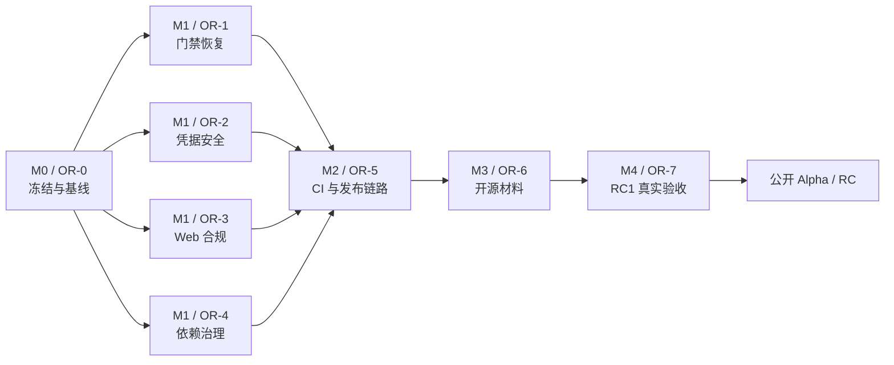

# Agents One 开源发布收口阶段 PRD

> 制定日期：2026-09-09
> 状态：执行中（当前发布结论：No-Go）
> 建议目标：首个公开预发布版本（Alpha/RC，不是 Stable）
> 执行入口：本文档是开源发布收口阶段的唯一任务清单与验收依据
> 历史依据：[开源前最终优化开发文档](./AGENTS_ONE_OPENSOURCE_PLAN.md) · [稳定化计划](./AGENTS_ONE_STABILIZATION_PLAN_20260820.md) · [发布回归矩阵](./AGENTS_ONE_RELEASE_REGRESSION_MATRIX.md)
> 修订记录：2026-09-09 v1.1 — 依据当日全量实测复核（typecheck/测试/lint/audit 逐条复跑），补充 OR-007/008/009（Git 历史安全扫描、公开范围内容审计、已跟踪开发环境杂物处置）、OR-004 分支整合要求、OR-505 版本与历史 tag 前置条件、CI 工具缺口（format:check、rc1-windows.yml 草稿复用）及基线勘误
> 修订记录：2026-09-09 v1.2 — 消除 OR-005/M0 循环依赖，明确 OR-0 串行顺序与启动文档保全规则，修正绝对路径基线，并补充首发平台范围门禁

## 1. 背景与结论

Agents One 的主要产品能力已经齐备：多 Runtime 接入、统一任务对话、项目容器、多智能体协作、Gateway v1、工作区授权、定时任务、备份恢复、Web Agent 与托盘交互均已落地。当前工作重心不再是扩充功能，而是把“可用的开发版本”收口为“可审计、可复现、可安全公开的预发布版本”。

截至 2026-09-09，功能成熟度估计为 **80%–85%**，开源发布准备度估计为 **50%–55%**。当前不得发布 Stable 或直接触发公开 Release，主要阻断项为：工作区未收口、功能分支未整合（main 仍停留在上游 Hermes 时代）、公开前 Git 历史安全扫描与内容审计未执行、全量测试和 lint 未通过、生产依赖仍有高危漏洞、凭据宣传与实现不一致、Web Agent 合规边界未完成、发布工作流缺少强制门禁。

本阶段的产品结论：**冻结非必要新功能，先完成 P0 发布阻断项；通过全部发布闸门后，仅发布 Alpha/RC。**

## 2. 目标与非目标

### 2.1 目标

1. 建立干净、可复现、可审计的 Git 与依赖基线。
2. 恢复全部自动化门禁，并连续三次得到一致结果。
3. 使凭据存储、隐私说明和真实实现一致。
4. 为 Web Agent 建立默认安全、可下线、可审计的合规边界。
5. 将 CI、打包、签名/更新决策和发布动作串成不可绕过的流水线。
6. 补齐开源治理材料，让外部贡献者能够安全安装、反馈和贡献。
7. 在干净 Windows 环境完成 RC 真实回放，并留下证据。
8. 公开前完成 Git 全历史安全扫描与公开范围内容审计，确保无密钥、内部敏感信息或未授权资料外泄。

### 2.2 非目标

- 不新增 Runtime、页面或大功能。
- 不在 RC 前拆分超大文件或开展跨层架构重写。
- 不批量迁移、覆盖或删除用户的 Runtime、项目、会话、计划任务和凭据数据。
- 不恢复 SSH、旧远程 Hermes/OpenClaw 私有传输或已删除的上游页面。
- 不把发布收口与无关 UI 优化、品牌替换混在同一提交。
- 不重写 Git 历史；仅当 OR-007 扫描发现必须移除的敏感信息时，按第 10 节停止条件升级给维护者决策处置方式。

## 3. 当前基线（2026-09-09）

| 维度 | 当前结果 | 发布判断 |
| --- | --- | --- |
| Git 工作区 | 346 组状态项；tracked 变更 264 文件，约 +27,242/-8,157；存在大量未忽略备份/临时目录 | P0 阻断 |
| 远端 | `origin` 仍指向本地 Hermes 上游目录；目标 GitHub 仓库尚未成为有效公开远端 | P0 阻断 |
| 分支 | 全部 Agents One 工作积在 `agents-one-slim-task-dialog`（领先 main 39 个提交）；main 仍停留在上游 Hermes 时代（tip=`8a4268f`），不含任何本仓库功能提交 | P0 阻断 |
| TypeScript | `npm.cmd run typecheck` 通过 | 通过 |
| 生产构建 | `npm.cmd run build` 通过 | 通过，但需记录体积预算 |
| 全量测试 | 205/209 文件通过；1969 通过、82 失败、9 跳过 | P0 阻断 |
| 测试失败根因 | 79 项为 preload 类型名已从 `HermesAPI` 改为 `AgentsOneAPI`；另有托盘 IPC 静态扫描 1 项、配置审计日志 2 项 | 可收敛，禁止直接跳过 |
| ESLint | 干净源码范围仍有 11 errors；全量 lint 被未忽略目录拖慢/超时 | P0 阻断 |
| 生产依赖审计 | 6 个漏洞：2 high、4 moderate | P0 阻断 |
| 子项目测试 | Plugin SDK、Connector、Connect Service 共 34/34 通过 | 通过，但尚未纳入 CI |
| 文档链接 | 116 个本地 Markdown 链接，0 缺失 | 通过 |
| `lat.md` | `npx.cmd --yes lat.md check` 通过 | 通过 |
| 发布链路 | Release workflow 可由 `release` 分支 push 直接发布，内部没有完整测试/lint/audit 门禁 | P0 阻断 |
| 开源材料 | README、中文 README、CONTRIBUTING、MIT LICENSE 已有；缺 SECURITY、行为准则、CHANGELOG、Issue/PR 模板 | P1 |

> 注：基线数字为 2026-09-09 实测抽样，会随工作区漂移（本文件自身即为一个未跟踪项）；执行各 OR 任务时以当时复核实测为准，不得直接引用本表作为当前状态证据。

补充技术债：`RuntimeChat.tsx`、`agent-runtimes.ts`、`hermes.ts`、`ipc/register.ts`、`AgentRuntimesPane.tsx`、`agents-one-backup.ts` 和 preload API 文件体积较大。它们应登记为 P2，不应在 RC 前顺手重构。

## 4. 用户与发布场景

### 4.1 目标用户

- 首次从 GitHub 下载 Agents One 的 Windows 用户。
- 从源码安装并贡献代码的开发者。
- 已有本地 Runtime、历史会话和计划任务的早期使用者。
- 负责生成、验证和发布 RC 的维护者或智能体。

### 4.2 关键场景

1. 新用户从公开仓库获取明确的安装说明，在干净环境完成安装、启动和首个本地 Runtime 对话。
2. 现有用户升级后，其配置、历史、项目归属、计划任务与备份均不丢失。
3. 维护者只能从通过全部门禁的固定 commit 生成 Release。
4. 外部贡献者能够找到安全报告渠道、行为规范、变更记录和 PR 验收要求。
5. 未取得明确授权的网页 Provider 不会在公开版本中默认执行自动化访问。

## 5. 发布原则

1. **证据优先**：不以历史“曾通过”替代当前 commit 的验证结果。
2. **数据优先**：任何迁移先备份、保持幂等、保留未知字段，并验证回退。
3. **最小补丁**：一个根因、一个可独立回退的语义提交、一轮定向验证。
4. **门禁不可绕过**：不得用 skip、降级 severity、删除失败测试等方式制造绿灯。
5. **宣传与实现一致**：安全、隐私、签名和更新能力只描述已经交付的事实。
6. **默认安全**：实验性或存在第三方条款风险的功能默认关闭。

## 6. 工作包与验收标准

> 执行状态（2026-09-10）：**OR-001、OR-002、OR-003、OR-008、OR-009 已完成**。OR-001 私有权威快照位于 `<private-recovery-root>\OR-001-20260909-161432-333cf4d` 并已通过完整恢复演练；OR-002 已隔离本地依赖副本与临时目录；OR-008/009 已形成公开内容与开发环境资产审计；OR-003 已按精确文件清单形成仓库卫生、构建/依赖、扩展组件、桌面产品、发布文档五个可回退语义提交，证据见[语义提交清单](./AGENTS_ONE_OR003_SEMANTIC_COMMIT_MANIFEST_20260909.md)。下一任务为 OR-004；尚未修改远端、整合默认分支、扫描全部 Git 历史、建立迁移标签或迁移目录。

### OR-0：Git 基线与仓库卫生（P0）

| ID | 任务 | 验收标准 |
| --- | --- | --- |
| OR-001 | 为当前工作区建立只读清单与可恢复快照 | 记录分支、HEAD、status、tracked diff、untracked 分类；快照位置和恢复步骤可验证 |
| OR-002 | 隔离本地备份、依赖副本、构建与临时目录 | `.gitignore`/工具排除规则准确；不误删用户文件；lint/test 不再扫描这些目录 |
| OR-003 | 将现有变更按产品功能、测试、文档、构建拆成语义提交 | 禁止 `git add .`；每个提交可说明边界、验证和回退方式 |
| OR-004 | 校正远端与分支模型 | `origin` 指向 `pkulyn/agents-one`，Hermes 保留为 `upstream`；将 `agents-one-slim-task-dialog`（领先 main 39 个提交、含全部 Agents One 工作）合并/PR 回 main，或明确以该分支内容重建默认分支并废弃旧 main；默认分支与保护规则明确；CI/发布 workflow 的默认 ref（如 `rc1-windows.yml` 的 `inputs.ref` 默认值）同步切换到新默认分支 |
| OR-005 | 建立迁移前基线标签 | 在 OR-003/004/007～009 完成且必要处置结束后，为准备迁移的干净固定 commit 建立带注释的恢复标签；该标签仅用于目录迁移回退，不是 RC/Release 标签 |
| OR-006 | 将 Agents One 从 `Agent Console` 父目录中独立出来 | 在 OR-001～005、OR-007～009 完成后，从已审计固定 commit 干净克隆到独立目录；新目录不依赖旧父目录即可安装、测试、构建和打包；旧目录在验收前保留为只读恢复副本 |
| OR-007 | 公开前 Git 历史安全扫描 | 用 gitleaks/trufflehog 或等价工具扫描全部历史、tag、构建产物与备份目录，覆盖密钥、Cookie、Token、私钥与真实用户数据；任何命中先触发第 10 节停止条件再处置，禁止私自改写历史；扫描工具、版本、结果与处置记录留证 |
| OR-008 | 公开范围内容审计 | 对已跟踪的内部资料（`SSH-TUNNEL-VPS.md`、`security-audit-2026-07-09.md`、`HERS_*` 内部指南、评测报告、`KANBAN_GAP_REPORT.md`、`PROFILE_MODAL_HANDOFF.md`、`pr-comment.md` 等）逐一决定保留/脱敏/移除；内网地址、内部人名、未公开合作方信息不得进入公开仓库；逐项决定清单留档 |
| OR-009 | 处置已跟踪的开发环境杂物 | `.claude/settings.json`、`.claude/skills/`、`.codex/hooks.json`、`.agents/skills/`、`skills-lock.json` 等逐项决定保留（作为项目技能资产）/移除/加入忽略；决定与理由留档，不夹带进 OR-003 的功能提交 |

#### OR-003 启动文档保全与文档类提交

本 PRD 是 OR-0 的执行依据，但 2026-09-09 复核时它本身仍是未跟踪文件；进展日志已有跟踪但包含未提交修改。OR-001 在执行任何忽略、清理或目录迁移前，必须先把下列文件登记到快照清单并记录 SHA-256，防止“负责指导提交的文档”在 OR-003 前丢失：

| 文件 | 2026-09-09 状态 | OR-003 处置 |
| --- | --- | --- |
| `docs/AGENTS_ONE_OPENSOURCE_RELEASE_READINESS_PRD_20260909.md` | 未跟踪 | 纳入发布计划文档提交 |
| `docs/AGENTS_ONE_PROGRESS_LOG.md` | 已跟踪、有修改 | 复核全部待提交条目后纳入同一文档提交；若混有未完成任务记录，按 hunk 拆分 |
| `docs/AGENTS_ONE_OPENSOURCE_PLAN.md` | 已跟踪、有修改 | 纳入同一文档提交，保留历史计划与新 PRD 的权威入口关系 |
| `docs/AGENTS_ONE_STABILIZATION_PLAN_20260820.md` | 未跟踪 | 作为本 PRD 的历史依据提交；若 OR-008 决定不公开，则先移入受控私有归档并删除本 PRD 链接 |
| `docs/AGENTS_ONE_RELEASE_REGRESSION_MATRIX.md` | 未跟踪 | 作为 RC 验收依据提交；若拆成单独回归文档提交，必须与本 PRD 同批进入默认分支 |

建议语义提交为 `docs(release): add open-source readiness plan and audit trail`。智能体只能使用 `git add -- <精确文件路径>` 或对已跟踪文件使用交互式 hunk 暂存，不得使用 `git add .`、`git add -A` 或目录级通配暂存。提交前必须检查 `git diff --cached --name-status`、完整 staged diff 和 `git diff --cached --check`，确认 5 份文档均无凭据、内部敏感信息和无关任务内容。若任一引用文档没有进入提交，应先移除或替换链接，禁止生成在干净 clone 中断链的 PRD。

OR-0 的强制串行顺序为：**OR-001 → OR-002 → OR-008/009 → OR-003 → OR-004 → OR-007 及必要处置 → OR-005 → OR-006**。OR-007 必须扫描已经完成分支整合、内容审计和文档提交后拟公开的最终历史与 refs；若扫描导致维护者批准的历史处置，处置后必须重新扫描，再建立 OR-005 标签和执行 OR-006。

#### OR-006 目录独立化实施方案

当前仓库的 `.git` 与 common Git directory 均位于项目自身目录，不是依附其他仓库的 worktree，因此具备独立迁移条件；但当前 `origin` 仍指向本地 `<legacy-upstream-repo>`。2026-09-09 的 OR-008 处置已将本机恢复记录和定向环境交接文档移出公开范围，并把活跃构建说明、插件说明、启动脚本及测试中的固定开发机路径改为占位符、环境变量或 PATH 探测。OR-006 仍须在独立 clone 中重新扫描全部活跃文件，目录迁移必须作为仓库卫生和可移植性验证的一部分完成，而不是在 RC 收口后追加。

**执行时点**：完成上述 OR-0 强制串行链之后、OR-1 开始之前。后续全部门禁修复、CI 验证和 RC 打包均在独立新目录中进行。

**建议目标目录**：默认使用 `D:\Projects\Agents-One`；维护者也可选择其他非 `Agent Console` 子目录。所有脚本和文档不得依赖该建议路径，应支持任意普通用户可写目录，包括含空格路径。

**迁移步骤**：

1. 在旧目录记录当前分支、HEAD、远端、tracked/untracked 清单和本地恢复资产位置，并验证 OR-001 快照。
2. 完成 OR-002 隔离规则，将 node_modules 副本、构建产物、缓存、临时文件和历史备份排除在源码迁移之外；不得以清理为名直接删除未知文件。
3. 完成 OR-003 语义提交，确认所有应保留的源码、测试和文档已经进入固定 commit。不得直接拖动、复制或压缩当前脏工作区作为新发布目录。
4. 从固定 commit 克隆到独立新目录；目标 GitHub 尚未可用时，可从旧仓库只读克隆，之后再按 OR-004 校正远端。禁止复制旧 `.git`、`node_modules`、`out`、`dist`、`release`、cache、tmp 和日志来代替干净克隆。
5. 仅按明确清单迁移开发所需的本地配置。`.env`、Token、Cookie、私钥等敏感信息不得提交或批量复制；确需迁移时使用受保护存储流程并逐项核验。
6. 将 `origin` 调整为 `pkulyn/agents-one`，原 Hermes 仓库配置为 `upstream`；确认 fetch/push URL、默认分支与保护规则。
7. 清理活跃源码、脚本和文档中的开发机绝对路径。历史恢复记录可保留原始路径，但必须明确标注为历史示例；测试路径改用临时目录或平台无关夹具。
8. 在新目录执行 `npm ci`、typecheck、全量 test、lint、生产 audit、build 和 Windows 打包；验证应用资源、版本和产物不引用旧目录。
9. 验证 Runtime 工作目录、项目/任务归属、附件、定时任务、备份恢复和用户数据路径。已有配置引用旧源码目录时，只提示或逐项更新，不批量重写未知路径。
10. 新目录通过 G0～G8 和 RC 回放前，旧目录保持只读且不再开发；通过后再由维护者决定归档或删除，删除不属于自动执行范围。

**回退方案**：迁移失败时停止在新目录继续开发，保留失败日志并回到旧目录对应固定 commit；旧目录、OR-001 快照和用户数据不得在迁移验收前删除。新旧目录之间禁止双向同步式开发，避免产生两套无法追踪的领先版本。

**迁移完成证据**：记录新目录、clone 来源、固定 SHA、远端列表、绝对路径扫描结果、全门禁结果和 Windows 包校验值；证据写入进展日志和 Release Checklist，不把本机凭据或用户数据写入日志。

### OR-1：自动化门禁恢复（P0）

| ID | 任务 | 验收标准 |
| --- | --- | --- |
| OR-101 | 更新 preload API 表面测试 | 测试读取 `AgentsOneAPI` 的真实公开契约；79 个关联失败归零，不降低断言强度 |
| OR-102 | 修正托盘 IPC 一致性检查 | 检查能够识别 `tray.ts` 中真实注册的 `tray-menu-data` 与 `tray-completion-data`；保持重复/遗漏检测能力 |
| OR-103 | 修正配置审计日志测试隔离 | API key 迁移和 sibling home drift 用例不依赖开发机残留状态，并验证真实审计事件 |
| OR-104 | 清零源码与测试 ESLint errors | `src tests plugins services` 范围 0 errors；CRLF/Prettier 采用独立机械提交，不夹带逻辑修改 |
| OR-105 | 连续三轮全门禁 | 同一 commit 上 typecheck、test、lint、build 连续 3 次通过；跳过项逐项登记理由和负责人 |

### OR-2：凭据、安全与隐私事实一致（P0）

| ID | 任务 | 验收标准 |
| --- | --- | --- |
| OR-201 | 立即修正文档中的绝对安全承诺 | README 不再声称所有 Secrets 均已进入受保护存储；准确披露 `.env`、Remote Token、Connector 凭据现状 |
| OR-202 | 迁移桌面托管敏感信息 | 优先使用 Electron `safeStorage`/操作系统凭据保护；迁移幂等、保留回退、旧值不静默丢失；Linux 无安全后端时明确提示 |
| OR-203 | 加固 Connector 私钥与设备 Token | Windows 使用 DPAPI 或等价用户级保护；其他平台保持严格文件权限；日志、崩溃报告和导出不得泄漏 |
| OR-204 | 建立安全响应与威胁模型 | 新增 `SECURITY.md`，列出支持版本、私下报告渠道、响应窗口；覆盖 Runtime、Gateway、WebView、更新与备份边界 |
| OR-205 | 安全回归测试 | 覆盖迁移、损坏密文、换机/换用户、无 keyring、回滚和日志脱敏；不得使用真实凭据 |

### OR-3：Web Agent 合规与默认边界（P0）

内置豆包、ChatGPT、Grok Provider 当前通过受控网页会话执行自动化与回复提取。公开发布前需基于第三方现行条款完成正式评估： [OpenAI Terms of Use](https://openai.com/policies/terms-of-use/)、[xAI Acceptable Use Policy](https://x.ai/legal/acceptable-use-policy)、[豆包服务协议](https://www.doubao.com/legal/terms)。本 PRD 的判断是工程风险控制建议，不代替法律意见。

| ID | 任务 | 验收标准 |
| --- | --- | --- |
| OR-301 | 公开构建默认禁用内置网页 Provider | 保留通用框架和本地实验开关；全新安装不可在无明确动作时自动访问第三方网页 |
| OR-302 | 完成 Provider 逐项授权/合规记录 | 每个 Provider 有条款版本、评估日期、允许依据、负责人；无书面许可或正式结论则保持禁用 |
| OR-303 | 增加实验功能告知与总开关 | 启用前展示数据流、账号与封禁风险；设置中可一键停用；远端 kill switch 不得收集凭据 |
| OR-304 | 验证隔离与退出 | Cookie/partition 不跨 Provider；域名白名单、下载、弹窗、OAuth、登出与数据清除均有测试 |

### OR-4：依赖、锁文件与构建质量（P0/P1）

| ID | 任务 | 验收标准 |
| --- | --- | --- |
| OR-401 | 删除确认未使用的直接依赖 | 重点核查 `ethers`、Three.js 相关包、`react-file-icon`；删除前以导入扫描和构建为证据 |
| OR-402 | 处置生产依赖漏洞 | `npm audit --omit=dev` 为 0 critical/0 high；moderate 必须修复或形成有期限、有人负责的风险接受记录 |
| OR-403 | 验证锁文件可复现 | 干净目录执行 `npm ci` 成功；package/lock 一致；不依赖全局或开发机私有文件 |
| OR-404 | 建立产物体积基线 | 记录 main、renderer 主要 chunk 和 CSS 体积；本阶段不强制大重构，但新增回归需有解释 |
| OR-405 | 统一子项目验证入口 | Plugin SDK、Connector、Connect Service 的 34 项测试进入根级脚本与 CI |

### OR-5：CI、打包与发布链路（P0）

| ID | 任务 | 验收标准 |
| --- | --- | --- |
| OR-500 | 决定首发平台范围 | 默认建议首个公开 Alpha 仅发布 Windows x64；若采用该范围，macOS/Linux job 只能执行 dry-run 或保持禁用，不得上传公开资产，README 与 Release 明确平台边界。若维护者决定同时发布 macOS/Linux，则必须先为每个公开 OS/架构补齐安装、启动、基础 Runtime、签名/公证和产物校验门禁 |
| OR-501 | 落地统一 release-gate workflow | 包含 install、typecheck、lint、格式检查、主测试、子项目测试、生产 audit、build；任何一步失败均阻止发布；新增 `format:check`（`prettier --check`）脚本作为 G3 格式门禁（当前仅有 `prettier --write`，CI 无法直接卡口）；可复用已存在的 `rc1-windows.yml` 草稿（当前未跟踪，已含 typecheck/lint/audit/三轮测试/Windows 打包，缺子项目测试与发布接线），并清理 `release.yml` 残留的空 `env:` 块 |
| OR-502 | 增加公开平台 RC 打包与冒烟 | Windows runner 生成安装包/便携包并完成启动、版本、资源、基础对话/配置路径冒烟；产物保留校验值。若 OR-500 选择多平台发布，则 macOS/Linux 对应公开 OS/架构必须达到同等最低冒烟要求，未验收平台不得发布资产 |
| OR-503 | 隔离发布权限 | 普通 `release` 分支 push 不再直接发布；仅 workflow dispatch 或受保护 tag，经人工环境批准后执行 |
| OR-504 | 固定提交发布 | 发布任务下载/构建同一 SHA，验证工作区和 lockfile；Release 中记录 SHA、校验值、已知问题和回退版本 |
| OR-505 | 决定版本线与历史 tag 命名空间 | 维护者必须在打包前完成三项决策并留档：(1) 历史 tag（本地已存在 `v0.1.0`–`v0.7.3` 共 40+ 个上游时代 tag）是否推送到新公共仓库——若推送，release.yml 的 tag-exists 检查会跳过同名发布，且公开历史语义须与 OR-008 结论一致；(2) 打包前必须先 bump `package.json` version（当前 0.1.0 与既有 `v0.1.0` tag 冲突），tag、应用显示和更新元数据统一；(3) 版本线二选一：全新公开建议 `v0.1.0-alpha.1`（注意其低于既有 `v0.7.3`，electron-updater 默认不向低版本降级，需确认无既有用户依赖该更新通道），需兼容既有 `v0.7.3` 更新通道则采用 `v0.8.0-rc.1` |
| OR-506 | 决定签名与自动更新策略 | Windows 未签名时默认关闭自动更新并明确警告；启用自动更新前必须完成签名、发布源和回滚验证；macOS 公证凭据需在 CI 实测 |
| OR-507 | 首次公开 Dry Run | 先生成不公开/草稿 Release，验证安装、升级、卸载、回滚和资产命名，再允许公开 |

### OR-6：开源文档与治理（P1，公开前完成）

| ID | 任务 | 验收标准 |
| --- | --- | --- |
| OR-601 | 校准 README 与中文 README | 安装状态、支持平台、版本阶段、数据路径、隐私、Web Agent、签名/更新和“暂无公开 Release”与事实一致 |
| OR-602 | 补齐治理文件 | 新增 SECURITY、CODE_OF_CONDUCT、CHANGELOG、Issue 模板、PR 模板；中英文入口互相可达 |
| OR-603 | 同步计划与回归资料 | 本 PRD、进展日志、稳定化计划、回归矩阵不再给出冲突状态；历史数据保留日期 |
| OR-604 | 提供贡献者快速路径 | 干净 clone 到 typecheck/test/build 的命令可复制运行；说明 Windows 无管理员权限的便携环境方案 |
| OR-605 | 建立已知问题清单 | 对未签名告警、实验功能、跳过测试、Linux keyring 和暂缓技术债给出边界与跟踪 ID |

### OR-7：RC1 真实验收（P0）

| ID | 任务 | 验收标准 |
| --- | --- | --- |
| OR-701 | 干净环境安装回放 | 从目标 GitHub commit 全新 clone，执行 `npm ci`、门禁与打包，不复用当前 node_modules/配置 |
| OR-702 | Runtime 黄金路径 | Hermes、本地 CLI、Gateway v1 至少各完成配置、probe、一次真实对话、取消/失败、重启恢复；其他首发 Runtime 按回归矩阵执行 |
| OR-703 | 用户数据回放 | 项目/任务归属、历史、附件、定时任务、时区/休眠补偿、备份、验证、恢复与回滚均通过 |
| OR-704 | 桌面体验回放 | Windows 首启、托盘、窄窗口、中英文、外链、下载、退出、崩溃恢复和卸载残留符合说明 |
| OR-705 | 连续稳定性验证 | 固定 RC commit 完成 3 轮自动门禁和至少 1 轮独立干净机人工验收，证据附于 Release Checklist |
| OR-706 | 建立 RC 标签 | 仅在 OR-701～705 和 G0～G8 全部通过后，为已验证固定 SHA 创建 RC tag；该 tag 与 OR-005 迁移恢复标签用途分离，版本号符合 OR-505 决策 |

## 7. 依赖顺序与里程碑

建议工期为 **8–11 个工程日**（v1.1 因历史扫描、内容审计与分支整合上调），不含第三方书面许可、代码签名证书采购和外部安全复核等待时间。

| 里程碑 | 建议时间 | 退出条件 |
| --- | --- | --- |
| M0 冻结、基线与目录独立化 | 1.5–2 天 | OR-0 全部完成（含 OR-007 历史安全扫描、OR-008 内容审计与 OR-004 分支整合）；项目已从固定 commit 克隆到 `Agent Console` 外的独立目录，旧目录只读保留，工作区风险可控 |
| M1 阻断项收敛 | 3–5 天 | OR-1/2/3/4 的 P0 项全部完成 |
| M2 发布工程 | 1–2 天 | CI、Windows 包、权限和版本策略落地 |
| M3 开源材料 | 0.5–1 天 | 治理文档与真实能力一致 |
| M4 RC 验收 | 1–2 天 | OR-7 全部完成并签字 |

## 8. 发布闸门

所有闸门均为 AND 关系，任一失败即保持 No-Go。

| Gate | 必须满足 |
| --- | --- |
| G0 仓库与目录独立性 | 发布候选来自 `Agent Console` 外独立目录的干净 clone；不依赖父目录即可安装、测试、构建和打包；远端与默认分支正确、SHA 固定；Git 全历史与公开范围内容已通过安全扫描与审计（OR-007/008），无误纳入的大型备份/密钥/用户数据/内部资料 |
| G1 编译 | Node/Web TypeScript 与生产 build 通过 |
| G2 测试 | 主项目和三个子项目全部通过；跳过项有明确依据；同一 SHA 连续 3 轮绿色 |
| G3 代码质量 | 发布范围 ESLint 0 errors，格式检查和 `git diff --check` 通过 |
| G4 供应链 | 生产依赖 0 critical/0 high，锁文件可复现，产物有校验值 |
| G5 安全合规 | 凭据事实一致；Web Provider 默认边界完成；SECURITY 与威胁模型可用 |
| G6 发布链路 | 只有通过 release gate 的固定 commit 可经人工批准发布；签名/更新策略已决定 |
| G7 产品回归 | OR-500 声明的每个公开发布平台均完成对应安装与最低冒烟；Windows 的 Runtime、历史、计划任务、备份恢复和完整桌面路径在干净环境全部通过，未验收平台不产生公开资产 |
| G8 开源材料 | README、LICENSE、贡献、安全、行为准则、CHANGELOG 和模板齐全 |

## 9. 智能体执行协议

后续智能体每次只领取一个可独立验收的 OR 任务；若任务过大，先拆成 `OR-xxx-a/b`，不得同时跨越多个高风险层。

### 9.1 开工前

1. 阅读 `AGENTS.md`、[变更安全守则](./AGENTS_ONE_CHANGE_SAFETY_PROTOCOL.md) 和本 PRD。
2. 运行 `lat search`、`lat expand`（全局命令不可用时用 `npx.cmd --yes lat.md`）。
3. 记录目标、允许修改范围、禁止触碰范围、影响数据、下游消费者、失败模式、回退方案和验证清单。
4. 检查 `git status`，确认不会覆盖或提交其他任务的变更；禁止 `git add .`。
5. 涉及依赖、条款、平台 API 或安全建议时，以当前官方资料重新核验，不沿用过期结论。

### 9.2 实施中

1. 优先补测试或复现证据，再做最小修改。
2. 不顺手重构相邻模块，不修改无关配置，不删除未知用户数据。
3. 凭据、迁移、发布权限和外部写入必须具备可验证回退路径。
4. 若发现 PRD 假设与代码事实冲突，先在进展日志记录证据，再提议修改任务，不自行扩大范围。

### 9.3 完工后

1. 运行定向测试，再按风险运行 typecheck、全量 test、lint、audit、build 和打包验证。
2. 运行 `git diff --check`、本地文档链接检查和 `npx.cmd --yes lat.md check`。
3. 更新 [项目进展日志](./AGENTS_ONE_PROGRESS_LOG.md)、相关回归矩阵和必要的 `lat.md` 设计事实。
4. 报告：任务 ID、改动边界、文件、验证结果、剩余风险、回退方式、建议下一任务。
5. 重大方向、安全结论或验收事实在 PowerMem 可用时同步，并检索复核；本地文档始终是审计来源。

## 10. 停止条件与升级机制

出现以下任一情况，智能体必须停止发布推进并报告，不得自行豁免：

- 发现密钥、Cookie、Token、私钥或真实用户数据已进入 Git 历史或构建产物。
- 迁移可能覆盖、删除或无法恢复现有配置/历史。
- 第三方网页自动化没有明确允许依据，却准备在公开构建中默认开启。
- 测试只能通过删除断言、扩大 skip、降低 audit severity 或绕过 CI。
- 发布产物不是由已验证的固定 SHA 构建。
- Git 历史安全扫描的原始报告包含疑似密钥、用户数据或内部信息，却准备直接提交到仓库；仓库只允许保存脱敏摘要，原始报告必须私下受控保存并设定保留期。
- 准备直接移动、复制或压缩仍有未归属变更的旧工作区，或准备在新旧目录同时继续开发。
- Windows 签名/更新状态与 README、安装器或 UI 宣传不一致。
- 工作区存在无法归属的大批变更，无法安全拆分。

涉及第三方授权、漏洞风险接受、版本线、代码签名费用或公开发布时间的决策，升级给项目维护者；智能体不得代替维护者作最终商业/法律决定。

## 11. 建议提交切片

1. `chore(repo): quarantine local artifacts and establish release baseline`（OR-001/002）
2. `chore(repo): curate public content and development-only assets`（OR-008/009）
3. `docs(release): add open-source readiness plan and audit trail`（OR-003 启动文档）
4. 其余现有功能、测试与构建变更按 OR-003 拆分语义提交
5. `chore(repo): integrate the long-running feature branch into main`（OR-004 分支整合部分）
6. `security(repo): record sanitized full-history scan results`（OR-007；无变更时只留受控证据）
7. `chore(repo): make the project portable outside Agent Console`（OR-005/006）
8. `test(preload): align public API surface with AgentsOneAPI`
9. `test(ipc): cover tray-owned handlers`
10. `test(config): isolate security audit log cases`
11. `chore(lint): clear release-scope errors`
12. `security(secrets): protect desktop-managed credentials`
13. `security(connector): protect device credentials on Windows`
14. `chore(web-agent): disable built-in providers in public builds`
15. `chore(deps): remove unused packages and resolve production advisories`
16. `ci: add non-bypassable release gates and declared-platform package smoke`
17. `docs: add open-source governance and accurate security disclosures`
18. `release: prepare fixed-sha RC manifest, tag and checklist`

每个切片必须独立验证；机械换行/格式化不得与逻辑修复混合。

## 12. Definition of Done

只有同时满足以下条件，本阶段才算完成：

- OR-0 至 OR-7 的 P0/P1 项均有提交、证据和负责人确认。
- Agents One 已从固定 commit 干净克隆到 `Agent Console` 外的独立目录；全套门禁和 RC 产物均在新目录生成，且不依赖旧父目录或旧工作区。
- Git 全历史与公开范围内容已完成安全扫描与审计（OR-007/008），无密钥、内部敏感信息或未授权资料外泄，证据留档。
- 功能分支已整合，默认分支、历史 tag 命名空间与版本线决策留档；发布版本号已 bump 且与既有 tag 无冲突。
- OR-005 迁移恢复标签与 OR-706 RC 标签职责分离；RC 标签只指向完成全部发布闸门的固定 SHA。
- G0–G8 全部通过，且同一 RC SHA 的自动门禁连续 3 次绿色。
- OR-500 已明确首发平台范围；每个公开平台都有对应验收证据，未验收平台没有出现在公开 Release 资产中。
- 干净 Windows 环境完成安装、核心对话、计划任务、备份恢复、升级/回滚回放。
- 生产依赖无 critical/high；敏感信息没有进入仓库、日志或发布资产。
- Web Agent 默认策略和第三方允许依据明确；无依据的 Provider 保持禁用。
- README、安全说明、安装器、应用 UI 和发布说明描述同一组真实能力。
- 发布只能经人工批准，从固定 SHA 生成；版本、签名和自动更新策略已明确。
- 首次公开版本标记为 Alpha/RC，并公布已知问题，不宣称 Stable。
