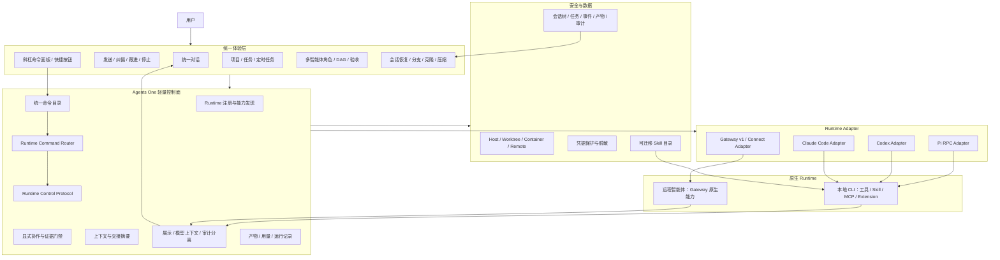

# Agents One“极简可塑”功能与架构优化实施方案

## 1. 文档目的

本文将 Pi Agent“核心极简、原语稳定、工作流可塑”的设计哲学转化为 Agents One 可执行的功能与架构优化计划，供后续编程智能体按阶段实施、测试、验收和回滚。

本文是实施入口，不代表所有功能已完成。每个阶段只有在自动化、人工冒烟、数据兼容和回滚检查通过后，才能标记完成并进入下一阶段。

## 2. 产品决策

Agents One 的目标不是实现新的通用 Agent Loop，也不替代 Pi、Codex、Claude Code、Hermes 或远程 Gateway 的原生运行时。

Agents One 的产品定位保持为：

> 一个轻量、对话优先、能力驱动的多智能体桌面工作台。Agents One 负责统一交互、控制、组织、记录和安全边界；各 Runtime 继续负责自己的模型、工具、技能、MCP、扩展、上下文管理和执行循环。

核心分工如下：

| 层级              | 主要责任                                              | 明确不负责                       |
| ----------------- | ----------------------------------------------------- | -------------------------------- |
| Agents One UI     | 统一对话、运行控制、项目任务、协作、分支、产物        | 不解析或执行供应商私有工具       |
| Agents One 控制面 | Runtime 能力、命令、会话、协作、证据和审计            | 不实现通用 LLM 工具循环          |
| Runtime Adapter   | 将统一命令翻译为原生调用，将原生事件翻译为统一事件    | 不承载产品业务状态               |
| 原生 Runtime      | 模型、工具、Skill、MCP、Extension、Provider、原生会话 | 不直接写 Agents One 数据库       |
| 安全与数据底座    | Workspace、Worktree、容器、凭据、持久化、回滚         | 不把进程内提示框伪装成系统级隔离 |

## 3. 总体目标

### 3.1 用户目标

1. 用户在同一个对话界面中使用本地和远程智能体，不需要理解各自传输协议。
2. 智能体运行时，用户可以明确选择“立即纠偏”“完成后跟进”或“停止”。
3. 用户可以从历史消息创建分支、尝试不同方案并保留原路径。
4. 复杂工作继续通过显式多智能体角色和 DAG 完成，所有执行、交接和验收可见可审计。
5. 项目、任务和定时任务继续创建普通 Runtime 对话，不产生第二套隐藏执行语义。
6. 各 Runtime 的原生 Skill、MCP、扩展、Provider、Shell 和项目指令继续可用。
7. 用户可在同一输入框通过 `/model`、`/compact` 等命令控制当前本地 CLI 或远程智能体；命令只展示当前 Runtime 真实支持的能力。

### 3.2 架构目标

1. 在 Event Stream 之外建立独立的 `Runtime Control Protocol`。
2. 以 capability 决定可用功能，不通过 Runtime 名称猜测能力。
3. 将用户可见消息、模型上下文和平台审计记录正式分离。
4. 将 Pi 从一次性命令适配升级为可持续交互的第一等 Runtime。
5. 会话树、协作 DAG 和 Git worktree 分别承担上下文分支、任务依赖和文件副作用隔离，三者不得混用。
6. 任何第三方 Runtime 扩展均不得在 Electron 主进程中直接执行。
7. 在现有中央斜杠命令路由之上建立共享的 Runtime Command Router，使桌面命令、标准控制命令、Runtime 原生命令和提示模板命令具有明确边界。
8. 同名命令保持统一用户语义，但由 Adapter 映射到 Pi RPC、Codex App Server、Claude Agent SDK 或远程 Gateway 原生接口，禁止依赖终端文本模拟。

### 3.3 项目级成功标准

本项目完成后必须同时满足：

- Pi 对话支持发送、steer、follow-up、abort、实时 delta、工具进度和可靠 settled 终态。
- RuntimeChat 输入 `/` 可发现当前 Runtime 的真实命令；`/model` 和 `/compact` 不会作为普通 Prompt 发送给模型。
- Pi、Codex 和 Claude Code 至少完成 `/model`、`/compact` 的原生接口映射；远程智能体通过 capability 明确声明支持、平台降级或不支持。
- 不支持某项能力的 Runtime 显示真实降级行为，不伪造支持。
- 现有 Runtime ID、名称、头像、配置、项目归属和历史对话无需重建。
- 旧 Pi print-json 路径可作为兼容回退，不因 RPC 故障阻断基本对话。
- 会话分支不误导用户认为文件已自动回滚；实现型分支有独立 worktree 或明确风险提示。
- 本地 CLI 的原生资源继续可用，Renderer 不接触凭据，第三方扩展不进入 Electron 主进程。
- 目标测试、类型检查、生产构建、真实 Pi 冒烟、历史重开和应用重启全部通过。

## 4. 设计原则与实施边界

### 4.1 必须坚持的原则

1. **对话优先**：控制、任务、协作和产物均围绕普通对话呈现。
2. **能力驱动**：UI 只展示 Runtime 实际声明并通过 probe 验证的能力。
3. **原生能力优先**：不通过桌面端白名单裁剪本地 CLI 的正常资源。
4. **控制与证据分离**：控制命令不伪装成模型回复，平台状态不伪装成思考摘要。
5. **显式协作**：多智能体必须由用户明确要求或确认，不能由模型私下扩张角色。
6. **最小补丁**：一个假设、一个切片、一轮验证，禁止跨阶段顺手重构。
7. **真实安全边界**：Worktree 是代码分支隔离，Container/VM 才是系统级隔离。

### 4.2 第一阶段禁止修改

- Runtime ID、现有 Runtime 注册格式和外观配置。
- Remote Gateway v1、Agents One Connect 和 Workspace Grant 协议。
- 现有多智能体 DAG、角色身份和验收逻辑。
- 已持久化 `RuntimeConversationMessage` 的必填字段和读取语义。
- 现有项目、任务、归档、备份和恢复数据结构。
- Electron 主进程的第三方插件加载机制。

### 4.3 不纳入本项目的内容

- 使用 `pi-agent-core` 替换 Agents One 的跨 Runtime 控制面。
- 在 Agents One 内重新实现统一 MCP Server。
- 跨 Provider 保存或传播私有原始思维链。
- 用 tmux 代替 Agents One 的定时任务、后台运行或远程 Connector。
- 建设开放式、可在主进程执行任意代码的桌面插件市场。

## 5. 目标功能架构



## 6. 功能规格

### F1. Runtime Control Protocol

#### 功能说明

建立独立于 Agent Event Stream 的控制契约，为本地和远程 Runtime 提供一致命令语义。首版包含：

```ts
type RuntimeControlCommand =
  | { type: "prompt"; message: string }
  | { type: "steer"; message: string }
  | { type: "follow_up"; message: string }
  | { type: "abort" }
  | { type: "get_state" }
  | { type: "list_commands" }
  | { type: "list_models" }
  | { type: "set_model"; model: string; reasoningEffort?: string }
  | { type: "compact"; instructions?: string };
```

控制命令只表达用户意图，不作为 assistant 消息或工具事件持久化。用户输入仍按普通用户消息保存；队列、重试、压缩等状态进入平台审计或临时 UI 状态。

#### 能力声明

建议新增可选能力：

```ts
interface RuntimeControlCapabilities {
  prompt: boolean;
  steering: boolean;
  followUp: boolean;
  abort: boolean;
  liveDeltas: boolean;
  toolProgress: boolean;
  settledEvent: boolean;
  branching: boolean;
  commandCatalog: boolean;
  modelSelection: boolean;
  compaction: "native" | "platform" | "none";
}
```

#### 行为规则

- 空闲时发送使用 `prompt`。
- 运行中“立即纠偏”使用 `steer`，在 Runtime 真实支持的边界投递。
- 运行中“完成后跟进”使用 `follow_up`。
- `/model`、`/compact` 等标准命令通过控制协议执行，不进入普通 Prompt 提交路径。
- `compaction: "platform"` 必须在 UI 中明确标注为 Agents One 摘要换会话，不能冒充 Runtime 原生压缩。
- 不支持 steer 的 Runtime 不得显示为已纠偏；只能提供“停止后发送”或“本轮结束后发送”。
- 能力必须来自稳定 probe/adapter 声明，不能根据最近一次是否出现某事件动态变化。

#### 验收标准

- 同一套共享类型可表达 Pi、Codex、Claude Code 和 Gateway 的真实能力。
- UI 不通过 `runtime.kind` 判断 steer/follow-up 是否可用。
- UI 不通过 `runtime.kind` 推断模型、压缩或命令目录能力。
- 不支持能力时有确定的中文降级提示和自动化测试。
- 控制命令不会被渲染成模型思考或普通产物。

### F2. Pi 持久 RPC Runtime

#### 功能说明

新增 Pi RPC Adapter。每个活动 Pi 会话由独立子进程承载，通过严格 JSONL stdin/stdout 进行命令、响应和事件交互。当前 print-json 适配器保留为 fallback。

#### 进程边界

- Pi RPC 不在 Electron 主进程内加载 SDK 或第三方 extension。
- 子进程使用 `shell: false` 和隐藏窗口启动。
- stdout 只接收协议 JSONL；stderr 进入有界、脱敏诊断日志。
- 应用退出、会话关闭、用户停止、超时和子进程异常都必须回收整个进程树。
- 进程环境继承策略必须显式配置和测试；交互式原生能力与无人值守最小凭据策略分开处理。

#### 会话行为

- 首次发送创建或绑定 provider session id。
- 后续发送复用同一 RPC 会话，不重复启动临时进程。
- `agent_end` 不是最终完成；只有 `agent_settled` 或等价状态才进入稳定终态。
- RPC 启动或协议握手失败时，可回退 print-json，并在运行记录中标明降级原因。

#### 验收标准

- 连续三轮对话复用同一 Pi 会话，历史上下文正确。
- 运行中 steer、follow-up、abort 均有真实端到端测试。
- 自动重试或压缩后不会在 `agent_end` 提前标记完成。
- 子进程崩溃、协议错误和应用退出不会留下运行中的孤儿进程。
- Pi extension、Skill、MCP、项目指令和自定义 Provider 在普通本地会话中继续可用。
- fallback 可完成普通对话且不改写用户 Runtime 配置。

### F3. Pi 原生事件映射

#### 功能说明

按 Pi 当前 RPC/JSON 事件直接映射，不再主要依赖最终 message 反推过程：

| Pi 事件                 | Agents One 处理                                             |
| ----------------------- | ----------------------------------------------------------- |
| `message_update`        | 临时 `assistant.delta`，按 content index 拼接，不逐条持久化 |
| `message_end`           | 权威 assistant/toolResult 消息                              |
| `tool_execution_start`  | `tool.started`                                              |
| `tool_execution_update` | 同一 callId 的临时进度更新                                  |
| `tool_execution_end`    | `tool.completed` 或 `tool.failed`                           |
| `queue_update`          | 控制队列 UI 状态，不伪装成思考                              |
| `compaction_start/end`  | 运行状态或审计记录                                          |
| `auto_retry_start/end`  | 运行状态或诊断记录                                          |
| `extension_error`       | 脱敏错误事件                                                |
| `agent_settled`         | Runtime Run 稳定终态                                        |

Pi RPC 原生事件通常没有稳定事件 ID，Adapter 应使用 run-scoped sequence 生成本地稳定 ID；工具相关事件优先保留原生 toolCallId。

#### 验收标准

- delta 拼接为线性内存增长，不重复保存累计文本。
- 同一工具的 start/update/end 在 UI 中只有一个工具组。
- 并行工具更新可交错，但最终结果按 callId 正确配对。
- retry、compaction、queue 状态不产生伪 reasoning.summary。
- 原始事件 fixture 覆盖成功、工具失败、重试、压缩和 abort。

### F4. 对话控制 UI

#### 功能说明

RuntimeChat 输入区根据运行状态和 capability 提供：

- 空闲：发送。
- 运行中且支持 steering：立即纠偏。
- 运行中且支持 follow-up：完成后跟进。
- 运行中：停止。
- 有队列：显示待处理条目数量，并允许撤回尚未投递的消息。
- 输入 `/`：显示合并后的命令面板，包含命令名、说明、参数提示、来源和当前可用状态。
- 输入 `/model`：打开 Agents One 原生模型选择器；带模型参数时直接调用同一控制处理器。
- 输入 `/compact [instructions]`：确认后执行当前会话压缩，并展示开始、进度、完成或失败状态。

控制入口应保持紧凑，不增加新的全屏任务页面。协作角色定向沟通继续使用现有协作逻辑，不与普通 Runtime steer 混为同一状态机。

#### 验收标准

- 鼠标和键盘均能区分发送、纠偏和跟进。
- 用户在点击前能看到消息何时生效。
- 发送失败保留原输入，不生成空用户消息。
- 重开对话后不恢复已经被 Runtime 消费的临时队列。
- 窄窗口、中文长文案和运行中状态无重叠或误触。
- 控制命令不生成普通用户气泡；仅提示模板或 Runtime 明确返回的 `send-prompt` 进入标准消息路径。

### F5. 统一斜杠命令与 Runtime 命令适配

#### 功能说明

将现有 Chat 的命令解析、目录合并、冲突消解和命令面板抽为共享能力，并接入 RuntimeChat。用户看到统一的 `/model`、`/compact`、`/status`、`/abort`、`/new` 等命令，但每项命令必须由当前 Runtime capability 和命令目录决定是否展示、是否可执行以及何时生效。

斜杠输入必须先进入命令解析与路由；未知命令返回错误和相似命令建议，禁止自动降级为普通 Prompt。点击模型名称、上下文占用条或快捷按钮时，也必须调用同一命令处理器，避免 UI 与文本命令产生两套状态。

#### 命令分类与路由优先级

统一命令目录由以下来源合并：

1. `desktop`：Agents One 本地 UI 与会话操作，例如 `/new`、`/clear`、`/settings`。
2. `runtime-control`：跨 Runtime 的稳定语义，例如 `/model`、`/compact`、`/status`、`/abort`。
3. `runtime-native`：Runtime 动态发现的 Skill、Plugin、Extension 或自定义命令。
4. `model`：声明为提示模板、最终需要进入普通 Prompt 的命令。

路由优先级固定为 `desktop → runtime-control → runtime-native → model`。Agents One 自有命令名和别名优先；Runtime 返回的名称、说明、参数提示和图标均视为不可信元数据，必须规范化、限长并做冲突消解。

建议共享契约：

```ts
interface RuntimeCommandDescriptor {
  name: string;
  aliases?: string[];
  description: string;
  argumentHint?: string;
  target: "desktop" | "runtime-control" | "runtime-native" | "model";
  availability: "idle" | "running" | "any";
  supportsAttachments?: boolean;
}

type RuntimeCommandResult =
  | { type: "handled"; message?: string; statePatch?: Record<string, unknown> }
  | { type: "send-prompt"; prompt: string }
  | { type: "needs-input"; input: "model-picker" | "confirmation" }
  | { type: "unsupported"; reason: string }
  | { type: "error"; message: string };
```

#### `/model` 行为

- 无参数时打开模型选择器；候选项来自 Runtime 原生模型目录，不维护跨 Runtime 硬编码全集。
- 带参数时校验模型是否可用，再更新当前 provider session 或下一轮请求的模型覆盖。
- 默认只对当前会话生效；只有显式“设为默认”操作才更新 Runtime 配置，并且配置写入必须先读后写、保留未知键。
- Runtime 忙碌时，Adapter 必须返回“立即生效”“下一轮生效”或“不允许切换”之一，UI 不得静默排队。
- 成功后更新会话状态栏并写入脱敏审计事件，不创建普通用户或 assistant 消息。

#### `/compact` 行为

- 支持可选定向参数，例如 `/compact 重点保留接口决策和未完成事项`。
- 原生压缩只作用于当前 provider session，并通过 Runtime 事件展示进度和结果。
- 平台压缩必须使用独立标识，保存摘要与新旧会话关联；不支持压缩时命令禁用并说明原因。
- 压缩结果记录压缩前后 token（Runtime 提供时）、触发方式、摘要引用和失败原因；摘要正文不重复显示为普通对话气泡。
- 默认仅在 Runtime 空闲时允许手动压缩；若原生接口支持并发控制，再由 capability 放开。

#### Runtime 原生接口映射

| Runtime        | 模型发现与切换                                                | 上下文压缩                                                          | 命令发现                                         |
| -------------- | ------------------------------------------------------------- | ------------------------------------------------------------------- | ------------------------------------------------ |
| Pi             | RPC `get_available_models`、`set_model`                       | RPC `compact`，支持 `customInstructions`                            | RPC `get_commands`；内置 TUI-only 命令不直接转发 |
| Codex          | App Server `model/list`；`thread/start` 或 `turn/start.model` | `thread/compact/start`，监听 `contextCompaction` 生命周期           | Agents One 标准目录与 App Server capability 组合 |
| Claude Code    | Agent SDK `supportedModels()`、`setModel()`                   | 在同一 SDK session 执行受支持的 `/compact`，监听 `compact_boundary` | Agent SDK `supportedCommands()`                  |
| Remote Gateway | `commands.catalog`、`commands.execute` 或等价控制接口         | capability 声明 `native`、`platform` 或 `none`                      | 连接握手后动态获取并缓存                         |

实现时以 [Pi RPC](https://pi.dev/docs/latest/rpc)、[Codex App Server](https://learn.chatgpt.com/docs/app-server)、[Claude Agent SDK](https://code.claude.com/docs/en/agent-sdk/typescript) 和 [Claude SDK 斜杠命令](https://code.claude.com/docs/en/agent-sdk/slash-commands) 的当前正式契约为准，不通过伪终端键盘输入操作交互式 TUI。

#### 远程能力协商

远程智能体连接后返回稳定能力，例如：

```json
{
  "commands": true,
  "modelSelection": true,
  "compaction": "native",
  "interrupt": true
}
```

目录请求和命令执行必须携带 `requestId`、`runtimeId`、`conversationId` 和超时；重试需幂等。旧 Gateway 未声明命令能力时保持普通对话可用，但不展示虚假 `/model` 或 `/compact`。

#### 验收标准

- RuntimeChat 不再将命令目录固定为空；输入 `/` 能看到当前 Runtime 真实可用的命令。
- `/model` 使用 Runtime 返回的模型目录，切换成功后下一轮实际模型与 UI 状态一致。
- `/compact` 调用原生控制接口并显示开始、完成和失败状态，不作为普通 Prompt 或气泡保存。
- 未知、不支持、冲突和带不兼容附件的命令均有确定错误，不会到达模型。
- Pi、Codex、Claude Code 和支持增强协议的远程 Gateway 共享同一 UI 与结果类型，各自 Adapter 保留真实语义。
- 命令执行有 requestId、超时、脱敏审计和重复提交保护；重开会话不会恢复已经消费的临时命令状态。

### F6. 跨 Runtime 能力与降级

#### 功能说明

Pi 试点稳定后，Codex、Claude Code 和 Gateway Adapter 逐一声明控制能力。Agents One 提供统一 UI，但不要求所有 Runtime 实现完全相同的控制语义。

#### 降级规则

- 原生 steer：直接使用。
- 无 steer 但可 cancel/resume：用户确认后停止当前运行，再以新消息恢复。
- 只有 follow-up：消息明确排到本轮之后。
- 无 native branching：创建 Agents One 关联会话并注入结构化交接摘要。
- 无真实 usage、reasoning 或 tool progress：明确显示未提供，不猜测。

#### 验收标准

- 四类 Runtime 的能力卡、输入区和实际行为一致。
- 降级不会默默取消运行或重复提交用户消息。
- 能力变化需要重新 probe，不由 UI 猜测。
- 旧 Gateway 没有增强能力时仍可完成最终答复。

### F7. 会话条目三分离

#### 功能说明

为会话内容增加显式受众和来源语义，避免平台生命周期、审计记录和 UI-only 状态进入模型上下文。

建议新增可选元数据：

```ts
interface ConversationEntryMeta {
  audience: Array<"model" | "user" | "audit">;
  origin: "user" | "runtime" | "platform";
  persistence: "transient" | "durable";
}
```

兼容策略：旧记录没有 meta 时按现有消息类型推导，读取时兼容，禁止一次性批量重写历史。

#### 验收标准

- Workspace Grant 生命周期不进入模型上下文。
- 用户要求、Runtime 最终回复和必要交接摘要可进入模型上下文。
- 工具进度可以显示和审计，但不作为下一轮普通用户文本重复注入。
- 旧会话无迁移也可正常打开。

### F8. 会话树与分支

#### 功能说明

Agents One 会话树表达“从哪段上下文继续”，与多智能体任务 DAG 和 Git worktree 分开。

建议增加：

```ts
interface ConversationBranchRef {
  parentConversationId?: string;
  forkedFromMessageId?: string;
  activeLeafId?: string;
  branchLabel?: string;
  branchSummary?: string;
}
```

#### 行为规则

- 从用户消息分支时，将原消息放回编辑器供修改。
- 从 assistant/tool/summary 分支时，从该节点之后继续。
- 只读分析分支可复用同一项目目录。
- 实现型分支必须创建新 worktree，或在开始前要求用户确认共享文件副作用。
- 切换对话分支不会自动撤销文件、提交或远程操作。
- Runtime 有原生分支能力时保存 provider branch/session 引用；没有时使用 Agents One 关联会话和交接摘要。

#### 验收标准

- 原分支和新分支都可恢复，切换不会删除记录。
- 分支历史、父节点和活动叶子在重启后保持一致。
- 实现分支不会静默写入原分支 worktree。
- 分支摘要只含用户可见事实和文件操作摘要，不保存私有思维链。
- 备份恢复后分支关系完整。

### F9. 隔离等级与无人值守安全

#### 功能说明

为 Runtime Run 显示并记录真实执行边界：

| 等级      | 含义                                                         |
| --------- | ------------------------------------------------------------ |
| Host      | 使用启动用户权限直接执行                                     |
| Worktree  | Git 工作树隔离代码分支，但共享宿主系统和凭据                 |
| Container | 由容器、VM 或受管沙箱提供系统级隔离                          |
| Remote    | 在远程 Runtime 环境执行，本地项目仅通过显式 Grant 或交接访问 |

#### 验收标准

- `safe_write` 和 worktree 不被描述为沙箱。
- 定时和无人值守任务能识别当前隔离等级并给出风险提示。
- Container/Remote 任务只获得必要目录、网络和凭据。
- UI 标签与真实启动路径一致，不根据用户选择伪造隔离状态。

### F10. 可迁移 Skill 与插件边界

#### 功能说明

生态分为三层：

1. Skill：跨 Runtime 的说明、脚本和资产，按需加载。
2. Adapter/Connector：进程外接入，负责协议和事件转换。
3. Desktop Extension：如未来开放，必须使用独立进程、权限清单和受限 API。

Agents One 首版只发现和展示 Skill 元数据、来源、启用状态与信任提示，不复制或改写用户现有技能目录。

#### 验收标准

- 本地 Runtime 原有 Skill 加载行为不变。
- Agents One 不把 Skill 内容常驻注入所有对话。
- 第三方 Adapter/Connector 有版本、来源和 capability 信息。
- 任意第三方代码都不能因“安装 Skill”而进入 Electron 主进程执行。

## 7. 非功能要求

### 7.1 数据兼容

- 所有新增字段首版均为可选字段。
- 旧会话、旧 Runtime 配置和旧备份可读取。
- 配置写入必须先读后写并保留未知键。
- 不通过删除并重建 Runtime 完成迁移。

### 7.2 安全

- Renderer 不接触 API Key、Bearer Token、Pi auth 文件或原始环境变量。
- RPC stderr、事件 detail 和错误消息继续有界、截断和脱敏。
- 本地文件路径进入 Renderer 前沿用现有授权与路径校验。
- 第三方 Pi extension 只在 Pi 子进程权限边界中执行。
- 远程命令名称、别名、说明和图标按不可信输入处理；桌面命令冲突时丢弃远程项并记录脱敏诊断。
- 命令参数默认不持久化秘密值；疑似 Token、密钥、授权头和环境变量内容进入审计前必须脱敏。

### 7.3 性能

- delta 采用增量拼接，不能随输出长度形成平方级复制或 IPC 流量。
- 单次 Run 的持久事件继续有界；高频 delta 和临时工具进度不逐条持久化。
- 活动会话子进程有明确上限和空闲回收策略。
- 历史加载不扫描全部 Pi 原生 session 文件。
- 命令目录按 Runtime session 缓存，并在连接、配置、模型或原生资源变化时失效；打开 `/` 不应启动新的 CLI 进程。
- 大型命令目录继续复用虚拟列表，过滤和键盘移动不随完整对话长度增长。

### 7.4 可观测性

- 每个控制命令有 request id、run id、conversation id 和明确响应。
- 命令审计至少记录名称、目标类型、Runtime、开始/完成时间、结果、是否降级和脱敏错误；不记录秘密参数原文。
- 子进程启动、握手、降级、退出和回收有脱敏诊断。
- `agent_end`、`agent_settled`、cancel、timeout、crash 的状态转换可审计。
- UI 展示的是用户可理解状态，原始诊断保留在日志而不是聊天正文。

### 7.5 可回滚

- Pi RPC 通过 feature flag 或 Adapter 选择可禁用。
- Runtime 命令目录、路由和各供应商命令 Adapter 可分别禁用，不能要求一次性回滚全部 Runtime。
- print-json 路径在 RPC 试点期间保持可用。
- 会话树数据只追加可选关系，不覆盖旧线性历史。
- 每个实施切片可单独回滚，不依赖一次性数据库破坏性迁移。

## 8. 分阶段实施计划

以下工期仅用于安排顺序，不作为交付承诺。编程智能体应以验收门槛而不是日期判断阶段是否完成。

### Phase 0：基线与协议设计

**优先级：P0**

#### 工作项

1. 保存本机 Pi 0.84.2 的 RPC/JSON 脱敏 fixture。
2. 固定现有 Pi print-json 的连续对话、工具、失败、取消和历史重开行为。
3. 新增 `RuntimeControlCapabilities`、`RuntimeCommandDescriptor` 和命令/响应共享类型，不接入 UI。
4. 固定现有 Chat 命令解析、目录冲突消解、未知命令拒绝和附件守卫测试基线。
5. 记录受影响数据、消费者、失败模式和回滚开关。

#### 交付物

- 控制协议共享类型。
- Runtime 命令目录、请求和结果共享类型。
- Pi fixture 与解析测试基线。
- 高风险边界评估记录。

#### 阶段验收

- 仅增加类型和 fixture，不改变现有用户行为。
- Node/Web TypeScript、现有 Pi 测试和 Runtime 对话测试通过。
- 现有配置与历史文件零改写。

### Phase 1：Pi RPC 核心与进程生命周期

**优先级：P0**

#### 工作项

1. 实现严格 JSONL RPC client。
2. 实现每会话 Pi 子进程注册、握手、命令关联和有界事件读取。
3. 实现 abort、超时、崩溃、应用退出和进程树回收。
4. 实现 prompt、steer、follow-up、get_state。
5. 实现 get_available_models、set_model、compact 和 get_commands。
6. 实现 feature flag 和 print-json fallback。

#### 交付物

- 独立 Pi RPC 模块。
- 进程生命周期测试。
- 不影响现有适配器入口的可切换集成。

#### 阶段验收

- 三轮连续会话、steer、follow-up、abort 真实通过。
- Pi `/model`、`/compact` 和动态命令目录通过 RPC 真实验证。
- `agent_settled` 前不提前完成。
- 强制关闭应用后无残留 Pi 子进程。
- fallback 冒烟通过。

### Phase 2：事件映射与控制 UI

**优先级：P0**

#### 工作项

1. 映射 Pi delta、工具进度、queue、retry、compaction 和 settled。
2. 在 RuntimeChat 增加纠偏、跟进、停止和队列状态。
3. 抽取并复用现有 Chat 命令解析、目录合并、冲突消解、命令面板和键盘交互。
4. 接入 `/model`、`/compact`、`/status`、`/abort`、`/new`；移除 RuntimeChat 的空命令目录占位。
5. 将命令状态、临时运行状态与持久会话内容分开。
6. 完成宽/窄窗口、中文文案、键盘路径和错误恢复测试。

#### 交付物

- Pi 原生事件 mapper。
- 统一输入区控制交互。
- RuntimeChat 统一命令目录、路由器和模型选择器。
- 端到端真实 Pi 冒烟记录。

#### 阶段验收

- 工具事件成组、delta 不重复、队列状态准确。
- 用户能在运行中改变方向或追加后续工作。
- `/model` 和 `/compact` 调用 Pi RPC 而不是普通 Prompt，状态栏和压缩结果准确。
- 未知命令、命令冲突和附件不兼容路径不会到达模型。
- 失败消息保留在编辑器，不重复创建用户消息。
- 历史重开只显示已持久化事实，不恢复过期临时状态。

### Phase 3：跨 Runtime 能力推广

**优先级：P1**

#### 工作项

1. Codex、Claude Code、Gateway 分别声明控制能力。
2. Codex 接入 App Server 的 `model/list`、逐轮 model override 和 `thread/compact/start`。
3. Claude Code 接入 Agent SDK 的 `supportedModels()`、`setModel()`、`supportedCommands()` 和 `/compact`。
4. Gateway 增加可选 `commands.catalog`、`commands.execute` 与命令 capability；旧协议保持兼容。
5. 实现统一降级策略。
6. Agent 卡片和 RuntimeChat 使用同一 capability 数据源。
7. 抽取 Adapter 接口，逐步减少 `agent-runtimes.ts` 的供应商分支，但不做无关重构。

#### 阶段验收

- 四类 Runtime 的能力展示与实际行为一致。
- Pi、Codex、Claude Code 的 `/model`、`/compact` 均通过原生接口执行；增强 Gateway 通过控制协议执行。
- 不支持 steer 的 Runtime 不出现虚假成功。
- 不支持命令目录、模型切换或压缩的 Runtime 不展示虚假入口，普通对话仍可用。
- 远程 Gateway v1 协议与历史行为无回归。
- 多智能体协作仍使用现有角色、DAG 和验收门禁。

### Phase 4：会话条目分离与会话树

**优先级：P1**

#### 工作项

1. 先实现可选 `ConversationEntryMeta` 的兼容读取。
2. 新增分支关系、活动叶子和分支标签。
3. 实现只读分支和历史导航。
4. 实现型分支接入新 worktree。
5. 更新备份恢复、归档、搜索和历史删除测试。

#### 阶段验收

- 旧线性会话无需迁移即可打开。
- 分支、切换、重启、备份恢复均保持树关系。
- 文件副作用与对话分支关系对用户明确。
- 项目任务 DAG 与对话树互不改变状态语义。

### Phase 5：隔离等级与 Skill 生态

**优先级：P2**

#### 工作项

1. 增加 Host/Worktree/Container/Remote 隔离事实模型和 UI。
2. 为定时与无人值守任务增加隔离预检。
3. 增加 Skill 元数据发现、来源和信任展示。
4. 为 Adapter/Connector 增加版本、完整性和权限审计设计。

#### 阶段验收

- UI 隔离标签与真实启动路径一致。
- 不可信或无人值守任务有可执行的容器/远程建议或阻断策略。
- Skill 展示不改变各 Runtime 原生加载行为。
- 第三方代码不能进入 Electron 主进程。

## 9. 编程智能体任务清单

后续编程智能体应从下表中一次领取一个任务，不得跨多个高风险边界合并实施。

| ID        | 任务                                    | 依赖                            | 主要范围             | 完成定义                                                        |
| --------- | --------------------------------------- | ------------------------------- | -------------------- | --------------------------------------------------------------- |
| AO-PI-00  | 采集 Pi RPC/JSON fixture                | 无                              | 测试、fixture        | 成功/工具/失败/重试/abort 样本脱敏并可重复解析                  |
| AO-PI-01  | 定义 Runtime Control 类型               | AO-PI-00                        | shared               | 类型检查通过，现有行为不变                                      |
| AO-CMD-00 | 定义命令目录、请求、结果与能力类型      | AO-PI-01                        | shared               | 四类命令 target、可用状态、冲突规则和结果联合类型测试通过       |
| AO-CMD-01 | 共享 Chat/RuntimeChat 命令解析与面板    | AO-CMD-00                       | renderer             | RuntimeChat 输入 `/` 可展示测试目录，未知命令不进入 Prompt      |
| AO-PI-02  | 实现严格 JSONL RPC client               | AO-PI-01                        | main                 | 分帧、关联、错误、关闭测试通过                                  |
| AO-PI-03  | 实现 Pi RPC 生命周期与控制方法          | AO-PI-02                        | main                 | 启动、复用、回收、crash、fallback 及模型/压缩/目录 RPC 响应通过 |
| AO-PI-04  | 映射 Pi 原生事件                        | AO-PI-03                        | main/shared          | delta/tool/queue/retry/settled fixture 通过                     |
| AO-CMD-02 | 实现 Pi `/model`、`/compact` 和动态目录 | AO-PI-04, AO-CMD-01             | main/shared/renderer | 模型发现切换、压缩事件和 `get_commands` 真实通过                |
| AO-PI-05  | 接入 RuntimeChat 控制 UI                | AO-PI-04, AO-CMD-02             | renderer             | 纠偏/跟进/停止/队列/命令组件与交互测试通过                      |
| AO-PI-06  | 完成 Pi 真实端到端验收                  | AO-PI-05                        | scripts/docs         | 三轮对话、steer、follow-up、abort、model、compact、重启记录完成 |
| AO-RC-01  | 推广跨 Runtime capability               | AO-PI-06                        | adapters/shared      | Pi/Codex/Claude/Gateway 声明真实能力                            |
| AO-CMD-03 | 实现 Codex 原生命令映射                 | AO-RC-01, AO-CMD-01             | main/shared          | App Server 模型目录、逐轮切换和压缩通过                         |
| AO-CMD-04 | 实现 Claude Code 原生命令映射           | AO-RC-01, AO-CMD-01             | main/shared          | SDK 模型、命令目录、压缩和事件通过                              |
| AO-CMD-05 | 实现远程命令能力协商                    | AO-RC-01, AO-CMD-01             | gateway/shared       | 新 Gateway 可执行命令，旧 Gateway 无回归                        |
| AO-RC-02  | 实现统一降级策略                        | AO-CMD-03, AO-CMD-04, AO-CMD-05 | renderer/main        | 所有不支持路径有明确行为和测试                                  |
| AO-CM-01  | 增加会话条目 meta                       | AO-RC-02                        | store/shared         | 旧会话兼容，控制噪声不进模型上下文                              |
| AO-ST-01  | 增加会话树数据模型                      | AO-CM-01                        | store/shared         | 可选字段、查询、删除和备份测试通过                              |
| AO-ST-02  | 实现会话树 UI                           | AO-ST-01                        | renderer             | 分支、切换、标签、重启恢复通过                                  |
| AO-ST-03  | 实现型分支绑定 worktree                 | AO-ST-02                        | main/renderer        | 原工作区不被静默修改                                            |
| AO-SEC-01 | 隔离等级事实模型                        | AO-RC-02                        | shared/main/UI       | Host/Worktree/Container/Remote 与执行一致                       |
| AO-SK-01  | Skill 元数据与信任展示                  | AO-RC-02                        | main/UI              | 不复制技能、不执行技能、不改变原生加载                          |

## 10. 测试与验收矩阵

| 场景             | 自动化验收                                    | 人工/真实验收                               |
| ---------------- | --------------------------------------------- | ------------------------------------------- |
| Pi RPC 握手      | 分帧、CRLF/LF、错误响应、超时                 | 本机 Pi 0.84.2 成功启动                     |
| 连续对话         | 同 session 三轮上下文测试                     | 追问前文并得到正确回答                      |
| Steering         | 运行中入队与投递顺序测试                      | 长工具任务中改变后续方向                    |
| Follow-up        | 队列状态与 settled 顺序测试                   | 本轮完成后自动处理追加要求                  |
| Abort            | 状态机与进程树回收测试                        | 停止后无残留进程、可继续新消息              |
| 并行工具         | callId 配对、更新交错测试                     | 工具卡进度和终态正确                        |
| Retry/Compaction | 不在 agent_end 提前完成                       | 真实或 fixture 验证 settled 后完成          |
| 命令目录         | 合并、别名冲突、恶意元数据、缓存失效测试      | 输入 `/` 只显示当前 Runtime 可用命令        |
| `/model`         | 模型目录、参数校验、会话作用域、忙碌状态测试  | Pi/Codex/Claude 切换后下一轮实际模型正确    |
| `/compact`       | 原生/平台/none、进度、失败、重复提交测试      | 压缩前后状态正确，不产生普通消息气泡        |
| 未知命令         | 相似建议、附件守卫、禁止 Prompt fallback 测试 | `/unknown` 明确报错且 Runtime 未收到 Prompt |
| 远程命令         | capability、requestId、超时、幂等和旧协议测试 | 新 Gateway 可执行，旧 Gateway 仍可正常对话  |
| Fallback         | RPC 失败转 print-json 测试                    | 普通对话仍可完成并提示降级                  |
| 历史兼容         | 旧 RuntimeConversation fixture                | 打开现有真实历史，无丢消息                  |
| 配置保护         | 未知键保留、Runtime ID 不变                   | 保存并重启，名称头像和配置不变              |
| 协作回归         | 现有 DAG/角色/验收套件                        | 主智能体→实施→复核→终验流程                 |
| 会话树           | fork/切换/删除/备份恢复测试                   | 两分支均可恢复和继续                        |
| Worktree         | 分支路径、diff、取消测试                      | 实现分支不改原工作区                        |
| 安全             | 脱敏、路径、环境、凭据测试                    | Renderer/日志无 Token，隔离标签真实         |
| UI               | RuntimeChat、MessageList、输入区测试          | 1920×1080 与窄窗口实拍复核                  |

## 11. 发布门槛

任一阶段进入默认启用前必须满足：

1. 无 Runtime 配置、会话、项目、任务或产物丢失。
2. 定向测试、Node/Web TypeScript 和生产构建通过。
3. 现有 Pi print-json、Codex、Claude Code、Gateway 关键回归通过。
4. 至少一次真实 Pi 端到端运行，覆盖成功、纠偏、跟进、停止和重开。
5. 默认启用命令功能前，Pi、Codex 和 Claude Code 的 `/model`、`/compact` 原生路径通过真实验收；远程能力至少完成协议 fixture 验收。
6. 未知或不支持命令、命令冲突和附件不兼容路径均不会降级为普通 Prompt。
7. 应用退出后无遗留本地 Runtime 子进程。
8. Renderer、会话和日志中无凭据或未脱敏环境变量。
9. feature flag 关闭后恢复旧行为。
10. 更新 `lat.md/`、进展日志、运行手册和必要的 PowerMem 项目记忆。

## 12. 迁移与回滚

### 12.1 迁移策略

- Pi RPC 首版以可选 Adapter/feature flag 灰度启用。
- Runtime 命令路由和命令面板以独立 feature flag 灰度启用；关闭时保持现有 Chat 命令行为和 RuntimeChat 普通消息路径。
- 继续沿用现有 Runtime definition 和 `runtimeSessionId`；新增原生 RPC/session 信息使用可选字段或独立 store。
- 不把用户现有 Pi session 文件导入 Agents One 数据库。
- 会话树使用追加关系；旧消息顺序仍是兼容真相源。
- 任何数据迁移必须幂等，并在独立临时 profile 中完成往返测试。

### 12.2 回滚策略

- 关闭 Pi RPC flag 后，新对话回到 print-json。
- 关闭 Runtime 命令 flag 后，隐藏 RuntimeChat 命令面板并恢复原输入行为；以 `/` 开头的未知文本仍应要求用户确认，不能静默作为 Prompt 发送。
- 已保存的普通用户/assistant 消息继续可读；临时队列状态可丢弃，但不得伪造成已发送。
- RPC 子进程和状态 store 可独立删除，不删除 Runtime 或会话。
- 会话树 UI 可关闭并回退线性活动分支展示，底层关系保留。
- 每个 AO 任务形成独立、可审查、可回滚的提交。

## 13. 编程智能体执行规范

每个实现任务开始前必须：

1. 阅读项目 `AGENTS.md`、本方案、变更安全守则和相关 `lat.md`。
2. 运行 `lat search` 和 `lat expand`；工具不可用时记录原因并直接读取相关知识文档。
3. 检查工作区已有修改，禁止覆盖或回退用户和其他任务的改动。
4. 写出本任务的允许修改范围、禁止触碰范围、影响数据、失败模式和回滚方式。
5. 先补失败用例或兼容 fixture，再修改实现。

每个任务完成时必须报告：

- 实际改动文件和功能。
- 未触碰的受保护边界。
- 运行的测试、类型检查、构建和人工冒烟。
- 已知限制和后续任务 ID。
- 配置、历史、凭据和进程回收检查结果。
- `lat.md` 与进展日志更新情况。

## 14. 单任务提示词模板

后续可将下面模板交给编程智能体，并将 `<任务 ID>` 替换为上表中的一个任务：

```text
请实施《Agents One“极简可塑”功能与架构优化实施方案》中的 <任务 ID>。

要求：
1. 只实施该任务，不提前处理后续任务，不做无关重构。
2. 开始前阅读 AGENTS.md、实施方案、变更安全守则和相关 lat.md。
3. 先说明改动边界、影响数据、消费者、风险和回滚方案。
4. 先补测试或 fixture，再写实现。
5. 保留现有 Runtime ID、配置未知键、历史对话、项目归属、头像和名称。
6. 不在 Electron 主进程加载第三方 Runtime 扩展。
7. 完成后运行定向测试、类型检查、必要构建和真实冒烟。
8. 更新相关 lat.md 与 docs/AGENTS_ONE_PROGRESS_LOG.md。
9. 最终给出验收结果、未完成项和下一任务建议；未满足验收标准时不得宣称完成。
```

## 15. 建议的近期执行顺序

为了尽快获得用户可见收益，建议近期只推进以下主链：

```text
AO-PI-00
  → AO-PI-01
  → AO-CMD-00
  → AO-CMD-01
  → AO-PI-02
  → AO-PI-03
  → AO-PI-04
  → AO-CMD-02
  → AO-PI-05
  → AO-PI-06
```

完成 AO-PI-06 后再决定是否默认启用 Pi RPC。跨 Runtime 命令推广按 `AO-RC-01 → AO-CMD-03/AO-CMD-04/AO-CMD-05 → AO-RC-02` 推进，其中三个 Adapter 任务可以独立验收，不应合并为一次跨供应商重构；命令语义稳定后再进入会话树阶段。
