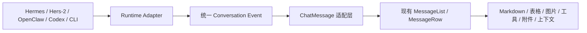

# Agents One 统一对话渲染与成熟界面复用开发方案

## 1. 文档状态

本文档原用于评审；用户已确认方案，现进入按阶段实施状态。每个阶段仍需通过对应的测试和人工验收门槛后再扩展范围。

### Phase 1 实施记录（2026-08-04）

- 新增 `src/renderer/src/screens/RuntimeChat/runtimeChatMessageAdapter.ts`，将 Runtime 会话、思考、工具调用、工具结果、错误、超时、取消和产物事件转换为原生 `ChatMessage`。
- `RuntimeChat` 消息区已切换为原生 `MessageList`，保留 Runtime 专属的发送、轮询、工作区、权限、网页预览、协作和持久化控制面板。
- `MEDIA:C:\...` 内容不在适配层改写，交由原生 `MessageRow` 的 `parseMediaTokens` / `MediaImage` 处理；这覆盖 Hers-2 本机图表回传场景。
- 已补齐适配器与 RuntimeChat 回归测试；定向测试 24/24 通过，Web 类型检查通过，受影响文件 lint 无错误。
- 全量测试在 120 秒上限内未完成，未观察到本次改动相关的断言失败；后续在本地开发构建/人工联调中继续验证完整界面。

### Phase 2 实施记录（2026-08-04）

- 移除 RuntimeChat 传给 `MessageList` 的通用 `toolProgress` 文案，避免原生“思考中”行下方重复显示“某某正在处理”。
- `AgentRuntimeEvent` 现在可携带脱敏的 `tool.callId`、`tool.kind`、`tool.inputSummary`、`tool.outputSummary`、`detail` 和 `code`；原生工具行可展示可展开的输入与结果，而不是只有“工具已完成”。
- Gateway Event Stream 到 Runtime 时间线的转换保留上述结构化字段；工具结果最多保留 8KB 脱敏详情，继续受运行事件数量上限约束。
- 主进程媒体入口统一规范化 `file:///C:/...`、引号包裹路径和 JSON 双反斜杠 Windows 路径，确保本机 `MEDIA:` 文件走同一读取链路。
- 远程任务若已交付 `MEDIA:` 图片、`artifact.created` 事件或 Gateway 产物，即使没有 workspace audit 也允许正常完成；普通文件操作仍必须有真实受控工作区记录。
- 新增结构化事件、媒体路径和远程媒体交付终态回归；本阶段定向测试 51/51 通过，Node/Web 类型检查通过。

### Phase 2 后续实施记录（2026-08-04）

- 本地 Codex、Claude Code、Pi 的 CLI 事件现在也写入统一的 `tool` 结构，保留工具名、类型、输入摘要、输出摘要和可用的 callId。
- Claude `tool_use/tool_result`、Codex `item.started/item.completed`、Pi `toolCall/toolResult` 均保留原始可展示详情；旧 summary 仍作为兼容回退。
- 新增 OpenClaw Gateway、Codex、Claude Code、Pi 的结构化事件 fixture，覆盖原生工具行的调用/结果配对以及模型/usage 元数据；Runtime 定向测试累计 54/54 通过。
- 本地 Codex、Claude Code、Pi 的不一致元数据入口（`turn.completed`、Claude `result/modelUsage`、Pi assistant message）现在统一映射到 `AgentRuntimeRun.model/usage`；模型上下文窗口优先采用 provider 回传值。
- 新增 Gateway `GET /artifacts/:id` 下载适配器，主进程校验 Base64、大小和 SHA-256 后暂存到短期媒体目录；渲染器只接收本机暂存路径，不接触 Bearer Token 或远端绝对路径。artifact UI 绑定留在 R-09。
- R-07/R-08 的 Node 定向测试 44/44 通过，Node 类型检查通过；后续继续做远程图片/文件在原生对话和产物面板中的人工回归。
- R-09 已开始：对话执行记录现在保留 artifact、model、usage；图片 artifact 转为原生 `MEDIA:` 段，非图片文件转为原生 `path-ref` 附件芯片。仍需人工验证真实 Electron 窗口中的图片加载、文件操作和历史重开。

### Phase 3/4/5 实施记录（2026-08-04）

- Phase 3 已收口：本机 `MEDIA:`、Markdown 图片、PNG/JPG/GIF/WebP/SVG 和不存在文件的提示继续复用原生 `MessageRow`/`MediaImage`；远程 Gateway artifact 由主进程下载、校验 SHA-256、暂存后绑定到同一套媒体/附件组件。
- Phase 4 已收口：Runtime 模型标签只显示真实回传值或本地配置值；上下文占用只有同时收到真实 `contextUsedTokens` 和窗口时才显示，不再把 `inputTokens` 猜成占用；Markdown 链接通过共享 `web-preview:navigate` 事件打开原生 `WebPreviewPanel`。
- Phase 5 已收口：移除重复的 Runtime 进度/执行记录 CSS 和消息呈现残留，保留协作、权限、工作区、产物和人工介入等 Runtime 专属控制；U5 真实 Electron 双视口回归通过，生成 15 张截图。
- 本机自动验证：RuntimeChat、适配器、Gateway、媒体与主进程 artifact hydration 定向测试 66/66 通过；Node/Web 类型检查和构建通过。
- 现场 smoke test 前置修复：Plugin SDK 已补齐真实 `GET /artifacts/{artifactId}` 路由，支持适配器返回 `contentBase64` 或 `bytes`；旧包虽然声明 `artifacts.download=true`，但会在该接口返回 404。新版包已重新打包并通过 SDK 6/6 测试。
- Hers-2 现场 smoke test 已通过：`artifacts.upload/download=true`、模型与 usage 完整、`artifact.created` 的 mime/size 与下载接口一致、HTTP 200、Base64 解码和 SHA-256 校验通过，事件 sequence 单调递增。

目标是让内置 Hermes、Hers-2、OpenClaw、Codex、Claude Code、Pi 等 Runtime 统一复用当前已经成熟的 Hermes 对话界面，避免每接入一种智能体就重新设计一套消息、工具、附件和媒体呈现逻辑。

## 2. 核心结论

采用“Runtime 适配器统一事件，前端统一渲染器”的方案：

- 各类智能体只负责连接、执行和产生标准化事件；
- 桌面端将不同 Runtime 的事件转换为统一的对话消息模型；
- 所有 Runtime 复用现有的 `MessageList`、`MessageRow`、`ReasoningRow`、`ToolActivityGroup`、`AgentMarkdown`、`MediaImage` 和 `ChatInput`；
- 保留 Runtime 专属的发送、轮询、权限、工作区、协作和会话持久化逻辑；
- 不要求远程智能体了解 React 或桌面端 UI，也不要求所有 Runtime 伪装成 Hermes Dashboard。



## 3. 当前问题与代码现状

### 3.1 当前存在两套对话呈现链路

内置 Hermes 使用成熟链路：

```text
Dashboard/Legacy 事件
  → dashboardEventAdapter
  → ChatMessage
  → MessageList
  → MessageRow / HistoryRow / AgentMarkdown / MediaImage
```

Runtime 对话使用另一套链路：

```text
Runtime API / CLI 输出
  → AgentRuntimeRun
  → RuntimeConversationMessage
  → RuntimeChat 自定义消息渲染
  → RuntimeExecutionRecord / AgentMarkdown
```

对应代码位置：

- 内置成熟消息列表：[src/renderer/src/screens/Chat/MessageList.tsx](../src/renderer/src/screens/Chat/MessageList.tsx)
- 内置消息行与媒体分段：[src/renderer/src/screens/Chat/MessageRow.tsx](../src/renderer/src/screens/Chat/MessageRow.tsx)
- Runtime 分支入口：[src/renderer/src/screens/Layout/Layout.tsx](../src/renderer/src/screens/Layout/Layout.tsx)
- Runtime 自定义消息区：[src/renderer/src/screens/RuntimeChat/RuntimeChat.tsx](../src/renderer/src/screens/RuntimeChat/RuntimeChat.tsx)

这会导致同样的内容在两个界面中的表现不一致：工具折叠方式不同、思考记录不同、媒体识别不同、错误分组不同，后续修复也会重复进行。

### 3.2 本次图表问题的准确根因

Hers-2 返回的 `<workspace-root>\test-chart.png` 是办公电脑本机路径，不是远程路径。因此，本次测试不需要先引入远程 artifact 下载。

本次图表未显示的直接原因是：

- `RuntimeChat` 当前直接把答复交给 `AgentMarkdown`；
- 裸的 `MEDIA:C:\...\test-chart.png` 不是标准 Markdown 图片语法；
- 现有 `AgentMarkdown` 不负责解析裸 `MEDIA:` 标记；
- 内置消息行才会先调用 `parseMediaTokens`，再使用 `MediaImage` 读取本机文件。

因此，第一阶段把 RuntimeChat 的消息区切换到现有 `MessageList` 后，本机 PNG/SVG 图表应沿用成熟媒体链路正常显示。

真正跨机器的远程图片、报告和文件，后续再通过 artifact 协议处理，不影响本次本机图表验证。

## 4. 目标与非目标

### 4.1 本项目标

- 所有 Runtime 复用同一套对话消息呈现组件；
- 思考、工具调用、工具结果、错误和答复的折叠方式统一；
- Markdown、GFM 表格、代码块、链接、图片和附件的行为统一；
- 模型名称、上下文使用量和工具详情使用统一的数据入口；
- 旧的 Runtime 对话历史可以继续打开；
- 远程 Runtime 与本地 CLI 可以逐步接入，不要求一次性重写所有适配器。

### 4.2 明确不做

- 不把所有智能体改造成 Hermes Dashboard 的后端实现；
- 不让 Connector 直接参与 React 界面设计；
- 不全局开启未经清洗的原始 HTML 渲染；
- 不在第一阶段重写发送、轮询、权限、工作区和协作逻辑；
- 不因为本机图表测试而提前引入复杂的远程文件传输改造；
- 不删除旧 Runtime 事件和历史数据，先做兼容读取。

## 5. 目标架构

### 5.1 三层职责

#### A. Runtime Adapter 层

负责把各类来源转换成统一的 Runtime 事件：

- Hermes Dashboard/Legacy；
- Agents One Remote Gateway；
- OpenClaw Bridge；
- Codex CLI；
- Claude Code CLI；
- Pi CLI。

适配器不关心 UI，只提供执行状态、事件、最终答复、模型、用量和产物引用。

#### B. Conversation Adapter 层

新增纯转换模块，将 Runtime 事件转换为现有前端 `ChatMessage`：

| Runtime 事件                  | 原生消息类型                                |
| ----------------------------- | ------------------------------------------- |
| reasoning/progress            | `ReasoningMessage`                          |
| tool started/tool call        | `ToolCallMessage`                           |
| tool completed/tool result    | `ToolResultMessage`                         |
| tool failed/workspace blocked | 失败的 `ToolCallMessage` 或 `SystemMessage` |
| assistant output              | `ChatBubbleMessage`                         |
| user input                    | 用户 `ChatBubbleMessage`                    |
| artifact/media                | 附件或媒体消息                              |

第一阶段兼容当前只有 summary 的旧事件；第二阶段补齐 `callId`、工具名、输入、输出和状态等结构化字段，逐步消除字符串解析。

#### C. Native Conversation UI 层

直接复用当前成熟组件：

- `ConversationWorkspace`
- `ChatInput`
- `MessageList`
- `MessageRow`
- `ReasoningRow`
- `ToolActivityGroup`
- `AgentMarkdown`
- `MediaImage` / `AttachmentChip`
- `ContextGauge`
- `WebPreviewPanel`

RuntimeChat 只保留 Runtime 特有控制面板，例如权限选择、工作区选择、协作角色、任务产物和人工介入。

## 6. 分阶段开发计划

### Phase 0：基线冻结与回归样本

目标：在替换 UI 前固定现有行为，避免“统一界面”过程中丢失 Runtime 能力。

任务：

- [x] 保存 Hers-2 当前联调样本：普通答复、思考、MCP、workspace、错误、模型、上下文、PNG/SVG 图表；
- [x] 保存 OpenClaw、Codex、Claude Code、Pi 的最小事件样本；
- [x] 为 RuntimeChat 当前行为补充渲染快照或组件测试；
- [x] 确认旧 `RuntimeConversationMessage.execution` 数据可以被读取；
- [x] 确认现有内置 Hermes 测试全部通过，作为不可回退基线。

交付物：一组脱敏的 Runtime 事件 fixture 和统一渲染验收矩阵。

### Phase 1：RuntimeChat 复用原生对话界面

目标：只换呈现层，不动 Runtime 执行链路。

任务：

- [x] 新增 `runtimeConversationToChatMessages` 适配器；
- [x] 将历史 `RuntimeConversationMessage[]` 转为 `ChatMessage[]`；
- [x] 将当前运行中的 `AgentRuntimeRun.events` 转为临时思考/工具行；
- [x] 替换 RuntimeChat 中的 `RuntimeExecutionRecord`；
- [x] 替换 RuntimeChat 中手写的 agent/user 消息气泡；
- [x] 传递 Runtime 的名称、头像和颜色给 `MessageList`；
- [x] 保留协作提案、协作面板、产物面板和人工介入入口；
- [x] 保留 RuntimeChat 当前的权限、工作区、上下文和 Web Preview 控件；
- [x] 保留现有 Runtime 会话持久化格式；
- [x] 为旧事件 summary 提供兼容解析，不能因为事件不完整而隐藏最终答复。

验收：Hers-2 的消息区域与内置 Hermes 的思考、工具调用、答复气泡布局一致。

### Phase 2：统一 Runtime 事件模型

目标：让所有 Runtime 以结构化事件驱动同一套 UI。

建议字段：

```ts
interface RuntimeConversationEvent {
  id: string;
  type:
    | "reasoning"
    | "assistant.delta"
    | "assistant.completed"
    | "tool.started"
    | "tool.completed"
    | "tool.failed"
    | "artifact.created"
    | "run.completed"
    | "run.failed";
  createdAt: number;
  callId?: string;
  tool?: {
    name: string;
    kind?: "tool" | "skill" | "mcp" | "terminal" | "workspace";
    inputSummary?: string;
    outputSummary?: string;
  };
  text?: string;
  summary?: string;
  error?: string;
  model?: {
    provider?: string;
    id?: string;
    contextWindowTokens?: number;
  };
  usage?: {
    inputTokens?: number;
    outputTokens?: number;
    totalTokens?: number;
    contextUsedTokens?: number;
    contextWindowTokens?: number;
  };
}
```

实施策略：

- 优先复用现有 `Agent Event Stream v1` 的字段和事件语义；
- Remote Gateway 直接保留结构化事件；
- 本地 Codex/Claude/Pi 由主进程适配器产生同样的结构化事件；
- 旧的 `AgentRuntimeEvent.summary` 继续兼容读取；
- 新旧格式并行一段时间，确认历史数据迁移无误后再清理字符串特例。

相关协议：[docs/AGENT_EVENT_STREAM_V1.md](./AGENT_EVENT_STREAM_V1.md)。

### Phase 3：本机媒体与远程 artifact 统一

#### 3.1 本机媒体，优先完成

- [x] `MEDIA:C:\...\chart.png` 经过统一消息适配器后进入 `parseMediaTokens`；
- [x] 本机 PNG/JPG/GIF/WebP/SVG 可以显示和放大；
- [x] Markdown 图片语法与 `MEDIA:` 语法结果一致；
- [x] 图片不存在时显示可理解的失败提示，而不是静默丢失；
- [x] 本机 CLI 生成的图片路径保持兼容。

#### 3.2 远程 artifact，后续完成

远程智能体不能依赖另一台机器的绝对路径。Connector 应通过：

```text
artifact.created
  → artifact id / name / mime / size / sha256
  → Gateway artifact download
  → 桌面端主进程安全暂存
  → MediaImage / AttachmentChip
```

要求：

- [x] 图片、SVG、文档和压缩包均有明确 MIME；
- [x] 下载由主进程携带认证信息，Renderer 不接触 Bearer Token；
- [x] 限制大小、扩展名、超时和临时文件数量；
- [x] 下载内容校验 SHA-256；
- [x] 远程 artifact 与本机 `MEDIA:` 展示最终使用同一套 UI。

协议基础已在 [docs/AGENTS_ONE_REMOTE_GATEWAY_V1.md](./AGENTS_ONE_REMOTE_GATEWAY_V1.md) 中定义，第一阶段不阻塞本机图表测试。

### Phase 4：统一模型、上下文和 Web Preview

- [x] 所有 Runtime 只展示真实回传的模型名称；
- [x] 所有 Runtime 使用相同的上下文占用组件；
- [x] 没有上下文数据时明确显示“未提供”，不猜测数值；
- [x] Markdown 链接继续进入现有 Web Preview；
- [x] 不把普通文本中的 URL 当成可执行 HTML；
- [x] Web Preview 加载失败、重试和关闭行为保持一致。

### Phase 5：清理重复实现与完整回归

- [x] 删除或下线 `RuntimeExecutionRecord` 及其重复 CSS；
- [x] 删除 RuntimeChat 中重复的消息气泡和工具分组逻辑；
- [x] 保留必要的 Runtime 专属协作和任务控件；
- [x] 更新 Runtime 接入指南和事件流文档；
- [x] 完成所有 Runtime 的回归矩阵；
- [x] 记录兼容旧会话、旧 Connector 和旧事件的截止版本。

## 7. 开发任务清单

| 编号 | 任务                                     | 优先级 | 依赖             | 状态   |
| ---- | ---------------------------------------- | ------ | ---------------- | ------ |
| R-01 | 生成 RuntimeChat 原生消息适配器          | P0     | 无               | 已完成 |
| R-02 | 用 `MessageList` 替换 RuntimeChat 消息区 | P0     | R-01             | 已完成 |
| R-03 | 保留协作提案和 Runtime 专属面板          | P0     | R-02             | 已完成 |
| R-04 | Hers-2 本机 `MEDIA:` PNG/SVG 回归        | P0     | R-02             | 已完成 |
| R-05 | OpenClaw/Codex/Claude/Pi 事件 fixture    | P1     | R-01             | 已完成 |
| R-06 | 扩展 Runtime 事件结构，减少 summary 解析 | P1     | R-01             | 已完成 |
| R-07 | 统一模型和 usage 映射                    | P1     | R-06             | 已完成 |
| R-08 | 远程 artifact 下载 API 与主进程暂存      | P1     | R-06             | 已完成 |
| R-09 | 远程图片/文件 artifact UI 回归           | P1     | R-08             | 已完成 |
| R-10 | 清理 RuntimeChat 重复渲染器和 CSS        | P2     | R-02、R-05       | 已完成 |
| R-11 | 完成全 Runtime 回归矩阵和发布说明        | P0     | R-04、R-07、R-09 | 已完成 |

## 8. 回归验收矩阵

| 能力               | 内置 Hermes | Hers-2        | OpenClaw     | Codex/Claude/Pi         |
| ------------------ | ----------- | ------------- | ------------ | ----------------------- |
| 普通 Markdown      | 基线        | 必须一致      | 必须一致     | 必须一致                |
| GFM 表格           | 基线        | 必须一致      | 必须一致     | 必须一致                |
| 代码块与复制       | 基线        | 必须一致      | 必须一致     | 必须一致                |
| 思考折叠           | 基线        | 真实事件优先  | 真实事件优先 | CLI 事件适配            |
| 工具调用折叠       | 基线        | MCP/workspace | Bridge 工具  | CLI 工具                |
| 工具失败展示       | 基线        | 保留详细错误  | 保留详细错误 | 保留详细错误            |
| 本机 `MEDIA:` 图片 | 基线        | 必须通过      | 适用时通过   | 必须通过                |
| 远程 artifact 图片 | 既有能力    | 后续接入      | 后续接入     | 不适用或按 Runtime 支持 |
| 模型名称           | 真实值      | 真实值        | 真实值       | CLI/Provider 真实值     |
| 上下文占用         | 真实值      | 真实值        | 真实值       | 有数据才显示            |
| 附件上传           | 基线        | 能力声明驱动  | 能力声明驱动 | 本地能力驱动            |
| Web Preview        | 基线        | 一致          | 一致         | 一致                    |
| 旧会话重开         | 必须通过    | 必须通过      | 必须通过     | 必须通过                |

## 9. 风险与控制措施

### 风险一：Runtime 事件信息不够结构化

当前 `AgentRuntimeEvent` 主要保存 summary，直接映射时可能只能靠字符串识别工具名。

控制措施：Phase 1 保留兼容解析；Phase 2 补齐 `callId`、工具名、输入、输出和状态；不以字符串解析作为最终协议。

### 风险二：替换消息区导致协作功能回退

RuntimeChat 目前包含协作提案、角色面板、产物面板和人工介入。

控制措施：只替换普通会话消息渲染；协作面板作为 Runtime 专属区域继续保留；为协作提案增加单独的渲染回归。

### 风险三：错误被统一逻辑误隐藏

控制措施：只过滤明确的重复/空泛事件；带 `error`、`detail`、`code`、路径或权限信息的错误必须原样保留并脱敏展示。

### 风险四：原始 HTML 或 SVG 引入安全问题

控制措施：不全局开启 `rehype-raw`；远程 SVG 先按 artifact 下载、MIME、大小和内容策略处理；普通链接仍走现有 Web Preview。

### 风险五：旧版本 Connector 或旧会话不兼容

控制措施：新适配器支持旧 summary 事件；旧 RuntimeConversation 数据只读兼容；协议升级通过能力声明和版本字段逐步启用。

## 10. 每个阶段的停止门槛

- Phase 1 未通过前，不进入大规模事件协议重构；
- 本机 `MEDIA:` 图表未显示前，不把问题归因于远程 artifact；
- 内置 Hermes 原有测试出现回归时，暂停 Runtime 迁移；
- 旧 Runtime 会话无法打开时，不删除旧的自定义渲染代码；
- 真实错误被误隐藏时，立即回退过滤逻辑，只保留明确重复事件清理。

## 11. 建议的开发顺序

1. 建立脱敏 fixture 和回归样本；
2. 新增 Runtime → `ChatMessage` 适配器；
3. RuntimeChat 接入 `MessageList`；
4. 验证 Hers-2 本机 PNG/SVG、Markdown 表格和工具记录；
5. 接入 OpenClaw、Codex、Claude Code、Pi 的事件样本；
6. 扩展结构化事件字段；
7. 最后实施远程 artifact 下载和跨机器媒体；
8. 删除重复 Runtime 渲染器，完成发布回归。

## 12. 评审确认项

开始实现前确认以下决定：

- [x] 同意以当前内置 Hermes 的 `MessageList` 作为所有 Runtime 的统一呈现基线；
- [x] 同意第一阶段只改桌面端消息适配和渲染，不改 Hers-2 Connector；
- [x] 同意本机 `MEDIA:C:\...` 图表作为第一阶段验收项；
- [x] 同意远程 artifact 作为后续阶段，不阻塞本机图表验证；
- [x] 同意保留旧事件和旧会话兼容，不做破坏性迁移；
- [x] 同意不全局开放原始 HTML 渲染。

## 13. 相关文档

- [Agents One Event Stream v1](./AGENT_EVENT_STREAM_V1.md)
- [Agents One Event Stream 插件接入指南](./AGENT_EVENT_STREAM_PLUGIN_GUIDE.md)
- [Agents One Remote Gateway v1](./AGENTS_ONE_REMOTE_GATEWAY_V1.md)
- Hers-2 定向 Connector 更新指南已转入受控私有归档；公开接入方式以通用 Plugin SDK 与 Connector 文档为准。
- [Agents One 项目进展日志](./AGENTS_ONE_PROGRESS_LOG.md)
