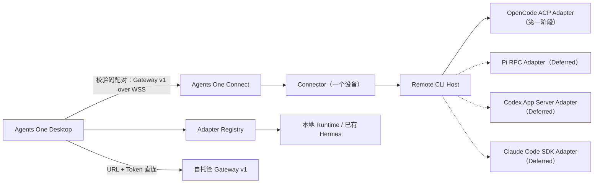

# Agents One 统一接入、Remote CLI Host 与多 Runtime Connector PRD

## 1. 文档信息

| 项目     | 内容                                                                                              |
| -------- | ------------------------------------------------------------------------------------------------- |
| 产品     | Agents One 智能体接入管理与远程运行基础设施                                                       |
| 版本     | PRD v1.1                                                                                          |
| 状态     | 方案已确认；分阶段实施                                                                            |
| 日期     | 2026-09-05                                                                                        |
| 当前交付 | 第一阶段：公共底座 + OpenCode ACP（入口拆分、Hermes 识别、Remote CLI Host、Connector 多 Runtime） |
| 延后交付 | Pi、Codex、Claude Code 远程 Adapter；根据第一阶段结果再分阶段批准和交付                           |
| 本次修订 | v1.1 将 OpenCode 从 Deferred 调整为首个真实远程 Adapter，与公共底座同批交付                       |
| 关联 PRD | [Agents One 接入管理升级 PRD](./AGENTS_ONE_ADAPTER_REGISTRY_PRD.md)                               |

本文是后续开发智能体的实施依据，补充并收敛现有 Adapter Registry、Gateway v1、Connect 和 Connector 方案。若本文与早期文档对“接入入口”“Connector 身份粒度”或“远程 CLI 是否本期开发”的描述冲突，以本文为准。

## 2. 已确认的产品决策

以下决策已经确认，实施时不得自行改回旧方案：

1. “校验码配对”和“自托管 Gateway”是两种独立接入方式，必须拆成两个入口，不在同一表单中并列堆放。
2. 校验码配对是普通用户的推荐路径，由 Agents One Connect 管理配对、设备身份和受限隧道。
3. Gateway 地址 + Token 是高级用户的自托管直连路径，不经过配对，不得显示为“已配对”。
4. Agents One 已有本地 Hermes Runtime 能力。本期补齐的是已有安装的发现、校验和采用流程，不新增第二套 Hermes Adapter。
5. 远程 CLI 采用一套通用 Remote CLI Host、一套 Gateway v1、一套 Connector/Connect，不为每个 CLI 单独开发 Relay、配对服务或 Gateway。
6. Connector 从“一个设备绑定一个 Runtime”演进为“一个设备可发布多个 Runtime”，请求始终按 `runtimeId` 路由和授权。
7. 第一阶段采用“公共底座 + OpenCode ACP”纵向交付：Host 和多 Runtime Connector 必须用真实 OpenCode 远程链路验证，不能只完成模拟 Adapter。
8. Pi RPC、Codex App Server、Claude Code SDK 不与第一阶段同时开工；根据 OpenCode 阶段形成的契约、工作量和稳定性结论再分阶段交付。预计顺序为 Pi → Codex → Claude Code，但每项仍需独立批准和验收。

## 3. 背景与问题

### 3.1 两种远程接入方式在界面上混为一体

现有远程 Runtime 管理表单同时显示 Gateway 地址、Gateway Token 和接入校验码。直接填写地址和 Token 后，即使没有完成 Connect 配对，也能保存并成功探测。这在技术上是有效的自托管 Gateway 直连，但界面容易让用户误以为“校验码已被绕过”或“设备已经配对”。

问题的本质不是功能重复，而是两种不同信任模型缺少明确的产品分层：

| 方式           | 信任建立                             | 网络路径                      | 适用用户                                |
| -------------- | ------------------------------------ | ----------------------------- | --------------------------------------- |
| 校验码配对     | 一次性短码 + 设备身份 + Connect 授权 | Desktop ↔ Connect ↔ Connector | 普通用户、无公网入口的远端主机          |
| 自托管 Gateway | 用户自行提供 URL + Bearer Token      | Desktop ↔ 用户 Gateway        | 高级用户、企业自托管、已有 Gateway 服务 |

### 3.2 本地 Hermes 能执行，但“采用已有安装”没有完整产品入口

主进程已经具备 Hermes 安装目录检查、目录校验和采用能力，并存在内置本地 Hermes Runtime。当前缺口是 Renderer 没有完整串起发现、选择目录、校验、采用和刷新 Runtime 的体验。因此用户可能看到“安装 Hermes”，却无法清晰地告诉 Agents One 使用电脑上已经存在的 Hermes。

### 3.3 Connector 当前以单 Runtime 为中心

现有 Connector 凭据、握手和运行参数主要围绕单个 `runtimeId`。如果直接按供应商复制 Connector，将产生多套进程、多份设备凭据、多次配对、重复的重连和升级逻辑，增加用户操作和安全审计成本。

### 3.4 四个 CLI 的生产基线仍以本地执行为主

Codex、Claude Code 和 Pi 在 Adapter Registry 中仍只声明本地位置；OpenCode 已增加远程 Host/Gateway v1 声明，但仍受第一阶段灰度开关和真实验收门槛控制。已有 Provider Adapter 能处理各自结构化协议，但远程 Runtime Host、远程文件边界和完整隧道恢复能力尚未达到生产发布标准。

因此，本 PRD 不把“复用本地 Adapter”误写成“远程功能已经可用”。第一阶段将 OpenCode 作为首个真实远程 Adapter 开发和验收；Pi、Codex、Claude Code 继续保持本地能力，待后续分别开发、测试和启用。

## 4. 目标与非目标

### 4.1 当前目标

- 在新建远程智能体时，先选择“校验码配对”或“自托管 Gateway”，再进入对应的最小表单。
- 正确显示连接来源、设备状态、Runtime 状态和错误，不用“已连接”代替“已配对”。
- 自动发现或允许用户选择本地已有 Hermes 安装，校验成功后采用，不重复下载安装。
- 建立通用 Remote CLI Host，使结构化 Provider Adapter 可以在远程主机上以统一方式运行。
- 让一个 Connector 设备发布和维护多个 Runtime，并通过一个 Connect 隧道路由。
- 完成 OpenCode ACP 远程 Adapter 的端到端纵向切片，覆盖配对、运行、事件、模型、权限、取消、会话、Artifact 和恢复。
- 保持 Gateway v1、统一事件流、Artifact、取消、会话和 Workspace Grant 的单一协议边界。
- 保证已有 Runtime 配置、Token、会话和历史无损兼容。

### 4.2 延后目标

以下内容完成设计预留，但不与第一阶段同时开发、发布或宣称可用：

- Pi RPC 远程 Adapter；
- Codex App Server 远程 Adapter；
- Claude Code SDK 远程 Adapter。

### 4.3 非目标

- 不为四个 CLI 分别建设 Relay、配对流程、Gateway、设备服务或升级器。
- 不通过 SSH、远程桌面、键盘模拟或终端录屏作为标准远程协议。
- 不提供任意 Shell、PowerShell、端口转发或通用文件服务器。
- 不把本地 CLI 强制改为经过 Gateway v1；本地调用继续使用原生 Adapter。
- 不把 Connect 和自托管 Gateway 合并为同一种安全状态。
- 不自动迁移、覆盖或删除现有 Token、Runtime、自定义字段、项目和会话历史。
- OpenCode 远程验收完成前，不把其 Manifest 对普通用户标记为稳定可用；Pi、Codex、Claude Code 在各自开发获批前不得增加远程位置声明。
- 不承诺不同 Provider 拥有完全相同的模型、思考级别、权限、工具和会话能力。

## 5. 术语与职责

| 术语               | 定义                                                           | 责任边界                                              |
| ------------------ | -------------------------------------------------------------- | ----------------------------------------------------- |
| Provider Adapter   | 把供应商原生协议转换成 Agents One Run/Event/Session 契约       | 只理解对应 CLI/SDK，不负责公网接入和配对              |
| Runtime            | 一个可被选择和执行的具体智能体实例                             | 具有稳定 `runtimeId`、位置、能力和状态                |
| Remote CLI Host    | 在远程主机上托管 Provider Adapter 的通用用户级进程             | 启停受注册 Adapter 限制，不是任意命令执行器           |
| Connector          | 维护设备身份、主动连接 Connect、发布 Runtime 并转发 Gateway v1 | 不解析 Provider 私有协议，不保存桌面 Gateway Token    |
| Connect            | 托管配对、设备注册、在线状态和受限 WSS 路由                    | 不执行模型、不读取 Provider 凭据、不提供任意 TCP 转发 |
| 自托管 Gateway     | 用户自己部署的 Gateway v1 服务                                 | 用户负责 URL、TLS、Token、可用性和服务运维            |
| Connection Profile | Runtime 的接入来源                                             | `local`、`managed-connect`、`self-hosted-gateway`     |
| Workspace Grant    | 桌面工作区的临时、项目范围授权                                 | 与远程主机本地文件权限、设备凭据和 Gateway Token 分离 |

## 6. 总体架构



OpenCode 实线表示与公共底座一起完成的第一阶段真实纵向链路；Pi、Codex、Claude Code 的虚线表示只预留、尚未开发和启用。Desktop 只理解 Runtime 和 Gateway v1，不感知远程 CLI 的启动细节；Connector 只理解设备、Runtime 发布和 Gateway 帧，不实现供应商协议。

## 7. 产品入口与用户流程

### FR-01 远程接入方式先选择、后配置

用户选择“添加远程智能体”后，必须先看到两个互斥入口：

1. **通过校验码配对（推荐）**：说明无需公网 IP 和入站端口，远端需要运行 Agents One Connector。
2. **连接自托管 Gateway（高级）**：说明需要用户自行维护 HTTPS Gateway v1 地址和 Token。

选择前不同时展示两种方式的字段。编辑已有 Runtime 时，根据其 `connectionProfile` 直接打开对应表单，并允许用户通过显式的“更换接入方式”操作切换；切换前说明会创建或替换连接凭据，但不删除会话历史。

### FR-02 校验码配对流程

推荐主流程采用 Connector-first：

1. 远端运行 Connector 的配对命令并生成 10 位校验码。
2. 用户在 Agents One 选择“通过校验码配对”，输入校验码。
3. Desktop 向配置的生产 Connect Endpoint claim 该码。
4. UI 展示待接入设备名称、设备指纹摘要、远端声明的 Runtime 列表和能力摘要。
5. 用户确认后，Connect 为 Desktop 和 Connector 分发相互隔离的凭据。
6. Runtime 列表写入本地非敏感配置，Gateway Token 只写入受保护凭据存储。
7. UI 显示“已配对”，并分别显示设备在线状态和各 Runtime 在线状态。

同时保留 Desktop-first 配对作为兼容流程，但不得与 Connector-first 同时占据主操作位。

配对页面只出现以下信息：

- 校验码；
- Connect 服务状态；
- 待配对设备和 Runtime 摘要；
- 过期时间；
- 确认、取消、重新生成或重试操作。

配对页面不得要求用户填写 Gateway URL 或 Gateway Token。Connect Endpoint 是部署配置，不是普通 Runtime 表单字段；只有开发或企业部署设置可以覆盖。

生产构建未配置 Connect Endpoint 时，配对入口必须显示“Connect 服务尚未配置”并停止流程，不得回退到 `127.0.0.1` 或让用户在普通 Runtime 表单里补地址。Loopback 默认值只允许测试和显式开发模式使用。

### FR-03 自托管 Gateway 流程

自托管表单只出现：

- 名称与 Runtime ID；
- Gateway v1 基础地址；
- Gateway Token；
- “测试连接”；
- 探测到的协议版本、插件/服务版本和能力。

保存前必须完成 HTTPS、证书链、鉴权和 `/capabilities` 探测。开发环境仅可通过显式开发开关允许 Loopback HTTP，不可静默降低生产 TLS 校验。

连接成功后的状态文案使用“自托管 Gateway 已连接”或“手动直连”，不得使用“配对成功”“已配对”或显示虚构设备身份。进程内 TLS 的服务端证书文件必须是叶子证书在前、包含中间证书的 PEM full chain；客户端 CA（如启用 mTLS）不替代服务端证书链。

### FR-04 连接状态分层

UI 必须分别表达以下状态，不能压缩成一个“已连接”：

| 层级         | 示例状态                                             |
| ------------ | ---------------------------------------------------- |
| 配对         | 未配对、待确认、已配对、已过期、已撤销               |
| 设备         | 在线、离线、重连中、版本不兼容                       |
| Runtime      | 可用、忙碌、离线、Adapter 不可用、需要 Provider 登录 |
| Gateway 探测 | 未测试、测试中、可达、证书失败、鉴权失败、协议不兼容 |

### FR-05 已有直连 Runtime 的无损标注

升级后，具有 `remoteGateway.protocol = "agents-one-v1"` 且没有有效 `connect` 元数据的现有远程 Runtime，按 `self-hosted-gateway` 解释并显示“手动直连”。

迁移必须满足：

- 不修改 Endpoint；
- 不重新生成或移动 Token，除非现有安全迁移逻辑本就要求；
- 不改变 Runtime ID、名称、头像、项目、任务或历史会话；
- 不伪造 `deviceId`、`pairedAt` 或配对记录；
- 可重复执行，结果一致；
- 无法判断时保留原数据并显示“旧版连接配置”，不能删除 Runtime。

## 8. 本地 Hermes 已有安装识别

### FR-06 自动发现

Agents One 启动或打开“添加本地 Hermes”时，按以下顺序做只读发现：

1. 当前有效的 Hermes Home 覆盖配置；
2. 用户级 `HERMES_HOME`；
3. Agents One 默认 Hermes Home；
4. `PATH` 中的 `hermes`/`hermes.exe`，并尝试反推出可采用的 Hermes Home；
5. 用户明确选择的目录。

自动发现不得递归扫描整块磁盘。每个候选项应显示来源、规范化路径、版本、可执行文件状态、配置状态和本地 API 状态。

### FR-07 选择并采用已有安装

当发现有效安装时，UI 提供“使用此安装”。未发现时，用户可选择 Hermes Home 或 Hermes 安装根目录；主进程负责规范化并校验，不允许 Renderer 自行拼接可执行文件路径。

校验至少包括：

- 路径存在且位于用户可访问目录；
- Windows 下存在可用的 `hermes-agent/venv/Scripts/hermes.exe` 或当前安装器契约认可的等价布局；
- Python/虚拟环境与 Hermes CLI 能正常读取版本；
- 配置文件损坏时给出“安装有效但配置需修复”，不把它误判为未安装；
- 已运行本地 API 时，探测 `/health` 协议、配置端口、`gateway.pid` 与监听进程归属；无法确认归属时只能标记未知，发现无关进程占用时不得绑定该服务。

采用成功后，系统持久化 Hermes Home 覆盖，刷新内置 `hermes-local` Runtime，并提示需要立即重载还是下次启动生效。不得创建第二个同义内置 Runtime，也不得覆盖用户自建 Hermes Runtime。

### FR-08 Windows 无管理员权限

所有发现、采用、启动和升级流程必须在普通 Windows 用户权限下工作：

- 不写系统级 PATH；
- 不安装系统服务或驱动；
- 优先使用用户级环境变量和用户目录；
- 如需自启动，使用无需管理员权限的用户级机制；
- 路径包含空格、中文或非 ASCII 字符时必须有测试。

## 9. Connection Profile 数据模型

### FR-09 显式连接来源

建议在共享 Runtime 契约中新增可选字段：

```ts
type AgentRuntimeConnectionProfile =
  | "local"
  | "managed-connect"
  | "self-hosted-gateway";
```

字段命名可在技术设计评审中调整，但语义必须唯一，不得同时维护多个互相冲突的“模式”字段。

读取兼容规则：

1. `connect` 含有效配对/设备引用 → `managed-connect`；
2. 远程 Runtime 含 Gateway v1 Endpoint 且无有效 `connect` → `self-hosted-gateway`；
3. `local-api`、`local-cli`、`local-web` → `local`；
4. 显式字段与旧字段冲突时，保留原记录、标记配置异常并禁止静默改写。

写入规则：

- 新记录必须写显式 Profile；
- 编辑时只更新当前表单拥有的键，保留未知字段；
- 从配对切换到自托管或反向切换必须由用户显式确认；
- 敏感值只保存 Secret Reference，不进入 `desktop.json`、日志、事件或聊天内容。

### FR-10 建议的非敏感结构

```ts
interface AgentRuntimeConnectionMetadata {
  profile: "local" | "managed-connect" | "self-hosted-gateway";
  connect?: {
    endpointRef: string;
    deviceId?: string;
    registrationId?: string;
    pairedAt?: string;
  };
  selfHostedGateway?: {
    endpoint: string;
    tokenRef: string;
  };
  localInstallation?: {
    source: "managed" | "adopted" | "path";
    homePath?: string;
  };
}
```

这是目标语义示例，不要求一次性替换现有 `AgentRuntimeConfig`。实施必须先给出增量迁移方案、消费者清单和回退路径。

## 10. Connector 多 Runtime

### FR-11 设备与 Runtime 解耦

一个 Connector 安装实例代表一个设备身份。该设备可以发布零个或多个 Runtime；每个 Runtime 具有独立 `runtimeId`、Adapter、显示信息、能力、健康状态和授权状态。

设备凭据不得复制到每个 Runtime。新增或删除 Runtime 默认不要求设备重新配对，但 Desktop 必须能够审阅新增 Runtime，并由 Connect 应用账户和设备策略。

为兼容现有 Gateway Token 绑定单 Runtime 的安全模型，首次配对可一次批准初始 Runtime 清单，并为每个获批 Runtime 签发独立的 Runtime-scoped Gateway Token/Secret Reference。后续新增 Runtime 复用设备身份，但必须经 Desktop 明确批准并取得新的 Runtime 授权；这不是重新配对设备。

### FR-12 Runtime 清单与握手

Connector 握手协议演进为支持 `runtimes[]`：

```json
{
  "type": "hello",
  "protocolVersion": "1.1",
  "deviceId": "device_123",
  "deviceToken": "<protected>",
  "runtimes": [
    {
      "runtimeId": "hers-home2",
      "adapterId": "builtin:hermes-gateway",
      "displayName": "Hers",
      "capabilityDigest": "sha256:..."
    }
  ]
}
```

协议必须兼容旧版单 `runtimeId` hello：服务端可将其规范化为单元素列表。新版 Connector 也必须处理旧版 Connect 的明确“不兼容”响应，不能无限重连。

`deviceToken` 不得出现在日志、诊断包或错误对象中。上例仅用于协议字段说明。

### FR-13 Runtime 生命周期

Connector 支持：

- 列出本机已配置 Runtime；
- 注册新 Runtime；
- 禁用、启用、更新或移除 Runtime；
- 对每个 Runtime 做独立 probe；
- 动态发布清单变更；
- 保持稳定 Runtime ID；
- 在设备撤销时使全部 Runtime 失效；
- 在单个 Runtime 故障时保持其他 Runtime 在线。

涉及 Adapter、命令、工作目录或权限扩大时，必须产生新的配置摘要并要求 Desktop/Connect 重新确认；纯显示名称变化不必重新配对。

### FR-14 路由与隔离

所有 Gateway 请求帧必须带 `runtimeId`。Connect 只能把请求路由到已绑定设备、已注册、已授权且在线的 Runtime。

最低隔离要求：

- 未知 Runtime 返回 `runtime_not_registered`；
- 已禁用 Runtime 返回 `runtime_disabled`；
- Runtime 离线返回 `runtime_offline`；
- Runtime 与设备不匹配返回 `permission_denied`，且不泄露目标是否存在；
- 每设备、每 Runtime 分别限流和限制并发；
- 一个 Runtime 的事件、取消、Artifact 和会话不能串到另一个 Runtime。

### FR-15 配置和凭据存储

Connector 配置分成：

- `device`：设备 ID、Connect Endpoint、设备凭据引用、配对状态；
- `runtimes`：Runtime 描述、Adapter ID、非敏感 Adapter 参数、启用状态；
- `secrets`：Provider 凭据或本地安全存储引用；
- `state`：最后在线时间、版本和可重建的运行状态。

写入必须原子化、保留未知字段并提供版本号。卸载 Runtime 不默认删除设备身份或 Provider 凭据；删除凭据必须有独立确认。

## 11. 通用 Remote CLI Host

### FR-16 Host 职责

Remote CLI Host 是运行在 Connector 同一台主机上的用户级进程或库，负责：

- 加载经过注册和签名/信任校验的 Provider Adapter；
- 管理 Adapter 的启动、停止、探测、会话、Run 和取消；
- 把供应商事件规范化为 Agent Event Stream v1；
- 通过 Loopback Gateway v1 向 Connector 提供统一接口；
- 管理远端工作目录、Artifact 证据和资源限制；
- 记录脱敏审计信息并报告真实模型和能力。

Connector 负责网络和设备身份，Host 负责运行时执行；两者可以同进程部署，但模块边界和安全职责必须保持独立。

### FR-17 Provider-neutral Adapter 接口

Host 应复用 Adapter Registry 的高层契约，最小接口包括：

```ts
interface RemoteHostAdapter {
  manifest(): RuntimeAdapterManifest;
  probe(context: HostContext): Promise<ProbeResult>;
  listModels?(context: HostContext): Promise<ModelDescriptor[]>;
  listSessions?(context: HostContext): Promise<SessionDescriptor[]>;
  startRun(input: StartRunInput, sink: RuntimeEventSink): Promise<RunHandle>;
  getRun(runId: string): Promise<RunSnapshot>;
  cancelRun(runId: string): Promise<CancelResult>;
  respondToPermission?(
    runId: string,
    requestId: string,
    decision: PermissionDecision,
  ): Promise<void>;
}
```

具体命名可以调整，但必须避免复制本地 Provider 的模型映射、会话映射、事件归一化和权限语义。与进程管理、远端文件和持久化有关的行为由 `HostContext` 注入，不能让 Adapter 任意访问 Connector 凭据。

### FR-18 进程和权限边界

- Host 默认只监听 Loopback，不能自动暴露公网端口。
- 只能启动 Manifest 中注册的可执行文件或 SDK，不接受 Gateway 请求传入任意命令行。
- 参数使用数组传递，不经 Shell 拼接。
- Provider 凭据留在远端主机，不上传 Connect 或 Desktop。
- 每个 Runtime 有独立工作目录白名单、环境变量白名单、并发和资源上限。
- Host 报告的“完全访问”只描述远端 Runtime 的权限，不代表拥有 Desktop 工作区权限。
- Desktop 文件访问必须继续经过独立 Workspace Grant；远端本机文件与 Desktop Workspace 在 UI 和审计中明确区分。

### FR-19 Run、事件与重连

Host 和 Connector 必须实现：

- 客户端生成或接受稳定的幂等键，重复 `startRun` 不重复执行；
- 每个事件具有稳定 `runId`、`eventId` 和单调 `sequence`；
- 终态写入前持久化最终答复、模型、用量、工具和 Artifact 证据；
- Connector 断线后按最后确认的 sequence 续传；
- Host/Connector 重启后可查询未完成 Run 并进行终态对账；
- Provider 原生 `sessionId` 必须与桌面 `conversationId` 分开保存并回传，供后续 ACP/RPC 回合恢复；
- Host 重启后的未完成 Run 在下一次查询时进入显式对账：Adapter 可通过 `reconcileRun` 恢复 Provider 终态和事件；无法恢复时必须返回带 `host_restart_reconciliation_required` 的确定性失败，不得伪造成功；
- 取消是幂等操作，明确区分“请求已接受”“进程已停止”和“已完成无法取消”；
- 背压、最大帧、最大事件积压和过期策略可配置；
- 思考内容、最终答复、工具调用和工具结果走不同事件类型，不能把最终答复放进“思考”。

### FR-20 模型和能力真实性

模型显示遵循以下优先级：

1. Run 完成或流事件中由 Provider 返回的实际模型；
2. 当前 Session 返回的模型；
3. Runtime probe/listModels 返回的已选模型；
4. 用户请求模型；
5. Runtime 配置默认值。

任何上游返回的实际模型都应覆盖请求值，且同时保留 `requestedModel` 与 `actualModel` 供审计。Host 不得用 Adapter 名称、客户端名称或静态默认值冒充模型名称。

Capability 必须由实际 Adapter 和当前版本协商，至少覆盖：

- 流式输出；
- 结构化思考摘要；
- 工具调用/结果；
- 交互式权限；
- 取消；
- 会话创建/恢复；
- 模型枚举/切换；
- Artifact；
- 远端工作目录；
- Desktop Workspace Grant；
- 用量统计。

UI 只展示已验证能力，不根据 Provider 名称猜测。

## 12. 本地调用与远程调用的差异

远程调用追求高层功能一致，但实现和安全边界不能假装与本地相同。

| 维度          | 本地调用                      | 远程调用                                                |
| ------------- | ----------------------------- | ------------------------------------------------------- |
| 进程启动      | Desktop 直接启动 CLI/SDK      | Remote CLI Host 启动，Desktop 只创建 Gateway Run        |
| Provider 凭据 | 保存在本机用户环境            | 保存在远端主机                                          |
| 工作目录      | Desktop 本地路径              | 远端路径；Desktop 文件需另行 Grant                      |
| 文件核验      | 可直接读取本地文件和 Git      | 通过 Artifact/Workspace 事件和哈希核验                  |
| 事件传输      | IPC/本地 stdio                | Gateway v1 + WSS，需 sequence、重放和背压               |
| 取消          | 可直接结束本地进程            | 跨网络幂等请求，存在最终一致窗口                        |
| 离线          | 通常是进程或路径错误          | 还包括设备、Connect、Connector、Host 断线               |
| 权限          | Desktop 本机权限              | 远端 Runtime 权限与 Desktop Workspace Grant 两套边界    |
| 升级          | Desktop 与 Adapter 同版本发布 | Desktop、Connect、Connector、Host、Adapter 要做版本协商 |
| 审计          | 本地执行记录                  | 还需设备、路由、重连、远端证据和操作来源                |

产品不以“所有按钮看起来一样”作为功能对等标准，而以能力协商和验收矩阵为准。

## 13. 远程 CLI Adapter 分阶段方案

本章定义第一阶段 OpenCode 的实际交付要求，以及 Pi、Codex、Claude Code 的后续开发边界。所有 Provider 共用 Host、Connector、Connect 和 Gateway v1，不允许形成供应商专用基础设施。

### 13.1 OpenCode ACP

第一阶段实际开发。复用现有 ACP JSON-RPC 的初始化、Session、Prompt、工具、思考增量、模型和取消映射，并作为 Remote CLI Host 的首个真实参考实现。

启用前必须证明：

- ACP stdio 可由 Host 稳定托管并在重连后恢复/对账；
- `agent_message_chunk` 只进入最终答复通道，`agent_thought_chunk` 只进入思考通道；
- 工具调用按 `toolCallId` 去重，路径只暴露 Grant/工作目录相对路径；
- 实际模型来自 Session 配置或 Run 事件；
- 远程进程退出、权限请求和取消均有结构化终态。

### 13.2 Pi RPC

未来优先级 2。复用 Pi RPC 的 Session、模型、思考级别、Compaction 和事件映射。

启用前必须证明：

- RPC request/notification 在隧道重连时不会重复执行；
- 原生思考级别仅在 Provider 确认支持时可选；
- Compaction 生命周期不进入模型正文；
- 权限和取消能映射成稳定 Run 状态；
- 自定义 Provider 的实际模型与上下文窗口能正确上报。

### 13.3 Codex App Server

未来优先级 3。复用 Codex App Server 的 Thread/Turn/Item、模型列表、Compaction 和权限映射。

启用前必须证明：

- Thread 与 Agents One conversation/session 的恢复映射稳定；
- Turn/Item 事件在重放时可去重；
- 工具、diff、Artifact 和权限请求保留结构化证据；
- App Server 版本协商和 Provider 登录状态可诊断；
- 远程任务取消后能完成终态对账。

### 13.4 Claude Code SDK

未来优先级 4。复用官方 SDK 的消息流、Session、模型、权限模式、命令和 Compaction 映射。

启用前必须证明：

- SDK 与 Claude 可执行文件版本兼容并可诊断；
- Provider 权限模式不会被 Agents One 的“完全访问”文案错误扩大；
- `compact_boundary`、系统事件和最终答复正确分流；
- Session 恢复和取消在 Host 重启后行为明确；
- 凭据、环境变量和敏感错误不会穿过 Connect。

### 13.5 第一阶段边界与后续开发触发条件

OpenCode 已获准进入第一阶段，但只能在以下基础条件具备后向普通用户开放：

1. 通用 Host 与多 Runtime Connector 已通过模拟 Adapter 基础验收；
2. OpenCode 本地 Adapter 的结构化事件和模型真实性测试稳定；
3. 已定义远端工作目录、Artifact 和权限策略；
4. 已准备真实 OpenCode E2E 环境、灰度开关和回滚路径；
5. 本章 13.1 的专项门槛全部通过。

Pi、Codex、Claude Code 只有在以下条件全部满足后才能从 Deferred 转入开发：

1. OpenCode 纵向链路形成稳定的 Host Adapter 契约和复盘结论；
2. 有明确用户场景、目标平台和维护负责人；
3. 对应本地 Adapter 的结构化事件和模型真实性测试稳定；
4. 已定义该 Provider 的远端工作目录、Artifact、凭据和权限策略；
5. 已准备真实 Provider E2E 环境和独立回滚开关；
6. 产品负责人明确批准该 Adapter 的实施阶段。

未满足前：不新增 Pi、Codex、Claude Code 的远程位置声明，不显示相应远程入口，也不创建供应商专用 Connector 包。

## 14. 安全与隐私要求

### SEC-01 凭据隔离

四类凭据必须分离：

- pairing code：一次性、默认 5 分钟、限速和失败次数上限；
- Connector device credential：设备身份，可撤销和轮换；
- Desktop Gateway Token：限定账户、Runtime 和 scope；
- Workspace Grant：按项目/任务短时授权。

Provider Token 是第五类凭据，只存在 Provider 所在主机。任何凭据都不得出现在 Runtime JSON、对话、事件正文、截图诊断或普通日志中。

### SEC-02 最小网络暴露

- Connector 和 Desktop 只向 Connect 建立出站 HTTPS/WSS；
- Host/Gateway 默认只监听 Loopback；
- 自托管 Gateway 必须通过受信任 HTTPS 暴露；
- Connect 只转发 Gateway v1 白名单方法和路径；
- 禁止任意 URL 代理、TCP 隧道和请求头透传。

### SEC-03 内容与路径脱敏

- 不传输原始 chain-of-thought；只允许 Provider 明确提供、经过边界限制的思考摘要；
- 绝对路径转换为 Runtime 工作区或 Grant 相对路径；
- 环境变量、命令行和错误堆栈经过凭据与路径脱敏；
- Artifact 必须有大小、类型、SHA-256 和访问授权；
- Connect 不解析或持久化不必要的模型正文。

## 15. 错误模型与可观测性

### FR-21 统一错误码

至少支持以下稳定错误码：

| 错误码                    | 含义                     | 建议操作                     |
| ------------------------- | ------------------------ | ---------------------------- |
| `pairing_invalid`         | 校验码格式或会话无效     | 检查后重输                   |
| `pairing_expired`         | 校验码已过期             | 在远端重新生成               |
| `device_revoked`          | 设备已撤销               | 重新配对                     |
| `connector_offline`       | 设备未连接 Connect       | 检查 Connector 和网络        |
| `runtime_not_registered`  | 设备未发布目标 Runtime   | 检查 Host 配置               |
| `runtime_offline`         | Runtime/Adapter 不可用   | 查看远端 probe               |
| `adapter_unavailable`     | Adapter 缺失或被禁用     | 安装/启用受信任 Adapter      |
| `provider_auth_required`  | Provider 需要登录或凭据  | 在 Provider 所在主机完成认证 |
| `incompatible_version`    | 协议或组件版本不兼容     | 升级指定组件                 |
| `gateway_tls_untrusted`   | HTTPS 证书链不受信任     | 修复完整证书链或受信任 CA    |
| `permission_denied`       | 策略、Runtime 或路径越权 | 调整明确授权                 |
| `workspace_grant_expired` | Desktop Grant 已失效     | 重新授权工作区               |
| `run_state_conflict`      | 幂等键或终态冲突         | 查询原 Run，不重复启动       |

错误文案必须说明失败层级：Desktop、Connect、Connector、Host、Adapter 或 Provider。不得将所有错误统一显示为“Workspace operation failed”或“Remote workspace timeout is invalid”。

### FR-22 诊断信息

诊断页按层展示：

- Desktop 版本、Gateway v1 版本；
- Connection Profile；
- Connect Endpoint 和 TLS 摘要；
- Device ID 摘要、Connector 版本和最后在线时间；
- Runtime ID、Adapter ID/版本、Host 版本和最后 probe；
- Provider 登录状态、实际模型来源；
- 最近一次 Run 的重连次数、最后 sequence 和终态。

诊断信息默认脱敏，可复制内容不得包含 Token、设备私钥、完整用户路径或模型正文。

## 16. 分阶段实施计划

### Phase 0：契约基线与安全评估

- 冻结 Connection Profile、设备/Runtime 关系、错误码和版本协商设计；
- 为现有配置、配对、Gateway v1 和 Connector hello 建立黄金夹具；
- 记录受保护数据、消费者、失败模式和回退路径；
- 不改变现有运行行为。

验收：旧 Runtime 配置可完整 round-trip，未知字段和 Secret Reference 不丢失。

### Phase 1：拆分接入入口

- 新增远程接入方式选择页；
- 配对和自托管表单完全分离；
- 引入或派生 Connection Profile；
- 纠正状态文案和诊断分层；
- 将现有无 `connect` 的 Gateway v1 Runtime 无损标注为手动直连。

验收：用户无法在未配对的情况下看到“已配对”；已有 `hers-home2` 等直连 Runtime 仍可用且历史不变。

### Phase 2：本地 Hermes 已有安装识别

- 将已有的 inspect/validate/adopt IPC 接入设置与首次运行界面；
- 实现自动发现、目录选择、校验结果和采用确认；
- 刷新内置 Hermes Runtime；
- 补齐 Windows 普通用户与特殊路径测试。

验收：有效已有安装无需下载即可被采用；无效目录不写配置；重启后仍使用所选安装。

### Phase 3：Connector 多 Runtime

- 配置和凭据由单 Runtime 结构升级为设备 + Runtime 清单；
- 扩展 hello、注册、动态清单、路由、撤销和状态 API；
- 保持旧版单 Runtime Connector 兼容；
- 建立每 Runtime 隔离、限流和测试矩阵。

验收：同一设备上的两个测试 Runtime 可并发执行且事件不串线；移除一个 Runtime 不影响另一个。

### Phase 4（第一阶段核心开发）：公共底座 + OpenCode 纵向切片

- 实现 Provider-neutral Host Adapter 接口；
- 实现 Loopback Gateway v1、Run journal、事件 sequence、幂等、取消和恢复；
- 先用模拟 Adapter 固定 Host/Connector 契约和故障测试；
- 接入真实 OpenCode ACP，复用既有 Session、消息/思考、工具、模型、权限、取消和 Artifact 映射；
- 打通 Desktop ↔ Connect ↔ Connector ↔ Host ↔ OpenCode ACP 完整链路；
- 实现用户级运行、诊断和版本协商。

验收：模拟 Adapter 通过完整 Gateway v1/Connect 契约测试；真实 OpenCode 完成对话、工具、模型、会话、权限、取消、Artifact 和断线恢复；Host 不接受任意命令或越权路径。

### Phase 5（第一阶段发布加固）：OpenCode 发布与基础设施加固

- Artifact 分块、背压、离线恢复和终态对账；
- Windows/Linux 用户级安装、升级和回滚；
- 设备密钥安全存储、审计、限流和故障注入；
- 完成生产 Connect 的账户、持久化、TLS 和多实例路由门槛。
- 完成 OpenCode Windows/Linux 真实环境、版本兼容、安装发现、Provider 登录和升级回滚验收；
- OpenCode 远程 Manifest/UI 入口通过功能开关灰度启用。

验收：基础设施达到真实远程 Adapter 的发布门槛；OpenCode 可单独灰度和回滚；Pi、Codex、Claude Code 仍不显示远程入口。

### Phase 6（后续分阶段交付）：其余远程 CLI Adapter

只有第 13.5 节触发条件满足并获得单独批准后，才根据第一阶段结果依次启动：

1. Pi RPC；
2. Codex App Server；
3. Claude Code SDK。

每个 Adapter 独立开发、灰度、回滚和验收。具体节奏根据 OpenCode 和上一阶段结果决定；不得绕过通用 Host 和 Connector 体系，也不得因一个 Provider 完成而批量开放其他 Provider。

## 17. 变更安全与兼容要求

本项目属于 Runtime 接入和持久化高风险变更。每个实施 PR 必须按 [Agents One 变更安全守则](./AGENTS_ONE_CHANGE_SAFETY_PROTOCOL.md) 提交以下信息：

| 项目       | 本 PRD 的基线要求                                                        |
| ---------- | ------------------------------------------------------------------------ |
| 改动原因   | 说明为何 Renderer、Main、Preload、共享契约或服务端必须变化               |
| 影响数据   | Runtime 配置、Connection Profile、设备、Token Reference、会话、Host 配置 |
| 下游消费者 | 设置页、Runtime 列表、任务执行、Connect、Connector、备份恢复、诊断       |
| 失败模式   | Runtime 消失、Token 丢失、历史错绑、事件串线、重复 Run、权限扩大         |
| 回退方案   | 功能开关、协议降级、旧 hello 兼容、配置备份和只读保留                    |
| 验证清单   | 定向单测、契约测试、重启、真实 probe、历史与多 Runtime 冒烟              |

附加规则：

- UI 拆分、配置迁移、Connector 协议和 Host 实现应拆成独立可审查变更；
- 迁移前创建可恢复备份，迁移失败继续读取旧格式；
- 不批量重写历史记录；
- 不修改未拥有的用户字段；
- 新协议通过版本协商启用，不按版本号猜测能力；
- OpenCode 使用独立灰度开关并在验收前默认关闭；Pi、Codex、Claude Code 使用各自独立开关，开发前默认关闭且构建中可完全缺席。

## 18. 验收矩阵

| 编号  | 场景                             | 预期结果                                                 | 阶段      |
| ----- | -------------------------------- | -------------------------------------------------------- | --------- |
| AC-01 | 新增远程智能体                   | 先选择配对或自托管，不出现混合表单                       | Phase 1   |
| AC-02 | 仅填写 URL + Token               | 显示“手动直连”，不产生配对/设备记录                      | Phase 1   |
| AC-03 | 输入有效校验码                   | 显示设备确认，完成后标记“已配对”                         | Phase 1   |
| AC-04 | 过期/重放校验码                  | 明确报错，不能创建 Runtime 或凭据                        | Phase 1   |
| AC-05 | 升级已有直连 Hers                | Endpoint、Token 引用、名称、历史均不变                   | Phase 1   |
| AC-06 | 自动发现已有 Hermes              | 展示来源、版本和校验状态，可一键采用                     | Phase 2   |
| AC-07 | 选择无效 Hermes 目录             | 不写配置，保留当前可用 Runtime                           | Phase 2   |
| AC-08 | 采用路径含中文/空格              | 重启后 probe 和一次真实对话成功                          | Phase 2   |
| AC-09 | 一个 Connector 发布两个 Runtime  | Desktop 分别可见、可探测和可撤销授权                     | Phase 3   |
| AC-10 | 两个 Runtime 并发 Run            | 请求、事件、取消、Artifact 无串线                        | Phase 3   |
| AC-11 | 单 Runtime 故障                  | 另一个 Runtime 和设备连接保持可用                        | Phase 3   |
| AC-12 | 旧 Connector 单 Runtime hello    | 新 Connect 正确兼容并路由                                | Phase 3   |
| AC-13 | Host 模拟 Adapter 执行           | Gateway v1 Run、事件、取消和终态完整                     | Phase 4   |
| AC-14 | 重复 startRun                    | 返回同一 Run 或冲突结果，不重复执行                      | Phase 4   |
| AC-15 | Connector/Host 中途重启          | 按 sequence 恢复并完成终态对账                           | Phase 4/5 |
| AC-16 | 最终答复与思考事件               | 分开呈现，最终答复不落入思考区域                         | Phase 4   |
| AC-17 | 请求模型与实际模型不同           | UI 显示实际模型并保留两者审计                            | Phase 4   |
| AC-18 | 未注册命令/路径                  | fail-closed，无任意 Shell 或路径访问                     | Phase 4/5 |
| AC-19 | 远端完全访问但无 Workspace Grant | 只能访问远端授权目录，不能访问 Desktop 文件              | Phase 4/5 |
| AC-20 | OpenCode 远程完整链路            | 配对、运行、事件、模型、权限、取消、会话和 Artifact 通过 | Phase 4/5 |
| AC-21 | OpenCode 未通过灰度门槛          | Manifest/UI 不标记为稳定可用，且可独立回滚               | Phase 4/5 |
| AC-22 | 查看 Pi/Codex/Claude 远程入口    | 未单独获批和验收的 Provider 不显示可用入口               | Deferred  |
| AC-23 | 未来单个远程 Adapter 启用        | 只开放已通过门槛的 Provider，其他仍关闭                  | Deferred  |

## 19. 测试策略

### 19.1 单元测试

- Connection Profile 派生、冲突和 round-trip；
- Hermes 路径规范化、安装校验和特殊字符；
- Runtime 清单校验、配置摘要和未知字段保留；
- hello 版本兼容、错误码和路由授权；
- Run 幂等、事件 sequence、去重、终态和取消；
- 模型来源优先级、思考/答复分流和脱敏。

### 19.2 契约测试

HTTP 自托管 Gateway 和 WSS Connect 隧道必须复用同一套 Gateway v1 黄金用例。单 Runtime 与多 Runtime hello 使用同一套路由断言。

### 19.3 集成测试

- Desktop ↔ Connect ↔ Connector ↔ Host 模拟 Adapter；
- Desktop ↔ Connect ↔ Connector ↔ Host ↔ OpenCode ACP 真实纵向链路；
- 配对、撤销、离线、重连、Host 重启；
- 两个 Runtime 并发、独立取消、独立 Artifact；
- 旧配置升级、备份恢复和降级读取。

### 19.4 人工验收

- Windows 普通用户、便携 Node/Python、无管理员权限；
- 无公网 IP、仅出站 443 的远端环境；
- 自托管 Gateway 正常证书、证书链不完整和 Token 错误；
- 本地 Hermes 已运行、未运行、配置损坏和多安装候选；
- 设置页、输入框 Runtime/模型显示、会话恢复和历史不回归。

OpenCode 真实远程 E2E 属于当前测试范围，至少覆盖 Windows 和 Linux 普通用户环境、OpenCode 受支持版本矩阵、Provider 登录、模型不一致、思考/答复分流、工具、权限、取消、会话恢复和文件证据。Pi、Codex、Claude Code 的真实远程 E2E 在各自后续阶段补充。

## 20. 发布、回滚与遥测

### 20.1 功能开关

建议至少设置：

- `runtimeOnboardingProfilesV1`；
- `localHermesAdoptionV1`；
- `connectorMultiRuntimeV1`；
- `remoteCliHostV1`；
- `remoteOpenCodeAcpV1`，验收前默认关闭并支持灰度；
- Pi、Codex、Claude Code 分别使用独立开关，获批开发前保持关闭。

### 20.2 回滚

- 入口 UI 可回滚，但显式 Profile 数据必须继续兼容读取；
- Connector 多 Runtime 可降级为发布首个 Runtime，但不得删除其余配置；
- Host 可整体停用，已存在本地 Runtime 和自托管 Gateway 不受影响；
- 新配置写入前保留版本与备份，旧版本无法理解时应保留而非清除；
- 任何回滚都不得撤销用户设备或删除 Provider 凭据，除非用户明确操作。

### 20.3 遥测与隐私

仅统计脱敏的流程成功率和错误码，例如入口选择、配对阶段、组件版本、重连次数和 Runtime 数量。不得采集 Token、完整路径、Prompt、回复、工具参数或文件内容。

## 21. 实施任务拆分

| Epic                    | 主要任务                                      | 重点影响区域                                       |
| ----------------------- | --------------------------------------------- | -------------------------------------------------- |
| E1 接入入口             | Profile 选择、独立表单、状态与迁移            | Renderer、共享 Runtime 类型、配置读写、凭据引用    |
| E2 Hermes 采用          | 发现、校验、目录选择、采用与刷新              | Installer IPC/Preload、设置页、内置 Hermes Runtime |
| E3 多 Runtime Connector | 设备配置、Runtime 清单、hello、路由、状态     | Connector、Connect、共享协议、诊断                 |
| E4 公共底座 + OpenCode  | Host 契约、模拟 Adapter、OpenCode 纵向链路    | Host、Plugin SDK、OpenCode ACP、事件流、Artifact   |
| E5 OpenCode 发布加固    | 安装升级、安全存储、限流、故障恢复和灰度      | Connector/Host、Connect、OpenCode、发布流水线      |
| E6 其余远程 Provider    | 根据开发结果分阶段交付 Pi、Codex、Claude Code | Deferred；每项单独批准、开关、验收和回滚           |

每个 Epic 开始前应先建立或更新 `lat.md/` 设计节点；完成后更新 `docs/AGENTS_ONE_PROGRESS_LOG.md`、回归矩阵和部署/运维手册。

### 21.1 当前代码锚点

后续智能体应先从以下已有实现扩展，不要另起平行体系：

| 主题                   | 当前代码/文档锚点                                                                             | 实施提示                                         |
| ---------------------- | --------------------------------------------------------------------------------------------- | ------------------------------------------------ |
| Runtime 配置契约       | [`src/shared/agent-runtimes.ts`](../src/shared/agent-runtimes.ts)                             | 增量增加 Profile 语义，保留旧字段读取            |
| Adapter Manifest       | [`src/shared/runtime-adapters.ts`](../src/shared/runtime-adapters.ts)                         | OpenCode 验收后灰度开放；其余三个当前不得开启    |
| Adapter Registry       | [`src/main/runtime-adapters/`](../src/main/runtime-adapters/)                                 | 抽取可复用 Provider-neutral 契约，不复制事件映射 |
| 远程接入 UI            | [`AgentRuntimesPane.tsx`](../src/renderer/src/components/settings/AgentRuntimesPane.tsx)      | 先拆 Profile，再分别维护表单状态                 |
| Desktop Connect 客户端 | [`src/main/agents-one-connect.ts`](../src/main/agents-one-connect.ts)                         | 增加生产 Endpoint 门禁和多 Runtime 配对结果      |
| Connect 共享协议       | [`src/shared/agents-one-connect.ts`](../src/shared/agents-one-connect.ts)                     | 版本化 hello、Runtime 清单和错误码               |
| Connect 服务           | [`services/agents-one-connect/src/server.mjs`](../services/agents-one-connect/src/server.mjs) | 设备与 Runtime 解耦、持久化和路由授权            |
| Connector              | [`plugins/agents-one-connector/`](../plugins/agents-one-connector/)                           | 一个设备配置、多 Runtime 发布、旧格式迁移        |
| Gateway Plugin SDK     | [`plugins/agents-one-plugin/`](../plugins/agents-one-plugin/)                                 | 复用 Gateway v1、事件流和 Adapter 接口           |
| Hermes 安装采用        | [`src/main/installer.ts`](../src/main/installer.ts)                                           | 复用 inspect/validate/adopt，不新建安装体系      |
| 内置 Hermes Runtime    | [`src/main/agent-runtimes.ts`](../src/main/agent-runtimes.ts)                                 | 刷新既有 `hermes-local`，不创建同义 Runtime      |
| Preload 桥接           | [`src/preload/index.ts`](../src/preload/index.ts)                                             | 复用既有 Hermes 安装 IPC 并补齐类型/测试         |

### 21.2 推荐任务编号

- `UA-01`：Connection Profile 契约、兼容读取和迁移测试；
- `UA-02`：远程接入方式选择页和独立表单；
- `UA-03`：配对/设备/Runtime/Gateway 状态文案与诊断；
- `UA-04`：本地 Hermes 自动发现和已有安装采用 UI；
- `MR-01`：Connector 设备配置与多 Runtime 配置迁移；
- `MR-02`：Connect v1.1 hello、Runtime 注册和授权；
- `MR-03`：多 Runtime 路由、隔离、限流和状态；
- `RH-01`：Remote CLI Host 核心接口与模拟 Adapter；
- `RH-02`：Run journal、幂等、事件恢复和终态对账；
- `RH-03`：Artifact、远端目录、权限和诊断；
- `RH-04`：用户级安装、升级、回滚和安全加固；
- `RA-01`：OpenCode ACP 远程 Adapter，纳入第一阶段实际开发；
- `RA-02`：Pi RPC 远程 Adapter，OpenCode 阶段复盘后决定启动时间；
- `RA-03`：Codex App Server 远程 Adapter，单独批准后开发；
- `RA-04`：Claude Code SDK 远程 Adapter，单独批准后开发。

## 22. Definition of Done

### 22.1 当前产品范围完成

当且仅当以下条件全部满足，当前范围才算完成：

- 配对和自托管 Gateway 的入口、字段、状态和诊断完全分离；
- 已有直连 Runtime 无损兼容，未配对连接不再显示配对语义；
- 本地 Hermes 已有安装可被发现、校验、采用并在重启后运行；
- 一个 Connector 设备可安全发布多个 Runtime；
- 通用 Remote CLI Host 通过模拟 Adapter 的 Gateway v1、事件、取消、恢复和安全测试；
- OpenCode ACP 真实远程链路通过配对、运行、事件、模型、权限、取消、会话、Artifact、断线恢复和跨平台验收；
- 生产 Connect 的必要安全和持久化门槛有明确结论；
- 文档、`lat.md`、自动测试、Windows 普通用户冒烟和回滚演练完成；
- OpenCode 可通过独立开关灰度启用和回滚；Pi、Codex、Claude Code 在 UI 和 Manifest 中仍保持未启用。

### 22.2 后续单个远程 CLI Adapter 完成

Pi、Codex 或 Claude Code 只有在独立 PRD/任务、Provider 真实 E2E、能力协商、安全审计、断线恢复、模型真实性、思考/答复分流和回滚全部通过后，才可将对应远程位置对用户开放。OpenCode 完成不等于其余 Provider 自动完成。

## 23. 关联文档

- [Agents One 接入管理升级 PRD](./AGENTS_ONE_ADAPTER_REGISTRY_PRD.md)
- [Agents One Remote Gateway v1](./AGENTS_ONE_REMOTE_GATEWAY_V1.md)
- [Agent Event Stream v1](./AGENT_EVENT_STREAM_V1.md)
- [Agent Event Stream Plugin Guide](./AGENT_EVENT_STREAM_PLUGIN_GUIDE.md)
- [Agents One Plugin SDK](./AGENTS_ONE_PLUGIN_SDK.md)
- [Agents One Connect + Connector 开发方案](./AGENTS_ONE_CONNECT_DEVELOPMENT_PLAN_20260821.md)
- Hers 定向部署与安装指引已转入受控私有归档；公开部署方式以通用 Connect 与 Connector 文档为准。
- [Agents One 变更安全守则](./AGENTS_ONE_CHANGE_SAFETY_PROTOCOL.md)

## 24. 当前实现状态

本阶段代码实现已按“公共底座 + OpenCode ACP”切分：通用 Remote CLI Host、Connector 多 Runtime、Connect v1.1 路由、统一事件/模型/用量/Artifact 契约、Provider 原生 sessionId 传递与 Host 重启对账，以及 OpenCode ACP 远程 Adapter 已进入同一条可测试的纵向链路；Pi、Codex、Claude Code 仍是后续分阶段交付项。

公共底座已补齐 Adapter manifest 身份一致性、可选注册/信任校验、每 Runtime 并发与 Connect 隧道限流、Runtime-scoped Token 的最小可见范围、Host 状态旁车 Artifact 持久化，以及 OpenCode 子进程环境变量白名单和工作区/Artifact 资源上限。上述能力已由 Plugin SDK、Connect 和 OpenCode ACP 定向回归覆盖。

当前实现不等于生产发布完成。OpenCode 已完成公共底座上的真实 ACP 纵向测试，但仍须通过真实 OpenCode 版本矩阵、Provider 登录、Windows/Linux 普通用户、Connect 重连、Host 重启、断线恢复和独立灰度门槛后，才可将 `remoteOpenCodeAcpV1` 对普通用户开放。当前代码以 `AGENTS_ONE_REMOTE_OPENCODE_V1` 实现该独立门禁：测试/开发环境默认开启，打包环境默认关闭，部署显式设为 `1` 后才发布远程入口，设为 `0` 可独立回滚。后续三个 Provider 必须分别建立任务、开关、真实 E2E、能力协商、安全审计、回滚和验收记录。
