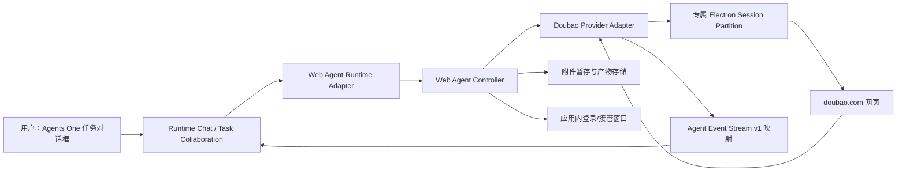
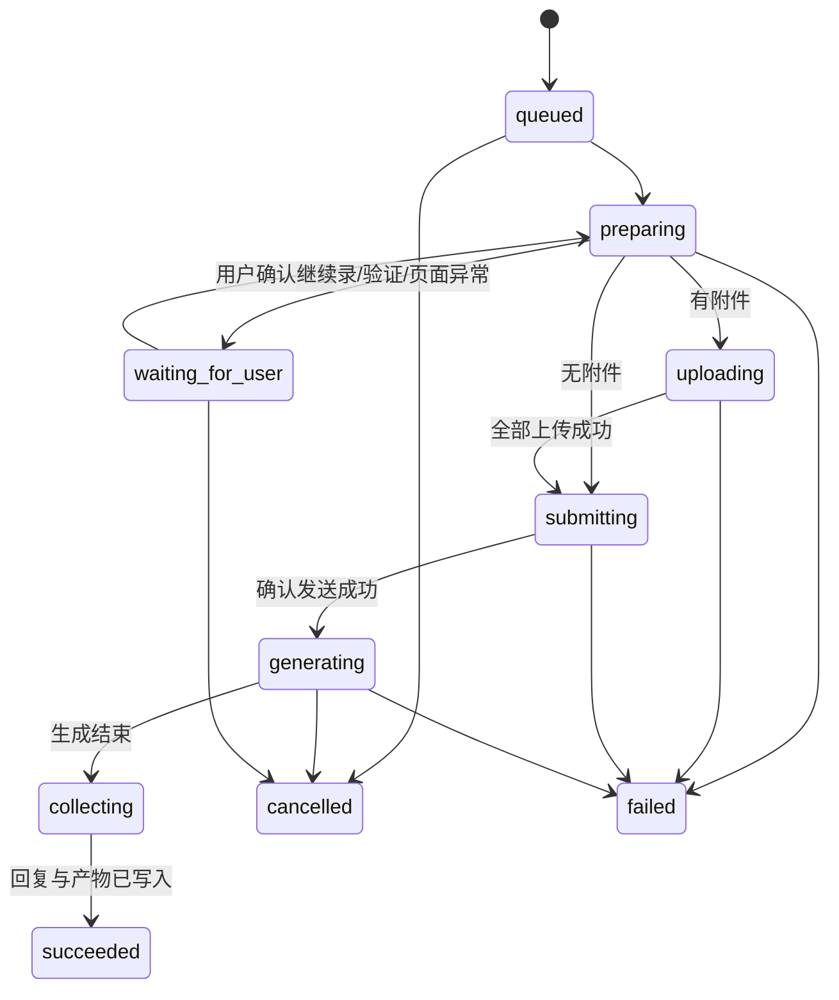

# Agents One Web Agent Runtime 产品需求文档

版本：v1.0
日期：2026-08-28
状态：首发实现完成，待真实账号人工验收
首发 Provider：豆包网页版（`https://www.doubao.com/chat/`）

## 1. 产品结论

Agents One 新增一种本地 `Web Agent Runtime`。用户只需在应用内完成一次豆包登录，之后即可像使用本地智能体一样，在 Agents One 的任务对话框中发送提示词和明确选择的文件，并在同一对话中接收豆包的回复、进度、错误和下载产物。

底层仍由 Agents One 自己托管的 Electron Chromium 会话访问豆包网页，但正常使用不要求用户切换到外部浏览器。仅在首次登录、登录失效、验证码、人机验证或站点要求确认时，应用内才显示可接管的豆包窗口；用户处理完成后，任务从中断点继续。

首版只适配豆包。架构保留 Provider Adapter 接口，后续可接入 DeepSeek、ChatGPT 等网页智能体，但不同网站分别维护适配器、测试夹具和发布开关，不共享脆弱的 DOM 选择器。

## 2. 背景与问题

当前用户使用豆包网页版时，需要离开 Agents One，在浏览器中重新选择文件、粘贴提示词、等待结果，再手工把回复或下载文件带回任务上下文。这个过程打断任务流，也无法复用 Agents One 已有的会话历史、附件、运行状态和产物展示。

官方 API 可以提供更稳定的程序化调用，但不能完全替代用户对“已登录网页版能力和账号权益”的使用诉求。因此本项目采用三层策略：

1. 正式 API Runtime：适合稳定、可规模化的模型能力，属于独立产品路径。
2. Web Agent Runtime：服务本 PRD 的核心场景，由 Agents One 托管用户自己的网页会话。
3. 私有接口逆向：不纳入产品方案，不调用未公开接口，不提取或持久化网页令牌。

## 3. 用户与核心场景

### 3.1 目标用户

- 已在豆包网页版拥有账号和可用权益；
- 主要在 Agents One 中组织项目、任务和多智能体协作；
- 希望避免在 Agents One 与浏览器之间反复切换；
- 可能需要发送 PDF、Word、图片、表格或其他豆包网页支持的文件。

### 3.2 核心用户故事

1. 作为用户，我可以在 Agents One 中添加“豆包网页版”智能体，并在应用内完成登录。
2. 作为用户，我可以在任务对话框选择豆包，输入提示词并添加文件，然后直接发送。
3. 作为用户，我可以在任务对话框看到上传、等待生成、回复完成、失败或需登录等真实状态。
4. 作为用户，我可以在同一个 Agents One 对话中连续追问，并延续同一个豆包网页会话。
5. 作为用户，我可以取消正在生成的回复，并得到明确的取消结果。
6. 作为用户，我可以在 Agents One 中看到并打开豆包生成的下载文件。
7. 作为用户，当登录失效或出现验证码时，可以在应用内接管网页，处理后继续当前任务。

## 4. 产品目标与非目标

### 4.1 产品目标

- 正常任务全程在 Agents One 中完成，不打开外部浏览器。
- 支持提示词、显式附件、多轮对话、最终回复、取消、错误和下载产物。
- 应用重启后保留豆包登录态和本地会话映射。
- 网页状态变化时安全失败，不误发消息、不重复发送、不伪造回复。
- 复用 Agents One 既有的 Runtime、Event Stream、附件暂存、会话历史和产物 UI。
- Provider 适配器可独立升级、禁用和回滚。

### 4.2 非目标

- 首版不接入 DeepSeek、ChatGPT 或其他网站。
- 不绕过验证码、人机验证、登录、付费、速率限制或地区限制。
- 不调用豆包未公开的内部接口，不复刻或导出登录 Cookie、Token。
- 不把豆包网页当作通用浏览器自动化平台。
- 不向豆包网页开放 Shell、任意本地路径或项目工作区。
- 不承诺获取豆包未在网页界面展示的原始思维链、Token 用量或模型内部元数据。
- 不支持无人值守批量抓取、并发群发或后台爬取。

## 5. 体验原则

1. **对话优先**：用户的主要界面始终是 Agents One 任务对话框。
2. **网页按需出现**：正常运行隐藏；需要用户操作时才在应用内显示。
3. **真实反馈**：只展示实际观测到的网页状态，不把猜测包装成进度。
4. **显式授权**：仅上传本轮由用户明确添加的文件。
5. **单次投递**：任何重试都必须先证明上一轮没有成功提交。
6. **安全失败**：适配器无法确认页面结构或完成状态时，停止并提示接管。
7. **Provider 隔离**：登录态、页面规则、会话和故障互不串用。

## 6. 用户流程

### 6.1 添加豆包网页版智能体

1. 用户进入“添加智能体”，选择“豆包网页版”。
2. Agents One 创建专属、持久化的 Chromium Session Partition。
3. 应用内打开豆包登录窗口，用户自行登录并处理验证码。
4. 适配器只检测“已登录且聊天页可用”，不读取或展示账号凭据。
5. 检测成功后关闭或隐藏窗口，Runtime 状态变为“可用”。

默认 Runtime 名称为“豆包网页版”，允许用户修改名称和头像。删除 Runtime 时应明确询问是否同时清除其本地网页登录数据；默认只删除 Runtime 配置，清除登录数据必须是单独的显式动作。

### 6.2 发起普通对话

1. 用户在任务对话框选择“豆包网页版”。
2. 输入提示词，可选择零个或多个附件。
3. Agents One 创建本地 Run，进入 `preparing`。
4. Web Agent Controller 检查登录态和页面健康状态。
5. 如有附件，先逐个上传并确认网页已接收，再发送提示词。
6. 观察豆包生成状态，将可见回复同步回 Agents One。

#### 豆包双模式降级策略

- 新建任务默认选择豆包“工作”模式，以获得工作模式的任务处理能力。
- 创建远端会话前先完成模式选择，避免以“对话”模式创建后再切到“工作”模式导致页面只保留思考节点。
- 若页面明确提示工作模式次数、额度或配额耗尽/达到上限、暂不可用，或要求切换到“对话”模式，则本轮只自动降级一次到“对话”模式。
- 降级时新建一个对话会话，原样重放本轮提示词和已暂存附件，并在任务时间线告知用户；不得因普通网络错误、登录/验证码、页面识别失败或一般生成失败而自动重复提交。
- 已映射的历史会话默认保持其当前模式，避免续聊时改变远端上下文；若历史会话的工作模式在提交时耗尽，同样允许上述一次性降级。

#### 豆包回复提取规则

- `block_type:10040`、`thinking_block` 及 `thinking-box-root` 仅表示思考进度，不得作为最终答复；只有剔除思考节点后仍存在可见文本时，才允许结束 `generating` 阶段。
- 当思考节点与最终答复位于同一消息行时，保留答复节点文本；当页面仅有思考节点时持续轮询，避免把“已思考”误报为最终答复。
- 提交回执优先使用稳定的用户消息行（`data-message-id`）或去除输入框后的可见提示词；不得因豆包用户气泡 CSS 类名变化而误报 `WEB_SUBMISSION_UNCONFIRMED`。
- 豆包专属隐藏窗口必须关闭 Chromium 后台节流（`backgroundThrottling: false`），确保窗口隐藏时仍持续处理流式答复；不得通过显示窗口来规避该问题。

7. 回复稳定且页面已退出生成态后，写入最终答复并完成 Run。

### 6.3 多轮追问

本地 `conversationId` 与豆包网页会话建立一对一映射。用户在同一 Agents One 对话中追问时，必须恢复相同的豆包网页会话；新建分支或新对话时创建新的豆包会话。若远端会话被用户在豆包侧删除，应明确提示“原网页会话不可恢复”，并让用户选择在新会话继续，不能静默串到其他会话。

### 6.4 需要用户接管

出现以下任一情况时，Run 进入 `waiting_for_user`，任务对话显示“需要在应用内完成操作”：

- 未登录或登录失效；
- 验证码、人机验证、设备确认；
- 服务条款、隐私或权限确认；
- 文件上传要求用户确认；
- 适配器无法安全识别页面状态。

用户点击“打开豆包窗口”后，在 Agents One 内完成操作，再点击“我已完成，继续”。适配器重新执行健康检查；通过后从安全检查点继续。等待期间不得自动重复点击发送按钮或重新上传文件。

### 6.5 下载产物

当豆包回复包含下载动作时，Controller 监听专属 Session 的下载事件，将文件保存到 Agents One 管理的 Run 产物目录。下载完成并通过文件名、大小、MIME 和路径校验后，生成 `artifact.created`；普通文本回复不作为产物。

## 7. 界面需求

### 7.1 Runtime 设置

设置页至少展示：

- 名称、Provider、状态；
- “登录/重新登录”；
- “打开豆包窗口”；
- “检测连接”；
- “清除登录数据”；
- 适配器版本、最近检测时间和最近错误摘要；
- 实验性能力提示和站点兼容性说明。

不得展示 Cookie、Authorization Header、Session Token 或完整网页存储内容。

### 7.2 任务对话框

复用现有输入栏、附件选择、消息列表和运行时间线。新增状态应以轻量事件呈现：

- 正在检查豆包登录状态；
- 正在上传 `文件名`；
- 文件上传完成；
- 豆包正在生成；
- 需要用户操作；
- 回复已完成；
- 下载产物已保存；
- 运行已取消或失败。

页面生成过程可以显示临时文本增量，但持久化历史只保存去重后的最终回复和有价值的执行事件。

### 7.3 应用内接管窗口

接管窗口使用独立的受控 `BrowserWindow`/`WebContentsView`，而不是复用通用 Web Preview。窗口包含：

- Provider 名称和当前用途；
- 返回任务按钮；
- “我已完成，继续”；
- 安全提示：仅在豆包官方域名输入账号信息；
- 当前允许域名提示。

通用 Web Preview 继续用于链接预览，不承担持久登录、后台运行、文件上传或下载拦截职责。

## 8. 功能需求

### 8.1 Runtime 生命周期

| ID     | 需求                                                  | 优先级 |
| ------ | ----------------------------------------------------- | ------ |
| WR-001 | 新增 `web-agent` Runtime 类型和 `local-web` Transport | P0     |
| WR-002 | 支持创建、编辑、禁用和删除豆包网页版 Runtime          | P0     |
| WR-003 | 每个网页账号配置使用独立持久化 Session Partition      | P0     |
| WR-004 | 应用重启后登录态仍可用，不要求重复登录                | P0     |
| WR-005 | Runtime 可执行登录探测、页面健康探测和版本探测        | P0     |
| WR-006 | 适配器可由发布开关紧急禁用，且不影响其他 Runtime      | P0     |

### 8.2 对话与文件

| ID     | 需求                                               | 优先级 |
| ------ | -------------------------------------------------- | ------ |
| WR-101 | 支持纯文本提示词发送并接收最终回复                 | P0     |
| WR-102 | 支持本地会话与豆包网页会话映射                     | P0     |
| WR-103 | 支持至少三轮连续追问                               | P0     |
| WR-104 | 支持上传豆包网页当前允许的常见文件类型             | P0     |
| WR-105 | 发送前确认所有附件上传成功，失败时不发送提示词     | P0     |
| WR-106 | 支持用户取消正在生成的回复                         | P1     |
| WR-107 | 支持识别并保存豆包生成的下载文件                   | P1     |
| WR-108 | 支持临时文本增量，最终回复只持久化一次             | P1     |
| WR-109 | 支持新建豆包会话，不自动复用其他本地对话的远端会话 | P0     |
| WR-110 | 新任务默认工作模式，额度不可用时单次降级到对话模式 | P0     |

### 8.3 中断与恢复

| ID     | 需求                                               | 优先级 |
| ------ | -------------------------------------------------- | ------ |
| WR-201 | 检测登录失效并进入 `waiting_for_user`              | P0     |
| WR-202 | 在应用内显示接管窗口，不跳转外部浏览器             | P0     |
| WR-203 | 用户完成操作后可继续原 Run                         | P0     |
| WR-204 | 页面结构不匹配时 fail-closed，不尝试猜测发送       | P0     |
| WR-205 | 应用异常退出后，恢复时先核对远端状态，禁止盲目重发 | P1     |
| WR-206 | 超时、网络错误、站点限流和服务错误具有不同错误码   | P1     |

### 8.4 安全与隐私

| ID     | 需求                                                             | 优先级 |
| ------ | ---------------------------------------------------------------- | ------ |
| WR-301 | `nodeIntegration=false`、`contextIsolation=true`、`sandbox=true` | P0     |
| WR-302 | 默认只允许豆包官方登录与聊天所需域名，外链在受控策略下处理       | P0     |
| WR-303 | 网页不得直接读取用户原始文件路径或任意工作区                     | P0     |
| WR-304 | 日志必须脱敏 Cookie、Token、Header、完整提示词和文件内容         | P0     |
| WR-305 | Runtime 默认 `workspaceAccess=false` 且不提供 Shell/Terminal     | P0     |
| WR-306 | 清除登录数据和删除 Runtime 是两个独立动作                        | P0     |
| WR-307 | 同一 Profile 默认只允许一个豆包 Run 并发执行                     | P0     |

## 9. 总体架构



### 9.1 组件职责

| 组件                       | 职责                                     | 明确不做                       |
| -------------------------- | ---------------------------------------- | ------------------------------ |
| Web Agent Runtime Adapter  | 接入现有 Run、取消、会话和事件体系       | 不包含豆包 DOM 规则            |
| Web Agent Controller       | 管理窗口、Session、队列、Run 状态和下载  | 不识别具体 Provider 页面       |
| Doubao Provider Adapter    | 登录检测、会话切换、上传、发送、回复观察 | 不写 Agents One 历史或配置     |
| Session Store              | 保存 Chromium 自有登录态                 | 不导出 Cookie/Token 到配置文件 |
| Conversation Mapping Store | 保存本地与网页会话的最小映射             | 不保存网页正文副本             |
| Runtime Chat               | 展示消息、状态、附件和产物               | 不直接控制 WebContents         |

### 9.2 推荐技术路径

- 使用应用已携带的 Electron Chromium，不要求用户安装浏览器、驱动或系统服务。
- 每个网页账号使用 `persist:agents-one-web-doubao:<profileId>` 形式的独立 Partition；实际键名需经过安全字符规范化。
- 使用主进程持有的隐藏 `BrowserWindow` 或 `WebContentsView` 执行任务，需要接管时显示同一 WebContents，避免登录态切换。
- 页面点击、输入和状态观察通过受控的页面脚本完成；文件输入可通过 Electron DevTools Protocol 的 `DOM.setFileInputFiles` 设置为 Agents One 暂存副本。
- 不依赖豆包内部 HTTP/WebSocket 私有协议，不注入绕过网站安全策略的补丁。
- Provider Adapter 选择器优先使用可访问性角色、稳定属性和可见文案组合，哈希类 CSS 类名仅作低优先级兜底。

## 10. 核心接口契约

### 10.1 Runtime 配置

建议在既有 `AgentRuntimeConfig` 中新增如下配置，最终字段命名以技术设计为准：

```ts
type WebAgentProvider = "doubao";

interface WebAgentRuntimeConfig {
  agentTransport: "local-web";
  webAgent: {
    provider: WebAgentProvider;
    profileId: string;
    adapterVersion: string;
    enabled: boolean;
  };
}
```

约束：

- `profileId` 是不透明本地标识，不使用账号名、手机号或邮箱。
- Runtime 配置不保存 Cookie、Token、Local Storage 内容或明文凭据。
- 写入配置时只更新 Web Agent 自有键，保留所有未知字段。
- 旧 Runtime 在缺少新字段时继续按原逻辑工作，不进行批量迁移或历史改写。

### 10.2 Provider Adapter

```ts
interface WebAgentProviderAdapter {
  provider: "doubao";
  adapterVersion: string;
  allowedOrigins: string[];

  probeLogin(ctx: WebAgentPageContext): Promise<LoginProbe>;
  ensureChatReady(ctx: WebAgentPageContext): Promise<ChatReadyResult>;
  createConversation(ctx: WebAgentPageContext): Promise<RemoteConversationRef>;
  resumeConversation(
    ctx: WebAgentPageContext,
    ref: RemoteConversationRef,
  ): Promise<ResumeResult>;
  uploadFiles(
    ctx: WebAgentPageContext,
    files: StagedUpload[],
  ): Promise<UploadResult[]>;
  sendPrompt(
    ctx: WebAgentPageContext,
    prompt: string,
  ): Promise<SubmissionReceipt>;
  observeResponse(
    ctx: WebAgentPageContext,
    receipt: SubmissionReceipt,
    sink: WebAgentEventSink,
  ): Promise<ObservedResponse>;
  cancel(ctx: WebAgentPageContext): Promise<CancelResult>;
  collectDownloads(ctx: WebAgentPageContext): Promise<DownloadedArtifact[]>;
}
```

每个方法必须返回可判定结果，不以“没有抛异常”等同成功。发送成功至少需要满足：输入内容已离开编辑器、对话中出现与本 Run 关联的新用户消息、页面进入生成态或出现新回复容器中的任一可靠证据组合。

### 10.3 Capabilities

豆包首版建议声明：

```json
{
  "attachments": true,
  "workspaceAccess": false,
  "eventStream": {
    "protocol": "agents-one-event-stream-v1",
    "transport": "poll",
    "reasoningSummaries": false,
    "toolEvents": true,
    "modelMetadata": false,
    "usageMetadata": false
  }
}
```

`toolEvents` 仅用于文件上传和下载等 Agents One 可独立验证的过程。除非网页提供稳定、明确的用户可见信息，否则不得声明推理、模型和用量能力。

## 11. Run 状态机



关键不变量：

- 只有 `submitting` 可以触发发送动作。
- `SubmissionReceipt` 一旦生成，恢复流程不得自动重新发送同一提示词。
- 只有观察到新回复容器后，才能发出 `assistant.delta` 或 `assistant.completed`。
- `assistant.completed` 在同一 Run 中最多持久化一次。
- 附件有任意一个上传失败时，本轮提示词不发送。
- `succeeded` 必须有非空最终回复；只有产物没有回复时按异常处理。

## 12. 回复观察与完成判定

回复观察使用 `MutationObserver` 加低频健康检查，不能只依赖固定延时。完成必须同时满足以下条件中的可靠组合：

1. 本轮对应的新助手消息容器已经出现；
2. 停止生成按钮消失或发送按钮恢复可用；
3. 最后一个助手消息在稳定窗口内文本和结构均未变化；
4. 页面不存在正在上传、生成、联网搜索或错误重试状态；
5. 新回复的规范化内容哈希与历史回复不同。

建议默认稳定窗口为 1.2 秒，最长运行时间由 Runtime 配置控制。稳定窗口不是唯一完成依据；站点仍显示生成状态时不得提前完成。

文本提取应保留段落、列表、代码块和链接的基本结构，转换为 Agents One 可渲染的 Markdown。隐藏节点、按钮文案、复制提示、点赞控件和推荐问题不得混入回复正文。

## 13. 事件映射

| 网页事实               | Event Stream v1                          | Agents One 持久化      |
| ---------------------- | ---------------------------------------- | ---------------------- |
| Run 已进入执行         | `run.started`                            | 执行时间线             |
| 开始上传文件           | `tool.started`                           | 文件名、大小的脱敏摘要 |
| 文件已出现在网页附件区 | `tool.completed`                         | 上传成功摘要           |
| 上传失败               | `tool.failed`                            | 错误码和用户可操作建议 |
| 新回复文本增长         | `assistant.delta`                        | 仅临时显示             |
| 回复完成               | `assistant.completed`                    | 一条最终智能体消息     |
| 下载完成且文件已验证   | `artifact.created`                       | 可打开的产物           |
| 需要登录或验证         | `run.status` + 本地 `userActionRequired` | 状态事件，不伪装成回复 |
| 任务成功               | `run.completed`                          | Run 终态               |
| 页面/网络/超时失败     | `run.failed`                             | 错误摘要与错误码       |

现有 Event Stream v1 暂无 `user_action_required` 标准事件。首版可在本地 Run 控制面增加结构化 `userActionRequired` 状态，UI 将其作为控制状态展示；不要把它写成 `reasoning.summary` 或 `assistant.completed`。若未来多个 Runtime 都需要此能力，再单独提出 Event Stream v2 或兼容扩展。

## 14. 附件与产物

### 14.1 输入附件

- 继续使用主进程附件暂存区，Renderer 不把原始路径交给 Runtime。
- Web Controller 仅接受通过 `isStagedAttachmentPath` 校验的真实普通文件。
- 单文件和单会话配额沿用现有暂存策略；Provider 限制更严格时取两者较小值。
- 上传前记录文件名、大小、MIME 和 SHA-256；不在日志记录文件正文。
- 上传成功必须以网页附件 UI 的可见确认作为依据。
- 仅向网页提供本轮选中的暂存副本，任务目录和工作区不挂载给 WebContents。

### 14.2 下载产物

- 下载目录按 `profileId/runId` 隔离，由主进程创建。
- 对文件名做路径净化，拒绝绝对路径、`..`、设备名和覆盖已有文件。
- 下载完成后计算大小、MIME 和 SHA-256，再发布 Artifact。
- 未完成下载、零字节异常文件或路径越界不得发布。
- 删除会话时是否删除下载产物沿用 Agents One 现有产物生命周期，不由 Provider Adapter 自行决定。

## 15. 会话与持久化

建议新增独立的 Web Agent Conversation Store，最小记录如下：

```json
{
  "localConversationId": "runtime-conv-...",
  "runtimeId": "runtime-...",
  "provider": "doubao",
  "profileId": "profile-...",
  "remoteConversationRef": {
    "url": "https://www.doubao.com/chat/...",
    "opaqueId": "..."
  },
  "lastVerifiedAt": 1787880000000
}
```

要求：

- 仅保存恢复会话所需的最小引用。
- `remoteConversationRef` 必须先验证属于允许域名。
- Store 写入使用既有原子写策略，损坏时保留原文件并安全降级。
- 不修改或重写既有 Runtime Conversation 历史。
- 删除本地对话默认只删除映射，不自动删除豆包云端会话。
- 同一个远端会话不得绑定到两个不同的本地对话，除非用户显式导入。

## 16. 错误模型

| 错误码                           | 含义                     | 默认处理                             |
| -------------------------------- | ------------------------ | ------------------------------------ |
| `WEB_LOGIN_REQUIRED`             | 未登录或登录失效         | 进入应用内接管                       |
| `WEB_USER_VERIFICATION_REQUIRED` | 验证码/人机验证/设备确认 | 进入应用内接管                       |
| `WEB_PAGE_UNSUPPORTED`           | 页面结构或版本未知       | 停止，提示更新适配器或接管           |
| `WEB_NAVIGATION_BLOCKED`         | 跳转到不允许域名         | 阻止导航并失败                       |
| `WEB_UPLOAD_REJECTED`            | Provider 拒绝附件        | 不发送提示词，展示原因               |
| `WEB_SUBMISSION_UNCONFIRMED`     | 无法确认消息是否成功发送 | 停止，不自动重发                     |
| `WEB_RESPONSE_TIMEOUT`           | 超时未完成               | 保留已观察内容，Run 失败或待用户处理 |
| `WEB_PROVIDER_RATE_LIMITED`      | 网页提示限流             | 显示原意摘要，不自动密集重试         |
| `WEB_DOWNLOAD_FAILED`            | 下载失败或文件校验失败   | 回复可完成，产物标记失败             |
| `WEB_SESSION_CRASHED`            | WebContents 崩溃         | 单次安全恢复；有提交回执时禁止重发   |
| `WEB_CANCEL_UNCONFIRMED`         | 无法确认停止生成         | 保持异常状态并允许接管               |

错误详情应包含适配器版本、页面 URL 的域名和路径模板、运行阶段、可恢复性，不包含完整查询参数、提示词、回复正文、Cookie 或页面存储。

## 17. 安全、合规与账号风险

1. Web Agent Runtime 属于用户发起、用户账号下的交互自动化，不代表网站官方 API。
2. 不绕过网站访问控制，不模拟付费权益，不自动处理验证码，不进行大规模抓取。
3. 正式发布前需再次审查豆包届时有效的服务协议，并决定默认开放范围、实验性标识和用户提示。
4. OpenAI 和 DeepSeek 当前条款对自动提取、机器人或自动抓取存在明确限制，因此它们不能因为技术接口已预留就默认上线；每个 Provider 必须单独完成条款复核。
5. 自动更新的 Provider 适配器必须经过签名或随应用发布，不能从网页动态执行未知远程脚本。
6. 页面脚本与主进程通过最小化消息协议通信；网页内容不得构造任意 IPC 方法名或本地路径。
7. Window 打开、权限请求、通知、摄像头、麦克风、地理位置和剪贴板默认拒绝，登录确需的能力单独评估。

参考条款：

- [豆包服务协议](https://www.doubao.com/legal/terms)
- [OpenAI Terms of Use](https://openai.com/policies/terms-of-use/)
- [DeepSeek Terms of Use](https://cdn.deepseek.com/policies/en-US/deepseek-terms-of-use.html)

## 18. 性能与可靠性要求

- 同一 `profileId` 默认串行执行 Run，避免网页会话相互覆盖。
- 应用空闲时可冻结或销毁隐藏页面，但保留 Session；下一次运行需重新健康检查。
- 页面观察不得采用高频全 DOM 扫描；MutationObserver 事件需节流和合并。
- 临时 delta 不逐条写磁盘，最终回复和有界执行事件才进入历史。
- 页面崩溃不得拖垮 Agents One 主窗口。
- Provider 适配失败不能影响 Codex、Claude Code、Pi、Hermes 或 Remote Gateway Runtime。
- 所有等待都应支持超时与取消，不能在主进程形成永久悬挂 Promise。

## 19. 测试策略

### 19.1 单元测试

- Runtime 配置解析、旧配置兼容和未知键保留；
- Profile/Partition 标识净化与隔离；
- 允许域名和导航阻断；
- Run 状态机合法/非法迁移；
- 回复规范化、哈希去重和完成判定；
- 会话映射写入、恢复、损坏降级；
- 错误码映射和日志脱敏；
- 下载文件名净化、路径约束和哈希计算。

### 19.2 Provider DOM 夹具

在仓库保存脱敏、最小化的 HTML 夹具，不提交真实账号页面快照。至少覆盖：

- 未登录页、已登录空白聊天页；
- 正在上传、上传成功、上传失败；
- 正在生成、生成完成、生成报错；
- Markdown、代码块、表格、引用和下载链接；
- 验证码或确认弹层；
- 选择器缺失、重复按钮、隐藏旧回复；
- 豆包页面小版本变化的兼容夹具。

### 19.3 集成测试

使用本地测试页面和独立临时 Partition 验证：

- 窗口创建、隐藏、显示和销毁；
- CDP 文件输入只接受暂存文件；
- MutationObserver 到 Event Stream 的映射；
- 取消、超时、页面崩溃和恢复；
- 下载拦截与 Artifact 发布；
- 应用重启后的 Session 和 Conversation Mapping 恢复。

真实豆包测试不得进入默认 CI，应通过显式环境开关运行，使用专门测试账号且不保存凭据或录屏。

### 19.4 回归范围

每个阶段至少验证：

- 既有 Codex、Claude Code、Pi、本地 API 和 Gateway v1 Runtime 注册不变；
- Runtime 设置保存后名称、头像和启用状态不丢失；
- 旧对话历史和项目归属不变；
- 现有附件上传和删除会话逻辑不回归；
- Web Preview 的普通链接预览不受影响。

## 20. MVP 验收标准

以下全部通过才可将豆包 Web Runtime 标记为 MVP：

| 场景       | 验收标准                                                    |
| ---------- | ----------------------------------------------------------- |
| 首次登录   | 在 Agents One 内登录成功，关闭窗口后 Runtime 变为可用       |
| 登录持久化 | 完全退出并重启 Agents One，无需再次登录即可通过探测         |
| 纯文本     | 发送一条提示词，只出现一条对应用户消息和一条最终回复        |
| 文件上传   | 上传一个 PDF 后发送提示词，豆包确认收到文件并返回答复       |
| 多轮对话   | 同一 Agents One 对话连续三轮，均落在同一豆包会话            |
| 会话隔离   | 新建 Agents One 对话后创建新的豆包会话，不串用上一会话      |
| 完成判定   | 长回复、代码块和慢速生成均不提前完成、不重复最终回复        |
| 登录失效   | Run 进入等待，应用内接管登录后可以继续且不重复发送          |
| 页面变化   | 关键选择器缺失时明确失败，不点击不确定的控件                |
| 取消       | 用户取消后停止生成，Run 进入 `cancelled` 或明确报告无法确认 |
| 产物       | 一个下载文件保存到受控目录并以 Artifact 展示                |
| 安全       | 网页无法读取未选择文件、工作区、Cookie 日志或任意 IPC       |
| 回归       | 既有 Runtime、历史、项目、附件和 Web Preview 回归通过       |

## 21. 分阶段实施计划

### Phase 0：技术探针与边界验证

目标：用最小代码验证 Electron 内可稳定完成登录探测、文本发送和回复读取。

交付：

- 豆包专属临时 Session 和应用内窗口；
- 已登录/未登录探测；
- 单轮纯文本发送与最终回复读取；
- 选择器诊断报告和脱敏 DOM 夹具；
- 条款与发布边界复核记录。

退出标准：连续完成 20 次单轮对话，无误发、重复回复或外部浏览器跳转。探针代码不得直接混入通用 Runtime 主干，验证通过后按正式接口整理。

### Phase 1：Runtime MVP

目标：让豆包作为正式 Runtime 出现在 Agents One，并支持日常核心流程。

交付：

- `web-agent` Runtime 与 `local-web` Transport；
- Web Agent Controller 和 Doubao Provider Adapter；
- 设置页登录、探测、打开窗口和清除登录数据；
- 纯文本、附件上传、三轮对话、会话映射；
- 最终回复和基础状态事件；
- DOM 夹具、单元测试和集成测试。

退出标准：通过第 20 节除取消、产物之外的全部 P0 验收项。

### Phase 2：可靠性与产物

目标：补齐长任务、异常和文件结果能力。

交付：

- 文本 delta、取消、超时和限流处理；
- 下载拦截和 Artifact；
- 页面崩溃恢复、提交回执和防重复发送；
- `waiting_for_user` 控制状态和恢复；
- Provider 健康开关与兼容性提示。

退出标准：第 20 节全部通过，并完成 100 轮混合场景稳定性回归。

### Phase 3：Provider 框架固化

目标：在豆包稳定后验证通用接口，而不是提前抽象。

交付：

- 从 Doubao Adapter 中提取已被两个以上场景证明稳定的通用控制能力；
- Provider 适配器版本、能力和发布开关机制；
- DeepSeek/ChatGPT 的合规评估和独立技术探针；
- 不承诺默认发布第二个 Provider。

退出标准：新增 Provider 不需要修改 Runtime Chat、附件 Store 或会话渲染主流程。

## 22. 建议的代码变更边界

以下为后续智能体的实施导航，不是要求一次完成的文件清单。

### 22.1 允许新增

- `src/main/web-agent/`：Controller、Session、Store、下载与状态机；
- `src/main/web-agent/providers/doubao/`：豆包选择器、动作和回复解析；
- `src/shared/web-agent.ts`：共享类型、错误码、能力与 IPC DTO；
- `src/renderer/src/components/settings/WebAgentRuntimePane.tsx`：设置与登录入口；
- `src/renderer/src/screens/RuntimeChat/` 下的最小控制状态 UI；
- `tests/fixtures/web-agent/doubao/`：脱敏 DOM 夹具；
- 对应的主进程、Renderer 和集成测试。

### 22.2 必须最小修改的受保护边界

- `src/shared/agent-runtimes.ts`：仅增加 Runtime/Transport 配置类型和能力；
- `src/main/agent-runtimes.ts`：仅增加 `local-web` 分派、探测、Run 与取消适配；
- preload/IPC：仅暴露结构化 Web Agent 操作，不暴露任意 WebContents 执行能力；
- Runtime Conversation：复用既有消息和执行事件，不重构历史模型；
- 设置页：新增 Provider 配置，不重写其他 Runtime 的保存逻辑。

### 22.3 明确禁止顺手修改

- 不重构 Codex、Claude Code、Pi、Hermes 或 Gateway v1 分支；
- 不批量重写 `desktop.json` 或历史会话；
- 不改变现有 Runtime 的默认注册、名称、头像或启用状态；
- 不把通用 Web Preview 改造成登录自动化容器；
- 不在首个补丁中加入 DeepSeek/ChatGPT 选择器；
- 不引入要求管理员权限、浏览器扩展或系统级驱动的依赖。

## 23. 建议的提交拆分

后续智能体应按小步提交，每一步都有独立测试和回滚路径：

1. `web-agent` 共享类型、配置兼容与状态机纯函数；
2. Session/窗口安全策略与本地测试页；
3. Doubao 登录探测和应用内接管；
4. 纯文本单轮发送、回复观察和 DOM 夹具；
5. Runtime 正式注册与任务对话接入；
6. 附件暂存上传与失败原子性；
7. 会话映射和多轮恢复；
8. 取消、下载产物、崩溃恢复和发布开关；
9. 完整回归、运行手册、进度日志与 `lat.md` 更新。

每个提交都必须先记录影响数据、下游消费者、失败模式、回滚方法和验证结果。若某一步需要扩大到受保护边界，应先更新本 PRD 或单独技术设计，不可自行跨层重构。

## 24. 发布与运营

- 首次发布标记为“实验性：网页兼容能力”，默认仅允许用户主动添加。
- 适配器健康状态至少包含：`supported`、`degraded`、`disabled`。
- 豆包页面重大变化导致误操作风险时，可通过本地版本开关或签名更新禁用自动发送，仍保留应用内手动窗口。
- 只收集不含内容的本地诊断：适配器版本、阶段、错误码、耗时、是否恢复成功；默认不上传提示词、回复或文件信息。
- 发布说明明确：网页能力受网站界面、账号状态和服务条款影响，稳定性低于官方 API Runtime。

## 25. 成功指标

MVP 上线后的本地可观测指标：

- 任务无需打开外部浏览器即可完成的比例不低于 90%；
- 登录有效时，纯文本首轮成功率不低于 95%；
- 已支持类型的附件上传成功率不低于 95%；
- 重复发送和重复最终回复为 0；
- 页面结构不兼容时的误点击为 0；
- 豆包 Runtime 故障导致其他 Runtime 回归为 0。

指标仅用于本地质量评估；如需集中遥测，必须另行进行隐私设计和用户授权。

## 26. 已确定的产品决策

- 首发只做豆包，不同时开发三个 Provider。
- 使用 Agents One 内嵌 Chromium 持久会话，不依赖外部 Chrome 扩展。
- 正常运行隐藏网页，需要人工操作时在应用内接管。
- 不使用网站私有 API，不自动处理验证码。
- Web Runtime 无工作区和 Shell 权限，只接收显式附件。
- 同一网页 Profile 默认单并发。
- 普通文本答复不是 Artifact。
- 无可靠数据时不显示模型、Token 用量或推理摘要。
- Provider 选择器与通用控制器隔离，可独立禁用和更新。

## 27. 进入实施前仍需确认的事项

这些事项不阻塞 Phase 0，但必须在对应功能进入发布前关闭：

1. 豆包真实账号对文件类型、大小、数量和频率的当前限制。
2. 豆包页面登录所需的最小域名白名单。
3. 下载产物与本地会话删除时的统一保留策略。
4. `waiting_for_user` 是先采用本地控制状态，还是升级 Event Stream 协议。
5. Provider 适配器是否仅随桌面应用发布，还是支持签名的独立热更新。
6. 正式分发前的豆包服务协议和法务评估结论。

## 28. 相关项目文档与参考实现

内部契约：

- [Agents One Agent Event Stream v1](AGENT_EVENT_STREAM_V1.md)
- [Agents One Plugin SDK](AGENTS_ONE_PLUGIN_SDK.md)
- [Agents One Remote Gateway v1](AGENTS_ONE_REMOTE_GATEWAY_V1.md)
- [Agents One 变更安全守则](AGENTS_ONE_CHANGE_SAFETY_PROTOCOL.md)

开源参考只用于学习架构和失效模式，不直接复制受许可证限制或依赖私有接口的实现：

- [ChatALL](https://github.com/ai-shifu/ChatALL)：Provider/Bot 适配层和多站点状态管理参考。
- [ChatHub](https://github.com/chathub-dev/chathub)：浏览器扩展的 Content Script 与页面桥接参考。
- [Sync Multi Chat](https://github.com/cccnam5158/sync-multi-chat)：Electron 多会话、人工登录和完成检测参考。
- [chatgpt-py](https://github.com/ceoimperiumprojects/chatgpt-py)：持久浏览器会话、上传与下载的工程风险参考。

以上项目的许可证、站点条款和技术路径各不相同。Agents One 应自行实现最小 Provider Adapter，不引入逆向私有 API，也不直接采用与本项目分发方式不兼容的代码。

## 29. 实现状态（2026-08-28）

本版本已完成首发豆包 Web Agent Runtime 的代码实现与自动化验证：共享契约、隔离 Session Partition、应用内接管、登录/验证等待恢复、文本与附件投递、多轮会话映射、取消、下载产物、设置页和 Runtime Chat 接入均已落地。自动化夹具覆盖登录探测、上传确认、发送回执、回复提取、下载控件、会话映射隔离和安全边界。

真实豆包账号登录、重启后登录态和长时间混合场景仍需使用专用测试账号执行第 20 节的人工验收；该流程不进入默认 CI，也不保存凭据、Cookie 或录屏。
